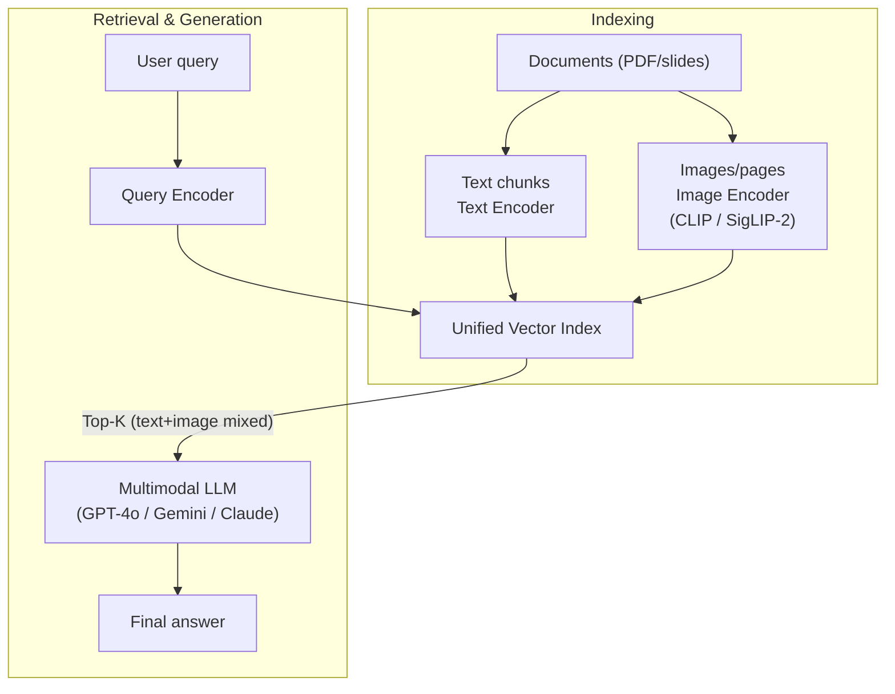
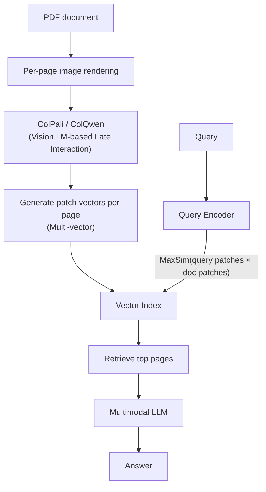

# Multimodal RAG

## Overview

**Multimodal RAG** is a RAG architecture that processes not only text but also visual information such as images, tables, charts, and PDF pages as retrieval units. It indexes text and images together in a shared embedding space, and multimodal LLMs (GPT-4o, Gemini, Claude 3.5) generate answers from mixed contexts.

Research including ColPali (ICLR 2025), SV-RAG (ICLR 2025), and URaG (AAAI 2026) has matured to production level since 2025 and is no longer experimental [1][2].

## Why It's Needed

Traditional text-only RAG misses the following types of information:

- **Graphs/charts in PDFs**: Converting with OCR loses numerical relationships
- **Medical images/X-rays**: Text descriptions cannot fully replace the original image information
- **Technical drawings/circuit diagrams**: Structural visual information
- **Slide decks**: Layout and visual emphasis are part of the meaning

Multimodal RAG directly embeds such visual information without OCR to make it retrievable.

## Architecture

### ① CLIP/SigLIP Shared Embedding Approach

Uses a Dual-Encoder that aligns text and images in a single latent space. Query (text) and image candidates are compared by cosine similarity in the same vector space.



**Representative models**: CLIP (OpenAI), SigLIP-2 (Google), ALIGN (Google), voyage-multimodal-3 (Voyage AI, 2025)

### ② ColPali / ColQwen Approach (OCR-free)

ColPali (Faysse et al., ICLR 2025) is a Late Interaction approach that processes PDF pages **as rendered images directly**. Retrieves while preserving document layout and visual elements without an OCR pipeline.



Clearly outperforms text RAG for documents with frequent OCR failures — equations, tables, non-Latin characters [3].

### Approach Comparison

| | CLIP Shared Embedding | ColPali Late Interaction |
|---|---|---|
| OCR required | Varies by approach | Not needed |
| Embeddings per item | 1 vector per image | N vectors per image (patch count) |
| Storage | Small | Large (patches × vectors) |
| Retrieval accuracy | Medium | High (layout preserved) |
| Speed | Fast | Slow (MaxSim operation) |
| Best use case | General image search | Document page search |

## Generation Stage

Pass retrieved context (text chunks + images/pages) directly to a Multimodal LLM.

```
Context = [3 text chunks] + [2 images] + [1 table image]
→ GPT-4o / Gemini 2.0 Flash / Claude 3.5 Sonnet → Answer
```

Key Multimodal LLMs: GPT-4o (OpenAI), Gemini 1.5/2.0 Pro·Flash (Google), Claude 3.5/3.7 Sonnet (Anthropic), Qwen3-VL (Alibaba)

## Pros and Cons

**Pros**
- Preserves original visual information without OCR failures or format conversion loss
- Can handle questions mixing text and images
- Immediately applicable to slide/PDF-centric knowledge bases

**Cons**
- Increased image embedding cost and storage (especially ColPali)
- Multimodal LLM call cost higher than text-only
- Precise evaluation metrics still being established (UNIDOC-BENCH, etc.)

## Suitable Use Cases

| Use case | Relevant modalities |
|----------|-------------------|
| Enterprise PDF/slide QA | Page images, tables, charts |
| Medical image reading assistance | X-ray, MRI + text reports |
| E-commerce product search | Product images + description text |
| Map/drawing search | Geographic images + metadata |
| Academic paper search | Equation images + text |

## Implementation Stack (2025~2026)

```
Embedding models:  ColPali / voyage-multimodal-3 / SigLIP-2 / CLIP
Vector DB:         Qdrant / Weaviate / pgvector (image vector support)
Generation LLM:    Gemini 2.0 Flash / GPT-4o / Claude 3.5 Sonnet
Frameworks:        LlamaIndex MultiModal / LangChain + GPT4V
```

## Role in AI Engineering

Multimodal RAG extends the boundaries of Retrieval Strategies beyond text corpora. Where traditional RAG addressed "which text chunks to put in context," Multimodal RAG addresses the broader problem of "what unit of which modality to put in context."

## Related Concepts

[[en/AI/Engineering/Context_Engineering/Retrieval_Strategies/RAG/RAG|RAG]] · [[en/AI/Engineering/Context_Engineering/Retrieval_Strategies/RAG/Vector_Storage|Vector Storage]] · [[en/AI/Engineering/Context_Engineering/Retrieval_Strategies/RAG/Advanced_Retrieval|Advanced Retrieval]] · [[en/AI/Engineering/Context_Engineering/Retrieval_Strategies/GraphRAG/GraphRAG|GraphRAG]] · [[en/AI/Engineering/Context_Engineering/Retrieval_Strategies/RAG/Agentic_RAG|Agentic RAG]]

## Sources

1. Rileylearning Medium "Recent Multimodal RAG Papers (ColPali, SV-RAG, URaG, MetaEmbed)" (2025) — [rileylearning.medium.com](https://rileylearning.medium.com/recent-multimodal-rag-papers-colpali-sv-rag-urag-metaembed-2f3069f9a9ae)
2. Hélain Zimmermann "Multimodal RAG 2026: Vision and Text for State-of-the-Art Pipelines" — [helain-zimmermann.com](https://helain-zimmermann.com/blog/multimodal-rag-2026-vision-and-text-for-state-of-the-art-pipelines)
3. Spheron "ColPali and Multimodal Document RAG on GPU Cloud: Visual PDF Retrieval Without OCR (2026)" — [spheron.network/blog](https://www.spheron.network/blog/colpali-multimodal-document-rag-gpu-cloud/)
4. NVIDIA Technical Blog "An Easy Introduction to Multimodal Retrieval-Augmented Generation" — [developer.nvidia.com](https://developer.nvidia.com/blog/an-easy-introduction-to-multimodal-retrieval-augmented-generation/)
5. Faysse et al. (2024) "ColPali: Efficient Document Retrieval with Vision Language Models" — [ICLR 2025](https://arxiv.org/abs/2407.01449)
6. KX Systems "Guide to Multimodal RAG for Images and Text (2025)" — [medium.com/kx-systems](https://medium.com/kx-systems/guide-to-multimodal-rag-for-images-and-text-10dab36e3117)
