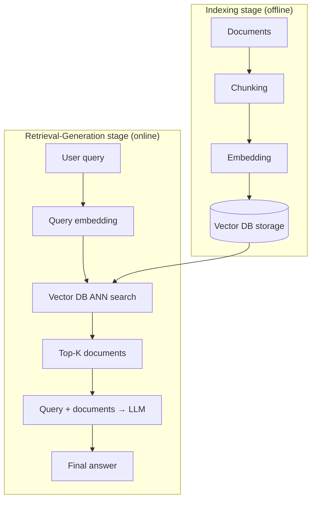

# RAG (Retrieval-Augmented Generation)

## Overview

**RAG** is an architecture proposed by Lewis et al. (Facebook AI Research, 2020) that supplements the limitations of LLM's parametric knowledge (information stored in weights) with external knowledge retrieval. The core idea is "using up-to-date information without retraining the model."

## Why Is It Needed?

```
Problems with pure LLMs:
  1. Knowledge cutoff — doesn't know events after training
  2. Hallucination — generates plausible falsehoods when it doesn't know
  3. No sources — unclear "where does this information come from?"
  4. Domain limits — no internal documents, proprietary data

RAG's solution:
  Question → [Retrieve: find relevant documents] → [Generate: answer based on documents]
  → Latest information + reduced hallucination + sources can be cited
```

## Standard RAG Pipeline



## Sub-documents

| Document | Content |
|------|------|
| [[en/AI/Engineering/Context_Engineering/Retrieval_Strategies/RAG/Chunking_Strategies\|Chunking Strategies]] | How to split documents — 5 strategies |
| [[en/AI/Engineering/Context_Engineering/Retrieval_Strategies/RAG/Vector_Storage\|Vector Storage]] | How to store and retrieve embeddings |
| [[en/AI/Engineering/Context_Engineering/Retrieval_Strategies/RAG/Advanced_Retrieval\|Advanced Retrieval]] | More accurate retrieval — reranking, Multi-Query, HyDE |
| [[en/AI/Engineering/Context_Engineering/Retrieval_Strategies/RAG/HyDE\|HyDE]] | Improving retrieval quality with hypothetical documents |
| [[en/AI/Engineering/Context_Engineering/Retrieval_Strategies/RAG/Agentic_RAG\|Agentic RAG]] | Agent-based dynamic retrieval — Self-RAG, CRAG, Multi-Agent RAG |
| [[en/AI/Engineering/Context_Engineering/Retrieval_Strategies/RAG/Hybrid_RAG\|Hybrid RAG]] | Dense(vector) + Sparse(BM25/SPLADE) combination — Reciprocal Rank Fusion |
| [[en/AI/Engineering/Context_Engineering/Retrieval_Strategies/RAG/Multimodal_RAG\|Multimodal RAG]] | Text+image+table integrated retrieval — CLIP, ColPali, Multimodal LLM |

## Performance Evaluation (RAGAS metrics)

```
Faithfulness:      Is the answer grounded in retrieved documents?
Answer Relevancy:  Is the answer relevant to the question?
Context Precision: Are the retrieved documents relevant?
Context Recall:    Were the necessary documents retrieved?
```

## Role in AI Engineering

RAG is the **foundational architecture for knowledge-intensive AI services**. It is the default choice for all domains where "accuracy matters" — enterprise QA, legal research, medical information, code documentation search, etc.

## Related Concepts
[[en/AI/Engineering/Context_Engineering/Retrieval_Strategies/GraphRAG/GraphRAG|GraphRAG]] · [[en/AI/Engineering/Context_Engineering/Retrieval_Strategies/SQL_RAG/SQL_RAG|SQL RAG]] · [[en/AI/Engineering/Context_Engineering/Memory_and_Semantic_Cache|Memory & Semantic Cache]] · [[en/AI/Engineering/Context_Engineering/Context_Compression|Context Compression]]

## Sources
- Lewis et al. (2020) "Retrieval-Augmented Generation for Knowledge-Intensive NLP Tasks" — [arxiv.org/abs/2005.11401](https://arxiv.org/abs/2005.11401)
