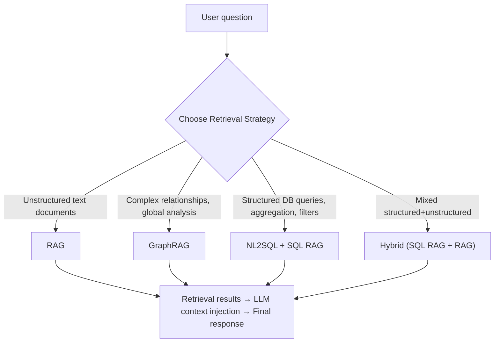
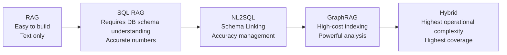
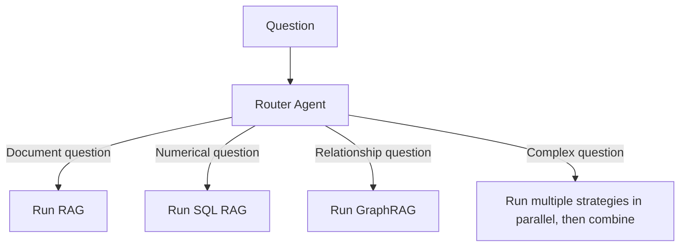

# Retrieval Strategies

## Overview

**Retrieval Strategies** is the collective term for methodologies by which LLMs fetch relevant information from external data sources. This layer determines "what form of data to retrieve and how," and choosing the wrong strategy leads to degraded retrieval quality → increased hallucination → lower final response quality.



## 4 Core Strategies

### 1. RAG (Retrieval-Augmented Generation)

The basic strategy of chunking and embedding unstructured text documents, then searching via vector similarity.

```
Suitable data: PDFs, emails, web pages, internal documents, news articles
Suitable questions: "Explain ~", "What are the conditions for ~?", "What's the difference between ~?"
Search method: Vector ANN (HNSW, FAISS)
```

→ Details: [[en/AI/Engineering/Context_Engineering/Retrieval_Strategies/RAG/RAG|RAG]]

---

### 2. GraphRAG

A strategy that uses Knowledge Graph structural relationships and community clusters to perform complex multi-hop reasoning and global summarization.

```
Suitable data: Documents where entity relationships matter (papers, law, corporate networks)
Suitable questions: "What are the main themes of this dataset?", "What's the relationship between A and B?", "Who are the key players in this industry?"
Search method: Graph traversal (Local Search / Global Search)
```

→ Details: [[en/AI/Engineering/Context_Engineering/Retrieval_Strategies/GraphRAG/GraphRAG|GraphRAG]]

---

### 3. NL2SQL (Natural Language to SQL)

A strategy that converts natural language questions to SQL queries and retrieves directly from RDBMS.

```
Suitable data: RDBMS, data warehouses, transaction DBs
Suitable questions: "What was last month's total revenue?", "Top 5 best-selling products?"
Search method: SQL query execution (deterministic)
Core challenge: Schema Linking, SQL generation accuracy
```

→ Details: [[en/AI/Engineering/Context_Engineering/Retrieval_Strategies/NL2SQL/NL2SQL|NL2SQL]]

---

### 4. SQL RAG

RAG architecture patterns using SQL as the retrieval mechanism. Includes NL2SQL and can extend to Hybrid architecture combining with vector RAG.

```
Suitable data: Mixed structured + unstructured enterprise data
Suitable questions: Complex questions requiring both numerical analysis and document reference
Search method: SQL execution + vector search (Hybrid)
```

→ Details: [[en/AI/Engineering/Context_Engineering/Retrieval_Strategies/SQL_RAG/SQL_RAG|SQL RAG]]

---

## Decision Criteria: "Which Strategy for Which Data?"

| Data type | Question type | Recommended strategy | Alternative |
|------------|----------|----------|------|
| Unstructured documents (PDF, text) | Fact retrieval, explanation | **RAG** | GraphRAG |
| Unstructured documents | Global summary, entity relationships | **GraphRAG** | RAG |
| Structured DB (numbers, transactions) | Aggregation, filters, ranking | **SQL RAG + NL2SQL** | — |
| Structured DB | Simple lookup | **NL2SQL** | — |
| Mixed structured + unstructured | Complex analysis | **Hybrid (SQL + Vector)** | — |
| Knowledge graph / ontology | Relationship inference | **GraphRAG** | RAG |

### Cost-Complexity Trade-off


Low cost/complexity → High cost/complexity

## Combination Patterns

**Agentic Retrieval**: An agent analyzes questions and dynamically selects strategies.



→ See [[en/AI/Engineering/Context_Engineering/Retrieval_Strategies/RAG/Agentic_RAG|Agentic RAG]]

## Sub-documents

| Chapter | Document | Content |
|------|------|------|
| **RAG** | [[en/AI/Engineering/Context_Engineering/Retrieval_Strategies/RAG/RAG\|RAG]] | Vector-based RAG basics |
| | [[en/AI/Engineering/Context_Engineering/Retrieval_Strategies/RAG/Chunking_Strategies\|Chunking Strategies]] | 5 document splitting strategies |
| | [[en/AI/Engineering/Context_Engineering/Retrieval_Strategies/RAG/Vector_Storage\|Vector Storage]] | Vector DB, HNSW, FAISS |
| | [[en/AI/Engineering/Context_Engineering/Retrieval_Strategies/RAG/Advanced_Retrieval\|Advanced Retrieval]] | Reranking, Multi-Query, RAG Fusion |
| | [[en/AI/Engineering/Context_Engineering/Retrieval_Strategies/RAG/HyDE\|HyDE]] | Hypothetical document embedding search improvement |
| | [[en/AI/Engineering/Context_Engineering/Retrieval_Strategies/RAG/Agentic_RAG\|Agentic RAG]] | Self-RAG, CRAG, Multi-Agent RAG |
| **GraphRAG** | [[en/AI/Engineering/Context_Engineering/Retrieval_Strategies/GraphRAG/GraphRAG\|GraphRAG]] | Microsoft GraphRAG, community clustering |
| | [[en/AI/Engineering/Context_Engineering/Retrieval_Strategies/GraphRAG/Knowledge_Graph/Knowledge_Graph\|Knowledge Graph]] | Knowledge graph overview |
| | [[en/AI/Engineering/Context_Engineering/Retrieval_Strategies/GraphRAG/Knowledge_Graph/LPG_and_RDF\|LPG & RDF]] | Neo4j Cypher vs SPARQL |
| | [[en/AI/Engineering/Context_Engineering/Retrieval_Strategies/GraphRAG/Knowledge_Graph/Ontology\|Ontology]] | OWL, domain ontology |
| **NL2SQL** | [[en/AI/Engineering/Context_Engineering/Retrieval_Strategies/NL2SQL/NL2SQL\|NL2SQL]] | Text-to-SQL pipeline, benchmarks, latest techniques |
| **SQL RAG** | [[en/AI/Engineering/Context_Engineering/Retrieval_Strategies/SQL_RAG/SQL_RAG\|SQL RAG]] | Structured data RAG, Hybrid architecture |

## Related Concepts

[[en/AI/Engineering/Context_Engineering/Context_Engineering|Context Engineering]] · [[en/AI/Engineering/Context_Engineering/Retrieval_Strategies/RAG/Advanced_Retrieval|Advanced Retrieval]] · [[en/AI/Engineering/Context_Engineering/Retrieval_Strategies/GraphRAG/GraphRAG|GraphRAG]]
