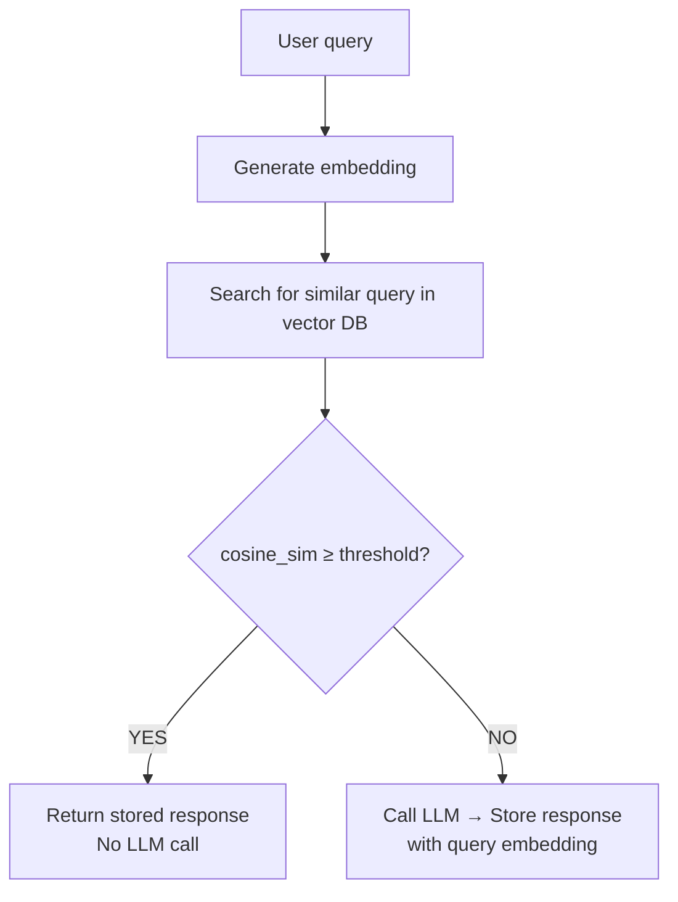
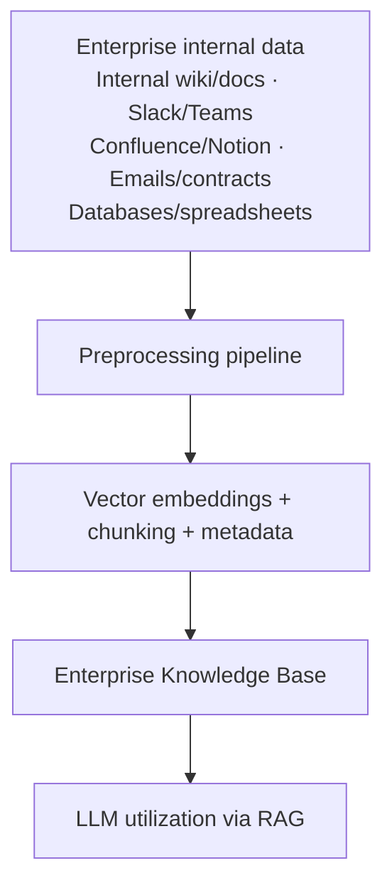

# Semantic Cache

## Overview

Semantic Cache is an optimization technique that reduces LLM API call costs and latency through **semantic similarity-based caching**. Unlike traditional caches that only hit on exact matches, it counts as a cache hit when embedding similarity exceeds a threshold.

```
Traditional cache:
  Stored: "How to sort a Python list" → [LLM response]
  New query: "How to sort list in python" → cache miss ❌

Semantic Cache:
  "How to sort a Python list" → embed → [0.2, 0.7, ...]
  "How to sort list in python" → embed → [0.21, 0.68, ...]
  cosine_sim = 0.94 > threshold(0.9) → cache hit ✅
```

---

## How It Works



---

## GPTCache

Open-source semantic cache library (developed by Zilliz) [1]:

```python
from gptcache import cache
from gptcache.adapter import openai
from gptcache.embedding import Onnx
from gptcache.manager import CacheBase, VectorBase, get_data_manager
from gptcache.similarity_evaluation import SearchDistanceEvaluation

# Initialize cache
onnx = Onnx()
data_manager = get_data_manager(
    CacheBase("sqlite"),          # store responses
    VectorBase("faiss", dimension=onnx.dimension),  # store embeddings
)
cache.init(
    embedding_func=onnx.to_embeddings,
    data_manager=data_manager,
    similarity_evaluation=SearchDistanceEvaluation(),
    similarity_threshold=0.8,   # similarity threshold
)

# OpenAI API calls are automatically cached afterward
response = openai.ChatCompletion.create(
    model="gpt-4",
    messages=[{"role": "user", "content": "How to sort a Python list"}]
)
```

---

## Redis-based Semantic Cache Implementation

```python
import redis
from openai import OpenAI
import numpy as np

class SemanticCache:
    def __init__(self, threshold=0.9):
        self.redis = redis.Redis()
        self.client = OpenAI()
        self.threshold = threshold
    
    def embed(self, text: str) -> list:
        return self.client.embeddings.create(
            input=text, model="text-embedding-3-small"
        ).data[0].embedding
    
    def get(self, query: str):
        query_embed = self.embed(query)
        # Search for similar query via Redis Vector Search
        # Return cached response if above threshold
        ...
    
    def set(self, query: str, response: str):
        embed = self.embed(query)
        # Store embedding + response in Redis
        ...
```

---

## Performance Effects

Research results (GPT Semantic Cache, 2024) [2]:

| Metric | Value |
|------|------|
| Cache hit rate | 61.6 ~ 68.8% |
| Hit accuracy | 97%+ |
| Latency reduction | Instant response without API call |
| Cost reduction | 60~70% fewer API calls for same traffic |

---

## Category-Aware Cache

Apply different similarity thresholds per query type. Strict for factual queries, loose for creative:

```python
thresholds = {
    "factual": 0.95,      # fact verification — must be very similar to hit
    "creative": 0.70,     # creative — loose hit
    "code": 0.90,         # code — hit when language and purpose similar
    "conversation": 0.85  # conversation — middle threshold
}
```

---

## Integration with Enterprise Knowledge Base

A system storing an organization's internal data in a structured form for LLM use.



Semantic Cache sits on top of this, optimizing costs for repeated queries.

---

## Role in AI Engineering

Semantic Cache plays a key role in the **Runtime Optimization** layer of Loop Engineering (→ [[en/AI/Engineering/Loop_Engineering/Runtime_Optimization|Runtime Optimization]]). It dramatically reduces API costs in customer support, internal tools, and education platforms with many repeated questions.

## Related Concepts
[[en/AI/Engineering/Context_Engineering/LLM_Memory|LLM Memory]] · [[en/AI/Engineering/Context_Engineering/Retrieval_Strategies/RAG/Vector_Storage|Vector Storage]] · [[en/AI/Engineering/Loop_Engineering/Runtime_Optimization|Runtime Optimization]] · [[en/AI/Engineering/Agent_Engineering/Agent_Memory|Agent Memory]]

## References
1. GPTCache GitHub — [github.com/zilliztech/GPTCache](https://github.com/zilliztech/GPTCache)
2. "GPT Semantic Cache: Reducing LLM Costs and Latency via Semantic Embedding Caching" (2024) — [arXiv:2411.05276](https://arxiv.org/abs/2411.05276)
3. Anthropic "Contextual Retrieval" — [anthropic.com](https://www.anthropic.com/news/contextual-retrieval)
