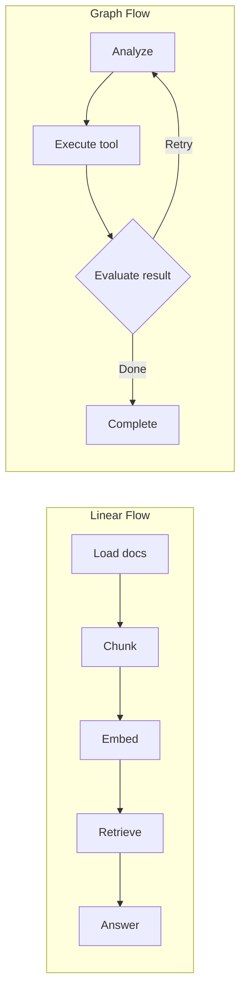
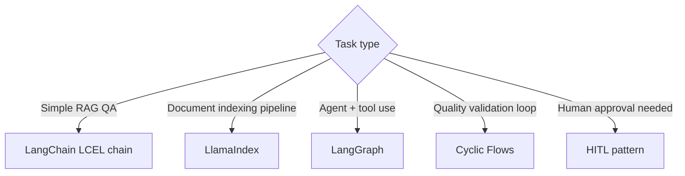

# Flow Engineering

## Overview

**Flow Engineering** is the architecture design skill of **connecting multiple LLM calls, tool executions, and data transformations into a pipeline** to complete complex tasks. It answers "how to compose things that a single LLM call cannot solve."

## Two Flow Types

## Sub-documents

| Document | Content |
|----------|---------|
| [[en/AI/Engineering/Flow_Engineering/Linear_Flow/Linear_Flow\|Linear Flow]] | Sequential pipeline overview |
| [[en/AI/Engineering/Flow_Engineering/Linear_Flow/LangChain\|LangChain]] | LCEL pipeline (Harrison Chase, 2022) |
| [[en/AI/Engineering/Flow_Engineering/Linear_Flow/LlamaIndex\|LlamaIndex]] | Indexing-query pipeline (Jerry Liu, 2022) |
| [[en/AI/Engineering/Flow_Engineering/Linear_Flow/Tool_Use_and_Function_Calling\|Tool Use & Function Calling]] | OpenAI/Anthropic Function Calling |
| [[en/AI/Engineering/Flow_Engineering/Graph_Flow/Graph_Flow\|Graph Flow]] | Cyclic graph flow overview |
| [[en/AI/Engineering/Flow_Engineering/Graph_Flow/LangGraph\|LangGraph]] | StateGraph agents (LangChain AI, 2024) |
| [[en/AI/Engineering/Flow_Engineering/Graph_Flow/Cyclic_Flows\|Cyclic Flows]] | Evaluate-and-Retry, Self-Correction |
| [[en/AI/Engineering/Flow_Engineering/Graph_Flow/ReAct_Pattern\|ReAct Pattern]] | Thought-Action-Observation (Yao, 2022) |
| [[en/AI/Engineering/Flow_Engineering/Graph_Flow/Human_in_the_Loop\|Human-in-the-Loop]] | Human intervention points — Breakpoints, Time Travel |

## Technology Selection Criteria

## Role in AI Engineering

Flow Engineering is the **layer that solves tasks impossible for a single LLM call by building a system around it**. It overcomes the limitations of single model calls (context length, step-by-step reasoning) through pipelines, and serves as the direct foundation for Agent Engineering.

## Related Concepts
[[en/AI/Engineering/Context_Engineering/Context_Engineering|Context Engineering]] · [[en/AI/Engineering/Agent_Engineering/Agent_Engineering|Agent Engineering]]
