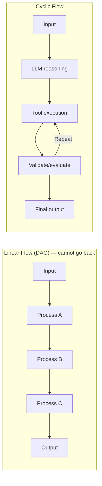
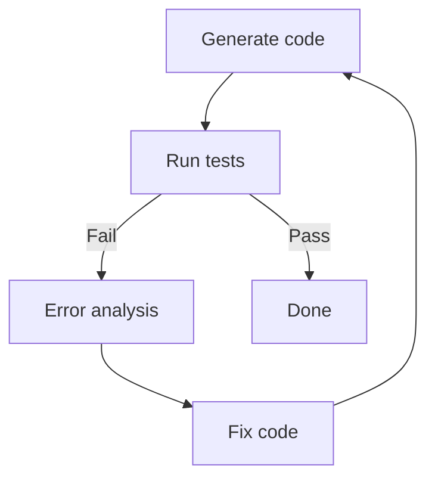
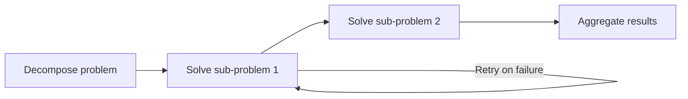
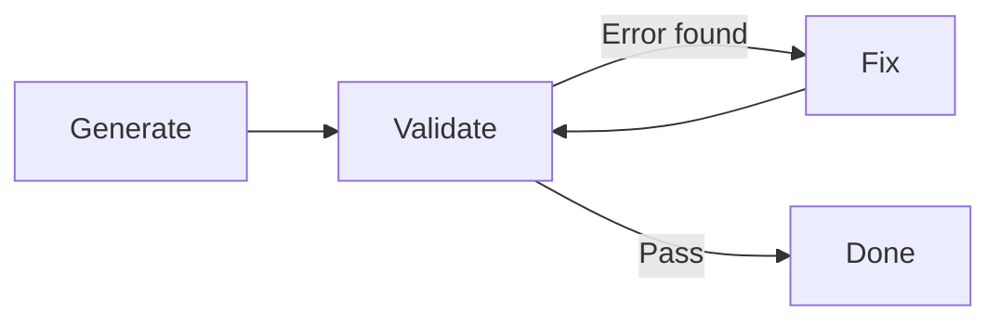
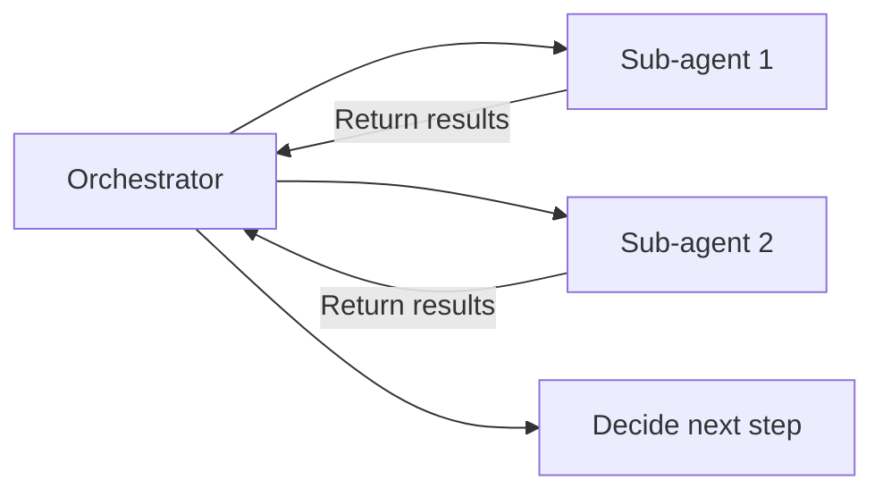

# Cyclic Flows

## Overview

**Cyclic Flows** is an execution architecture that allows **cycles** between nodes in LLM pipelines. Unlike linear (DAG) flows, the same steps can be repeatedly executed until the LLM achieves its goal. This is a core characteristic of agent behavior.

## Linear vs Cyclic



## Why Cyclic Flows Are Needed

### 1. Iterative Refinement


### 2. Multi-Step Problem Solving
Complex problems cannot be solved at once:


### 3. Tool-Use Loop (ReAct Pattern)
```
Think → Call tool → Observe → Think → Call tool → ... → Final answer
```

## Cycle Exit Conditions

Cyclic flows must always have **exit conditions**:

```python
def should_continue(state: AgentState) -> str:
    # Condition 1: Maximum iteration count
    if state["iterations"] >= 10:
        return END
    
    # Condition 2: Task completed
    if state["task_completed"]:
        return END
    
    # Condition 3: Exit if no tool calls
    last_msg = state["messages"][-1]
    if not (hasattr(last_msg, "tool_calls") and last_msg.tool_calls):
        return END
    
    # Continue
    return "continue"
```

## Cyclic Flow Patterns

### 1. Evaluate-and-Retry
```python
# Regenerate if quality below threshold
def evaluate_node(state):
    response = state["current_response"]
    score = evaluate_quality(response)
    if score < 0.8 and state["retries"] < 3:
        return {"quality_ok": False, "retries": state["retries"] + 1}
    return {"quality_ok": True}

# Conditional edge
builder.add_conditional_edges("evaluate", 
    lambda s: "generate" if not s["quality_ok"] else END)
```

### 2. Self-Correction Loop


### 3. Orchestrator-Worker Cycle


## Implementation: LangGraph

LangGraph is the de facto standard implementation for cyclic flows:

```python
from langgraph.graph import StateGraph, END

builder = StateGraph(State)
builder.add_node("agent", agent_node)
builder.add_node("tools", tool_execution_node)
builder.add_node("evaluator", quality_evaluator_node)

# Configure cycle
builder.set_entry_point("agent")
builder.add_conditional_edges("agent", route_after_agent)
builder.add_edge("tools", "agent")          # tools → agent (cycle)
builder.add_conditional_edges("evaluator",  # retry or end after evaluation
    lambda s: "agent" if not s["satisfied"] else END)
```

## Precautions

### Preventing Infinite Loops
```python
MAX_ITERATIONS = 20

def route(state):
    if state["iterations"] >= MAX_ITERATIONS:
        logger.warning("Max iterations reached")
        return "force_exit"
    return "continue"
```

### Cost Management
Every cycle incurs LLM calls → cost monitoring essential:
```python
# Track token usage per cycle
total_tokens = sum(step.token_usage for step in state["steps"])
if total_tokens > BUDGET_TOKENS:
    return "budget_exceeded"
```

## Role in AI Engineering

Cyclic Flows is the **core execution mechanism of Agent Engineering**. The agent's ability to "keep trying until goal is achieved" is impossible without cyclic flows. The most fundamental difference between simple pipelines and true agent systems is precisely the presence or absence of cycles (loops).

## Related Concepts
[[en/AI/Engineering/Flow_Engineering/Graph_Flow/LangGraph|LangGraph]] · [[en/AI/Engineering/Flow_Engineering/Graph_Flow/ReAct_Pattern|ReAct Pattern]] · [[en/AI/Engineering/Flow_Engineering/Graph_Flow/Human_in_the_Loop|Human-in-the-Loop]] · [[en/AI/Engineering/Agent_Engineering/Agent_Architectures|Agent Architectures]]

## Sources
- LangGraph Official Documentation — [langchain-ai.github.io/langgraph](https://langchain-ai.github.io/langgraph/)
- "Mastering LangGraph: The Backbone of Stateful Multi-Agent AI" — [Towards AI](https://pub.towardsai.net/mastering-langgraph-the-backbone-of-stateful-multi-agent-ai-0424500a510b)
