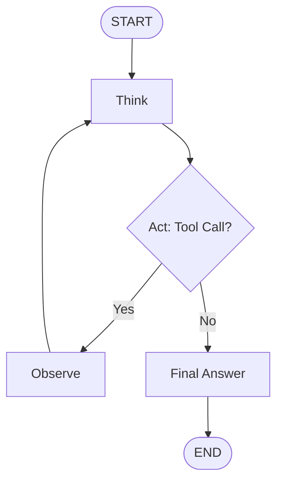
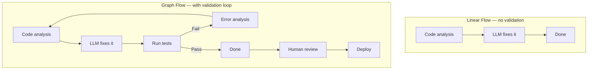

# Graph Flow

## Overview

**Graph Flow** is a pattern that represents LLM pipelines as a **directed graph** composed of nodes (processing steps) and edges (transition conditions). It supports loops, conditional branches, and state management, enabling implementation of agent systems and complex workflows.



## Sub-documents

| Document | Content |
|----------|---------|
| [[en/AI/Engineering/Flow_Engineering/Graph_Flow/LangGraph\|LangGraph]] | Implement agent workflows with StateGraph (LangChain AI, 2024) |
| [[en/AI/Engineering/Flow_Engineering/Graph_Flow/Cyclic_Flows\|Cyclic Flows]] | Loop patterns — Evaluate-and-Retry, Self-Correction |
| [[en/AI/Engineering/Flow_Engineering/Graph_Flow/ReAct_Pattern\|ReAct Pattern]] | Thought-Action-Observation loop (Yao et al. 2022) |
| [[en/AI/Engineering/Flow_Engineering/Graph_Flow/Human_in_the_Loop\|Human-in-the-Loop]] | Human approval/intervention points — Breakpoints, Time Travel |

## Why Graph Flow Is Needed



## State Management

The core of Graph Flow is the **state object shared between nodes**:

```python
from typing import TypedDict, Annotated
from langgraph.graph import StateGraph

class AgentState(TypedDict):
    messages: list          # conversation history
    tool_calls: list        # list of tools called
    iteration_count: int    # loop counter (prevent infinite loops)
    final_answer: str       # final answer
```

## Role in AI Engineering

Graph Flow is the **standard pattern for implementing agent systems**. If Linear Flow is "cooking by following a recipe," Graph Flow is "cooking while adjusting ingredients based on the situation." It is essential for complex task automation, quality assurance, and human-AI collaboration.

## Related Concepts
[[en/AI/Engineering/Flow_Engineering/Linear_Flow/Linear_Flow|Linear Flow]] · [[en/AI/Engineering/Agent_Engineering/Agent_Architectures|Agent Architectures]]
