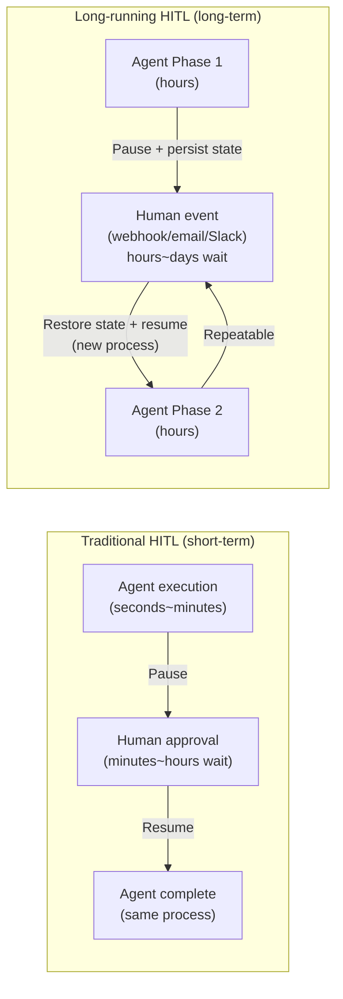

# Human-in-the-Loop (HITL)

## Overview

**Human-in-the-Loop (HITL)** is an architecture pattern that allows **humans to intervene for review, approval, and correction** at specific points during automated AI agent execution. It pauses agents and waits for human judgment through State Interruptions and Breakpoints.

## Why It's Needed

Fully automated agents are dangerous in the following situations:
```
Dangerous scenario:
  Agent: "I will delete specific records from the customer DB"
  → Irreversible action!
  → Must not execute without human approval

Business regulations:
  "Payments over $50,000 require CFO approval"
  "External API calls require security team review"
```

## HITL Pattern Types

### 1. Breakpoints (Static Interrupts)

Always interrupt at predefined nodes:
```python
# LangGraph static breakpoints
graph = builder.compile(
    interrupt_before=["dangerous_action", "send_email"],  # interrupt before these nodes
    interrupt_after=["data_fetch"]  # interrupt after these nodes
)

result = graph.invoke(initial_state, config)
# → Automatically pauses just before "dangerous_action" node
```

### 2. Dynamic Interrupts

Interrupt dynamically based on conditions during execution:
```python
from langgraph.types import interrupt

def action_node(state: AgentState):
    action = state["planned_action"]
    
    # Only interrupt for dangerous operations
    if action.is_destructive or action.cost > 100_000:
        # Request human review
        approval = interrupt({
            "action_description": action.description,
            "estimated_cost": action.cost,
            "question": "Do you approve this action?"
        })
        
        if not approval["approved"]:
            return {"status": "rejected", "reason": approval.get("reason")}
    
    # Execute after approval
    result = execute_action(action)
    return {"action_result": result}
```

### 3. Edit & Continue

Human modifies agent state then resumes:
```python
# Run graph (stops at breakpoint)
thread_config = {"configurable": {"thread_id": "task_123"}}
result = graph.invoke(initial_state, thread_config)

# Check current state
current_state = graph.get_state(thread_config)
print(current_state.values["draft_response"])  # LLM-generated draft

# Human modifies state
graph.update_state(
    thread_config,
    {"draft_response": "Modified response content..."}  # Human directly edits
)

# Resume with modified state
final_result = graph.invoke(None, thread_config)
```

### 4. Time Travel

Roll back to a previous checkpoint:
```python
# Check all checkpoint history
history = graph.get_state_history(thread_config)
for checkpoint in history:
    print(checkpoint.config["configurable"]["checkpoint_id"])

# Roll back to specific checkpoint
old_config = {"configurable": {"checkpoint_id": "checkpoint_v3"}}
result = graph.invoke(None, old_config)
```

## Practical HITL Patterns

### Interrupt-on-Action (Recommended)

Apply interrupt only to destructive actions:
```python
DESTRUCTIVE_ACTIONS = ["delete", "send", "publish", "transfer_money"]

def should_interrupt(state: AgentState) -> bool:
    next_action = state.get("next_action", "")
    return any(action in next_action for action in DESTRUCTIVE_ACTIONS)
```

### Approval Workflow

Multi-stage approval process:
```python
def approval_node(state: AgentState):
    # Level 1: Team lead approval (over $10,000)
    if state["cost"] > 10_000:
        team_lead_approval = interrupt({"approver": "team_lead", ...})
        if not team_lead_approval["approved"]:
            return {"status": "rejected"}
    
    # Level 2: CFO approval (over $500,000)
    if state["cost"] > 500_000:
        cfo_approval = interrupt({"approver": "cfo", ...})
        if not cfo_approval["approved"]:
            return {"status": "rejected"}
    
    return {"status": "approved"}
```

## HITL + Async Execution

Prevent server resource waste waiting for human responses in long-running tasks:
```python
# 1. Start task → pause at interrupt
task_id = start_async_task(initial_state)

# 2. Server handles other work (save paused state to DB)

# 3. Human approves from web UI
# POST /api/tasks/{task_id}/approve
# {"approved": true, "comment": "Approved"}

# 4. Server resumes
resume_task(task_id, human_input={"approved": True})
```

## Long-running Agent HITL *(May 2026)*

In agents running over hours to days, HITL presents different challenges than traditional cases. It must support **resuming after days**, not just "pause briefly and get approval."

### Traditional HITL vs Long-running HITL



**Core infrastructure requirements**: Long-running HITL is very complex to implement without Agent Runtime's auto-resume (resuming after days) and Memory Bank (state persistence). More details → [[en/AI/Engineering/Agent_Engineering/Agent_Deployment|Agent Deployment]]

## Role in AI Engineering

HITL is the **safety valve of agent systems**. It balances full automation with safety, enabling AI automation adoption in regulated industries (finance, medical, legal). Anthropic's agent safety guidelines also strongly recommend human review before risky operations.

## Related Concepts
[[en/AI/Engineering/Flow_Engineering/Graph_Flow/LangGraph|LangGraph]] · [[en/AI/Engineering/Flow_Engineering/Graph_Flow/Cyclic_Flows|Cyclic Flows]] · [[en/AI/Engineering/Harness_Engineering/Guardrail_Engineering|Guardrail Engineering]] · [[en/AI/Engineering/Agent_Engineering/Agent_Architectures|Agent Architectures]] · [[en/AI/Engineering/Agent_Engineering/Agent_Deployment|Agent Deployment]]

## Sources
- LangChain Official "Making it easier to build HITL agents with interrupt" — [langchain.com](https://www.langchain.com/blog/making-it-easier-to-build-human-in-the-loop-agents-with-interrupt)
- LangGraph HITL How-to — [langchain-ai.github.io](https://langchain-ai.github.io/langgraph/cloud/how-tos/human_in_the_loop_breakpoint/)
- "Architecting Human-in-the-Loop Agents" — [Medium](https://medium.com/data-science-collective/architecting-human-in-the-loop-agents-interrupts-persistence-and-state-management-in-langgraph-fa36c9663d6f)
