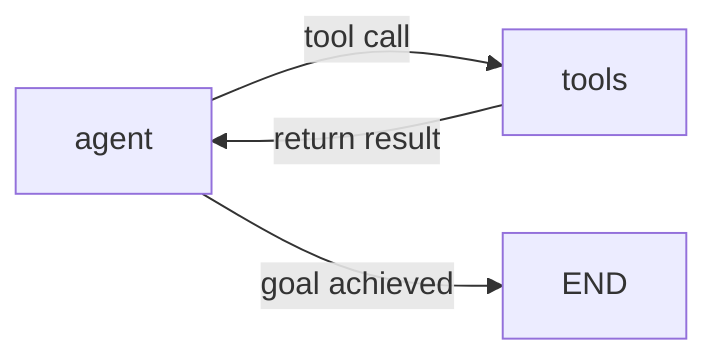

# LangGraph

## Overview

**LangGraph** is a framework for modeling LLM applications as a **stateful graph**. Unlike LangChain's linear chains, it supports **cycles**, allowing agents to repeatedly execute until goals are achieved.

## Origin

- **Developer**: LangChain AI (Harrison Chase team)
- **Release**: January 2024
- **Position**: Agent layer of the LangChain ecosystem. Complementary to LangChain.

## Core Concepts

### State

Shared memory object flowing through the graph:

```python
from typing import TypedDict, Annotated
from langgraph.graph.message import add_messages

class AgentState(TypedDict):
    messages: Annotated[list, add_messages]  # conversation history
    current_task: str
    tool_results: list
    iterations: int
```

All nodes receive State and return updated State.

### Nodes

Python functions = one processing step:

```python
from langchain_openai import ChatOpenAI
from langchain_core.messages import SystemMessage

llm = ChatOpenAI(model="gpt-4o")

def agent_node(state: AgentState):
    """LLM reasoning node"""
    messages = state["messages"]
    response = llm.invoke(messages)
    return {"messages": [response]}

def tool_node(state: AgentState):
    """Tool execution node"""
    last_message = state["messages"][-1]
    results = execute_tools(last_message.tool_calls)
    return {"messages": results, "tool_results": results}
```

### Edges

Define flow between nodes. Conditional branching possible:

```python
from langgraph.graph import StateGraph, END

builder = StateGraph(AgentState)

# Add nodes
builder.add_node("agent", agent_node)
builder.add_node("tools", tool_node)

# Entry point
builder.set_entry_point("agent")

# Conditional edges (key!)
def should_continue(state: AgentState) -> str:
    last_message = state["messages"][-1]
    if hasattr(last_message, "tool_calls") and last_message.tool_calls:
        return "tools"  # tool call needed → go to tools node
    return END          # complete → terminate

builder.add_conditional_edges("agent", should_continue)
builder.add_edge("tools", "agent")  # tools → agent cycle!

graph = builder.compile()
```

### Checkpointing

Resume after interruption, track history:

```python
from langgraph.checkpoint.memory import MemorySaver

checkpointer = MemorySaver()
graph = builder.compile(checkpointer=checkpointer)

# Distinguish conversation sessions by thread_id
config = {"configurable": {"thread_id": "user_123"}}
result = graph.invoke({"messages": [user_message]}, config=config)

# Calling with same thread_id restores previous state
result2 = graph.invoke({"messages": [follow_up]}, config=config)
```

## ReAct Agent Implementation Example

```python
from langgraph.prebuilt import create_react_agent
from langchain_community.tools import TavilySearchResults

# Tool definition
tools = [TavilySearchResults(max_results=3)]

# Create pre-built ReAct agent
agent = create_react_agent(
    model=ChatOpenAI(model="gpt-4o"),
    tools=tools,
    checkpointer=MemorySaver()
)

# Execute
result = agent.invoke(
    {"messages": [{"role": "user", "content": "Find the latest AI news"}]},
    config={"configurable": {"thread_id": "session_1"}}
)
```

## Key LangGraph Features

### 1. Cyclic Flow Support


### 2. Multi-Agent Orchestration
```python
# Supervisor coordinates multiple Sub-Agents
supervisor = create_supervisor(
    agents={"researcher": research_agent, "writer": writer_agent},
    model=llm
)
```

### 3. Human-in-the-Loop

→ See [[en/AI/Engineering/Flow_Engineering/Graph_Flow/Human_in_the_Loop|Human-in-the-Loop]]

## LangGraph Platform

Managed service providing cloud deployment, API serving, and debugging tools:
```python
# LangGraph Platform deployment
langgraph deploy --config langgraph.json
# → Serve agent via REST API
# → Automatic tracking with LangSmith
```

## Role in AI Engineering

LangGraph is the foundation for reliably operating complex Agent systems and Multi-Agent workflows in production. With built-in state management, checkpointing, Human-in-the-Loop, and conditional branching, it has established itself as the de facto standard framework for agent engineering.

## Related Concepts
[[en/AI/Engineering/Flow_Engineering/Linear_Flow/LangChain|LangChain]] · [[en/AI/Engineering/Flow_Engineering/Graph_Flow/ReAct_Pattern|ReAct Pattern]] · [[en/AI/Engineering/Flow_Engineering/Graph_Flow/Cyclic_Flows|Cyclic Flows]] · [[en/AI/Engineering/Flow_Engineering/Graph_Flow/Human_in_the_Loop|Human-in-the-Loop]] · [[en/AI/Engineering/Agent_Engineering/Agent_Architectures|Agent Architectures]]

## Sources
- LangGraph Official Documentation — [langchain-ai.github.io/langgraph](https://langchain-ai.github.io/langgraph/)
- "Building Stateful AI Systems with LangGraph" — [notes.muthu.co](https://notes.muthu.co/2025/10/building-stateful-ai-systems-with-langgraph-and-agentic-workflow-graphs/)
- "LangGraph Tutorial 2026" — [alicelabs.ai](https://alicelabs.ai/en/insights/langgraph-guide-2026)
