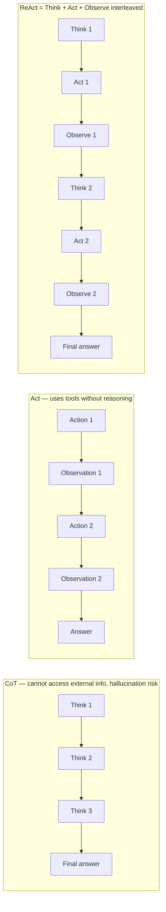

# ReAct Pattern (Reasoning + Acting)

## Overview

**ReAct** is an agent pattern where LLMs solve problems by **interleaving reasoning and acting**. It generates explicit reasoning traces while leveraging external tools through repeated "think → act → observe" loops.

## Origin

- **Authors**: Yao et al., Princeton + Google Brain (2022)
- **Paper**: "ReAct: Synergizing Reasoning and Acting in Language Models" — [arXiv:2210.03629](https://arxiv.org/abs/2210.03629)
- Overcomes the limitations of CoT (reasoning only) and Act (acting only) by combining them

## Core Idea



## ReAct Loop Example

```
User: "What was Samsung Electronics' 2024 revenue and YoY growth rate?"

[Think 1]: I need to search for Samsung Electronics' 2024 revenue.
[Act 1]: search("Samsung Electronics 2024 annual revenue")
[Observe 1]: "Samsung Electronics 2024 revenue: ₩300.69 trillion"

[Think 2]: I need to search for 2023 revenue to calculate growth rate.
[Act 2]: search("Samsung Electronics 2023 annual revenue")
[Observe 2]: "Samsung Electronics 2023 revenue: ₩258.94 trillion"

[Think 3]: Growth rate = (300.69 - 258.94) / 258.94 × 100 = 16.1%
[Final Answer]: Samsung Electronics' 2024 revenue was ₩300.69 trillion,
               approximately 16.1% growth compared to 2023.
```

## Implementation

### LangGraph ReAct Agent

```python
from langgraph.prebuilt import create_react_agent
from langchain_openai import ChatOpenAI
from langchain_community.tools import TavilySearchResults, WikipediaQueryRun

# Tool list
tools = [
    TavilySearchResults(max_results=3),
    WikipediaQueryRun(),
]

# Create ReAct agent
agent = create_react_agent(
    model=ChatOpenAI(model="gpt-4o"),
    tools=tools,
)

# Execute
result = agent.invoke({
    "messages": [{"role": "user", "content": "What was Samsung Electronics' 2024 revenue?"}]
})
```

### Manual Implementation

```python
def react_agent(question: str, tools: dict, max_steps: int = 10) -> str:
    history = []
    
    for step in range(max_steps):
        # 1. Think + decide action
        prompt = build_react_prompt(question, history)
        thought_action = llm.generate(prompt)
        
        # 2. Parse: action or final answer?
        if "Final Answer:" in thought_action:
            return extract_final_answer(thought_action)
        
        action, action_input = parse_action(thought_action)
        
        # 3. Execute tool
        if action in tools:
            observation = tools[action](action_input)
        else:
            observation = f"Error: Unknown tool '{action}'"
        
        # 4. Update history
        history.append({
            "thought": extract_thought(thought_action),
            "action": action,
            "action_input": action_input,
            "observation": observation
        })
    
    return "Max steps reached without final answer"
```

## ReAct Prompt Format

```
You have access to the following tools:
- search(query): Web search
- calculator(expression): Calculate expressions

Use this format:
Thought: [Analyze current situation and decide next action]
Action: [tool name]
Action Input: [tool input]
Observation: [tool output]
... (repeat)
Thought: I can now give the final answer.
Final Answer: [final answer]

Begin!
Question: {question}
```

## ReAct Advantages

- **Reduced hallucination**: Supplement reasoning with actual external information
- **Reasoning transparency**: Step-by-step thought process can be traced
- **Error recovery**: Can correct after wrong observations through reasoning
- **Versatility**: Can combine various tools

## ReAct Limitations and Improvements

| Limitation | Solution |
|------------|---------|
| Context loss in long loops | Context Compression |
| Wrong action selection | Add planning stage (Plan-and-Solve) |
| Loop cost | Caching, early exit conditions |
| Explores only single path | Combine with Tree of Thoughts |

## Relationship with Reflexion

Reflexion (→ [[en/AI/Engineering/Agent_Engineering/Planning_and_Reflection|Planning & Reflection]]) extends ReAct by adding **verbal self-reflection after failure**:
```
ReAct:     Think → Act → Observe → repeat
Reflexion: Fail → Generate reflection → Store in memory → Use in next attempt
```

## Role in AI Engineering

ReAct is the **fundamental design principle** of modern LLM agent architectures. LangGraph's default agent pattern, OpenAI Assistants, and Anthropic Claude's agent mode are all based on ReAct's ideas. It is the first pattern to apply when implementing "thinking and acting" agents.

## Related Concepts
[[en/AI/Engineering/Prompt_Engineering/Chain_of_Thought|Chain of Thought]] · [[en/AI/Engineering/Flow_Engineering/Linear_Flow/Tool_Use_and_Function_Calling|Tool Use & Function Calling]] · [[en/AI/Engineering/Flow_Engineering/Graph_Flow/LangGraph|LangGraph]] · [[en/AI/Engineering/Agent_Engineering/Planning_and_Reflection|Planning & Reflection]]

## Sources
- Yao et al. (2022) "ReAct: Synergizing Reasoning and Acting in Language Models" — [arXiv:2210.03629](https://arxiv.org/abs/2210.03629)
- LangGraph ReAct example — [langchain-ai.github.io/langgraph](https://langchain-ai.github.io/langgraph/tutorials/introduction/)
- Google AI for Developers "ReAct agent with LangGraph" — [ai.google.dev](https://ai.google.dev/gemini-api/docs/langgraph-example)
