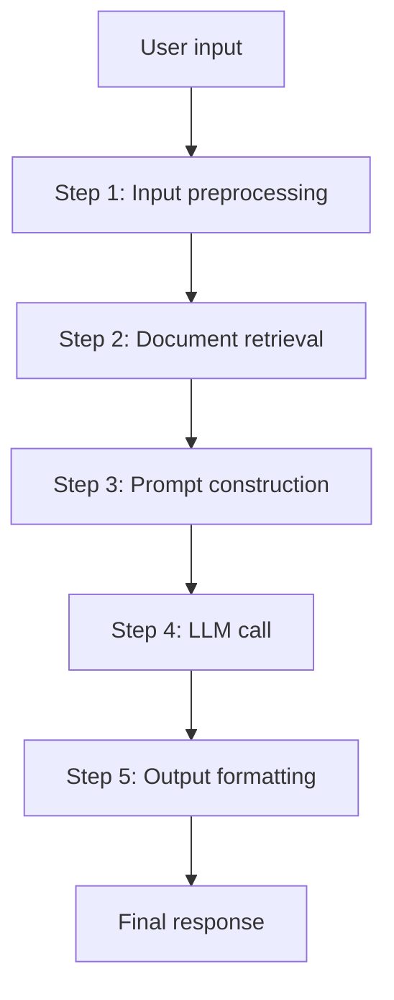

# Linear Flow

## Overview

**Linear Flow** is an LLM pipeline in the form of a **Directed Acyclic Graph (DAG)** where input passes through steps in a fixed order and output comes out. It flows in only one direction without conditional branches or loops.



## Sub-documents

| Document | Content |
|----------|---------|
| [[en/AI/Engineering/Flow_Engineering/Linear_Flow/LangChain\|LangChain]] | Chain assembly with LCEL `\|` operator (Harrison Chase, 2022) |
| [[en/AI/Engineering/Flow_Engineering/Linear_Flow/LlamaIndex\|LlamaIndex]] | 5-stage indexing-query pipeline (Jerry Liu, 2022) |
| [[en/AI/Engineering/Flow_Engineering/Linear_Flow/Tool_Use_and_Function_Calling\|Tool Use & Function Calling]] | Single round-trip where LLM calls external functions |

## Linear vs Graph Flow

| Comparison | Linear Flow | Graph Flow |
|------------|------------|-----------|
| Structure | Sequential steps | Nodes and edges |
| Loops | None | Possible |
| Conditional branches | Limited | Flexible |
| Debugging | Easy | Complex |
| Best for | RAG QA, summarization | Agents, HITL |

## When to Choose Linear Flow

```
✅ Linear Flow is suitable:
  - Fixed RAG pipeline (retrieve → generate)
  - Document summarization/transformation
  - Simple Q&A
  - Services where cost predictability matters

❌ When Graph Flow is needed:
  - Retry after quality validation
  - Human approval required
  - Dynamically decide next steps
  - Multi-agent collaboration
```

## Role in AI Engineering

Linear Flow is the **simplest and most reliable LLM pipeline pattern**. Predictable behavior, easy debugging, and low latency are advantages, forming the foundation of many production RAG systems.

## Related Concepts
[[en/AI/Engineering/Flow_Engineering/Graph_Flow/Graph_Flow|Graph Flow]] · [[en/AI/Engineering/Context_Engineering/Retrieval_Strategies/RAG/RAG|RAG]]
