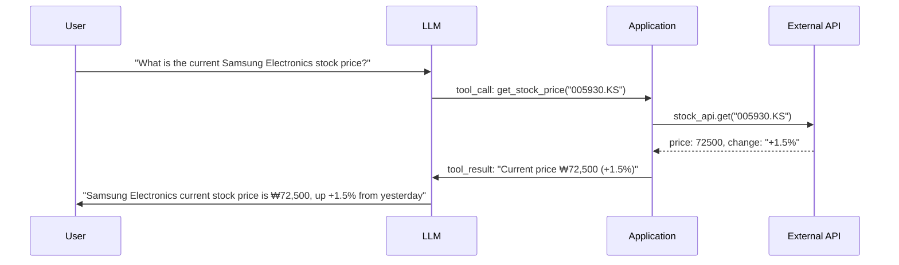

# Tool Use & Function Calling

## Overview

**Tool Use** (or Function Calling) is the ability of LLMs to call external functions, APIs, and tools to go beyond their knowledge limitations. When the LLM outputs "what tool to call with what arguments" in a structured form, the application handles actual execution and provides the results back to the LLM.

## Origin and History

- **OpenAI Function Calling** (June 2023): First official API support
- **Anthropic Tool Use** (early 2024): Official Claude support
- **Google Function Declarations**: Gemini support
- **MCP (Model Context Protocol)**: Open tool standard proposed by Anthropic (2024) → [[en/AI/Engineering/Agent_Engineering/Agent_Skills_and_Protocols/MCP|MCP]]

## How It Works



## API Implementation Examples

### OpenAI Function Calling

```python
import openai
import json

# Tool definition
tools = [
    {
        "type": "function",
        "function": {
            "name": "get_weather",
            "description": "Get current weather for a specified city",
            "parameters": {
                "type": "object",
                "properties": {
                    "city": {
                        "type": "string",
                        "description": "City name (e.g., Seoul)"
                    },
                    "unit": {
                        "type": "string",
                        "enum": ["celsius", "fahrenheit"]
                    }
                },
                "required": ["city"]
            }
        }
    }
]

# Provide tools to LLM
response = openai.chat.completions.create(
    model="gpt-4o",
    messages=[{"role": "user", "content": "What's the weather in Seoul?"}],
    tools=tools,
    tool_choice="auto"
)

# Check for tool calls
if response.choices[0].finish_reason == "tool_calls":
    tool_call = response.choices[0].message.tool_calls[0]
    args = json.loads(tool_call.function.arguments)
    # Actual function call
    result = get_weather(args["city"])
```

### Anthropic Tool Use

```python
import anthropic

client = anthropic.Anthropic()

tools = [
    {
        "name": "search_web",
        "description": "Search the web for information",
        "input_schema": {
            "type": "object",
            "properties": {
                "query": {"type": "string", "description": "Search query"},
                "num_results": {"type": "integer", "default": 5}
            },
            "required": ["query"]
        }
    }
]

response = client.messages.create(
    model="claude-sonnet-4-6",
    max_tokens=1024,
    tools=tools,
    messages=[{"role": "user", "content": "Find 2024 AI trends"}]
)

# Handle tool calls
if response.stop_reason == "tool_use":
    tool_use = next(b for b in response.content if b.type == "tool_use")
    result = search_web(tool_use.input["query"])
    # Pass result back to Claude
    ...
```

## Parallel Tool Calling

Latest models call multiple tools in parallel:
```python
# LLM decides to call multiple tools simultaneously
tool_calls = [
    {"name": "get_weather", "args": {"city": "Seoul"}},
    {"name": "get_news", "args": {"topic": "stocks"}},
    {"name": "search_db", "args": {"query": "Samsung Electronics"}}
]
# Run three tools in parallel → collect all results → generate single response
```

## Tool Design Best Practices

```python
# ✅ Good tool description
{
    "name": "search_products",
    "description": "Search for products in the product database. "
                   "Can filter by product name, category, and price range.",
    "parameters": {
        "query": "Search term (e.g., 'Bluetooth earphones')",
        "category": "Category filter (e.g., 'Electronics'). Optional.",
        "max_price": "Maximum price in USD. Optional.",
        "limit": "Maximum number of results to return (default: 10)"
    }
}

# ❌ Bad tool description
{
    "name": "search",  # Too vague
    "description": "Searches",  # No information
    "parameters": {"q": "query"}  # No description
}
```

## Tool Type Classification

Tools used in Tool Use are classified into three types by **who defines them and how they are executed** [1].

### 1. Built-in Tools

Tools provided at the platform level by model service providers. Developers activate them with a single API parameter without separate implementation; they are tightly integrated with model training.

| Platform | Built-in tool examples |
|---------|----------------------|
| Gemini (Google) | Google Search Grounding, Code Execution, URL Context, Computer Use |
| OpenAI | Web Search, Code Interpreter, File Search |
| Claude (Anthropic) | Computer Use |

**Characteristics**: No implementation needed, platform-specific, high performance due to model integration.

### 2. Function Tools

Custom tools defined by developers in JSON Schema, where the LLM decides whether and with what arguments to call them, and the application code handles actual execution [1]. This is the core pattern described in "How It Works" and "API Implementation Examples" above.

```python
# Google ADK example: docstring is automatically converted to description
def set_light_values(brightness: int, color_temp: str):
    """Set living room light brightness and color temperature.

    Args:
        brightness: Brightness (0-100%)
        color_temp: Color temperature ("warm" | "cool")
    """
    ...
```

**Characteristics**: Fully customizable, platform-independent, can be standardized with MCP.

### 3. Agent Tools / Sub-Agent

A pattern that abstracts an entire other agent as a single tool [1]. An Orchestrator calls specialized Sub-Agents like functions, and remote agents can also be made into tools using the A2A (Agent-to-Agent) protocol.

```python
# Google ADK: wrap Sub-Agent as tool with AgentTool
from google.adk.tools import AgentTool

research_agent = LlmAgent(name="researcher", tools=[search_tool])
writer_agent = LlmAgent(
    name="writer",
    tools=[AgentTool(agent=research_agent)]  # Sub-Agent as a tool
)
```

**Characteristics**: Delegate complex tasks to specialized agents, recursive composition possible, separation of agent responsibilities.

→ See: [[en/AI/Engineering/Agent_Engineering/Agent_Architectures|Agent Architectures]] (Orchestrator & Sub-Agents pattern), [[en/AI/Engineering/Agent_Engineering/Agent_Skills_and_Protocols/A2A|A2A]]

---

## Tool Use Cases by Function

Tools are classified into four categories by their role [1][2].

### 1. Information Retrieval

Tools that fetch data from external knowledge sources. Access latest information after LLM training cutoff or internal data.

- **Examples**: [[en/AI/Engineering/Agent_Engineering/Agent_Skills_and_Protocols/MCP|MCP]] Toolbox, [[en/AI/Engineering/Context_Engineering/Retrieval_Strategies/NL2SQL/NL2SQL|NL2SQL]] (natural language → SQL), [[en/AI/Engineering/Context_Engineering/Retrieval_Strategies/RAG/RAG|RAG]] (vector DB search), [[en/AI/Engineering/Context_Engineering/Retrieval_Strategies/GraphRAG/Knowledge_Graph/Knowledge_Graph|Knowledge Graph]] queries
- **Characteristics**: Read-only, no side effects, cacheable

### 2. API Integration

Tools that call external service APIs to fetch real-time data or execute simple actions.

- **Examples**: Weather API, stock price API, payment API, GitHub REST API
- **Characteristics**: Real-time data access, authentication (API Key/OAuth) required, idempotency consideration

### 3. System Integration

Tools that connect to internal enterprise systems or SaaS services to perform actual actions.

- **Examples**: Gmail, Google Drive, Calendar, Slack, Jira, Salesforce (Google Connectors, etc.)
- **Characteristics**: Permanent side effects (email sending, file modification, etc.), fine-grained permission management essential, HITL review recommended

### 4. Human-in-the-Loop (HITL)

Tools that request human approval/input at stages where agents cannot make autonomous judgments [1][2].

```python
def ask_for_confirmation(action: str, details: dict) -> bool:
    """Request human approval before irreversible actions"""
    # UI approval dialog → wait for user response
    return user_approved

def ask_for_input(prompt: str) -> str:
    """Request information from user that the agent cannot determine"""
    ...
```

- **When to use**: Irreversible operations (mass email sending, file deletion), sensitive data access, low model confidence
- **Characteristics**: Balance between autonomy and safety, can integrate with [[en/AI/Engineering/Agent_Engineering/Agent_Skills_and_Protocols/MCP|MCP]] Sampling primitive

---

## Relationship Between Tool Use and Agents

Tool Use is the core component of [[en/AI/Engineering/Agent_Engineering/Agent_Engineering|Agent Engineering]]:
```
Agent = LLM + Tools + Memory + Planning
              ↑
          Tool Use provides interface with the real world here
```

ReAct agent loop:
```
Thought → Action (tool call) → Observation (result) → repeat
```

## MCP: Standardization Layer for Function Calling

Function Calling has limitations: different API formats for each model (OpenAI, Anthropic, Google), and custom integration code needed for each tool. Anthropic announced an open standard in November 2024 to solve this.

**MCP (Model Context Protocol)** is a protocol where "any LLM communicates with external tools and services in a standardized way":

```
Function Calling (different per model):
  OpenAI: tools=[{"type": "function", "function": {...}}]
  Anthropic: tools=[{"name": ..., "input_schema": {...}}]
  → Same tool must be implemented twice

MCP (standardized):
  Implement MCP Server once → usable by Claude, GPT-4, Gemini
  → As of 2026, 20 million weekly downloads, de facto industry standard
```

Of MCP's 4 Primitives, **Tools** directly corresponds to Function Calling, additionally providing **Resources** (data exposure), **Prompts** (templates), and **Sampling** (server→LLM requests).

→ See: [[en/AI/Engineering/Agent_Engineering/Agent_Skills_and_Protocols/MCP|MCP]]

---

## Role in AI Engineering

Function Calling is the key technology that transforms LLMs from "text generators" to "real-world action executors." All external interactions — search, DB queries, API calls, code execution — happen through Function Calling. As a special form of Structured Output, it is an essential component of production Agent systems. MCP is the next step, elevating this Function Calling to a standard protocol.

## Related Concepts
[[en/AI/Engineering/Prompt_Engineering/Structured_Output|Structured Output]] · [[en/AI/Engineering/Flow_Engineering/Graph_Flow/ReAct_Pattern|ReAct Pattern]] · [[en/AI/Engineering/Agent_Engineering/Agent_Core_Pillars|Agent Core Pillars]] · [[en/AI/Engineering/Flow_Engineering/Linear_Flow/LangChain|LangChain]] · [[en/AI/Engineering/Agent_Engineering/Agent_Skills_and_Protocols/MCP|MCP]]

## Sources
- OpenAI Function Calling docs — [platform.openai.com](https://platform.openai.com/docs/guides/function-calling)
- Anthropic Tool Use docs — [docs.anthropic.com](https://docs.anthropic.com/en/docs/build-with-claude/tool-use)
- Anthropic (2024) "Introducing the Model Context Protocol" — [anthropic.com](https://www.anthropic.com/news/model-context-protocol)
- Anthropic (2025) "Equipping Agents for the Real World with Agent Skills" — [anthropic.com](https://www.anthropic.com/engineering/equipping-agents-for-the-real-world-with-agent-skills)

## References

[1] Mike Styer et al. (Google), "Agent Tools & Interoperability with Model Context Protocol (MCP)" — [kaggle.com](https://www.kaggle.com/whitepaper-agent-tools-and-interoperability-with-mcp)

[2] Kaggle 5-Day Gen AI Course (May 2026), "Agent Tools" (Day 2)
