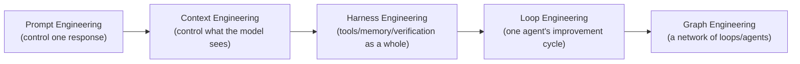

# Graph Engineering

## Overview

**Graph Engineering** is a term that emerged in the industry around July 2026, pointing to the next stage after [[en/AI/Engineering/Loop_Engineering/Loop_Engineering|Loop Engineering]]. While Loop Engineering made **a single agent's behavior cycle** (observe → reason → act → verify) programmable, Graph Engineering treats **an entire organization made of many loops and agents** as the object of engineering — explicitly designing which nodes exist, what each one owns, which transitions are permitted, and how different loops watch, constrain, and correct one another.

## Naming Lineage: Why Now

Carlos E. Perez (Intuition Machine) frames this as the latest stage in a naming lineage: `prompt engineering → context engineering → harness engineering → loop engineering → graph engineering`. LangChain's Sydney Runkle argues each name is what practitioners called the wall they ran into in production, not marketing-driven jargon. At the same time, LangChain pushes back that "Graph Engineering itself isn't new — LangGraph has been doing this for three years." This wiki synthesizes both positions: **the graph representation (nodes/edges/state) itself isn't new, but a node can now contain a full agent, and the graph itself has started to be treated as the governance unit of a multi-agent "organization" — both are genuinely new.**

## Three Perspectives

Three different sources define the same term from different angles:

| Perspective | Core Claim | Focus |
|-------------|------------|-------|
| **LangChain** | Structural constraints on agent behavior via graphs (nodes/edges/state). What's new is that a node can now contain a full agent | Implementation mechanics |
| **TrueFoundry** | Explicitly designing the **topology** of a multi-agent system — which nodes exist, what each owns, which transitions are permitted | Organizational structure + governance |
| **Eigent** | Wiring multiple feedback loops (metrics, evals, audits, policies, workflows) into a network that watches, constrains, and corrects itself | Network of loops |

This chapter focuses on the TrueFoundry/Eigent perspective (organizational topology, loop-of-loops), organized into two sub-documents: [[en/AI/Engineering/Graph_Engineering/Multi_Agent_Topology|Multi-Agent Topology]] and [[en/AI/Engineering/Graph_Engineering/Loop_Networks_and_Anchors|Loop Networks and Anchors]].

## Sub-documents

| Document | Content |
|----------|---------|
| [[en/AI/Engineering/Graph_Engineering/Multi_Agent_Topology\|Multi-Agent Topology]] | Node/edge types, dynamic routing (LangGraph `Send()`), governance (identity/budget/guardrail hooks), Graph-of-Agents academic grounding |
| [[en/AI/Engineering/Graph_Engineering/Loop_Networks_and_Anchors\|Loop Networks and Anchors]] | Work Graph vs Improvement Graph, 4 structural failure modes (Goodhart's Law, etc.), Anchors (external fixed reference points) |

## Relationship to Existing "Graph" Content in This Wiki

This wiki already covers graph-related content in two places. **Graph Engineering does not replace either — both remain valid; this chapter sits as an organizational/governance layer above them.**

- [[en/AI/Engineering/Flow_Engineering/Graph_Flow/Graph_Flow|Graph Flow]] — LangGraph's **implementation mechanics** (StateGraph, conditional edges, cyclic flows, ReAct, Human-in-the-Loop). Answers "how do you code the graph?"
- [[en/AI/Engineering/Context_Engineering/Retrieval_Strategies/GraphRAG/GraphRAG|GraphRAG]] / [[en/AI/Engineering/Context_Engineering/Retrieval_Strategies/GraphRAG/Knowledge_Graph/Knowledge_Graph|Knowledge Graph]] — **Data** graphs. Structures for storing/retrieving entity-relationships. Answers "what are you retrieving?"
- **Graph Engineering** (this chapter) — **Organizational** graphs. Which nodes exist, what authority and budget they hold, which loops monitor or veto which others. Answers "who can do what?"

## Role in AI Engineering

Graph Engineering is the top layer that surfaces and manages failures invisible at the single-agent, single-loop level — loops that conflict with each other (Inter-loop Conflict), or one agent's optimization undermining another agent's goal. If [[en/AI/Engineering/Loop_Engineering/Loop_Engineering|Loop Engineering]] asked "does this one system improve itself?", Graph Engineering asks "do multiple improvement systems improve together without undermining each other?"

## Related Concepts
[[en/AI/Engineering/Loop_Engineering/Loop_Engineering|Loop Engineering]] · [[en/AI/Engineering/Flow_Engineering/Graph_Flow/Graph_Flow|Graph Flow]] · [[en/AI/Engineering/Agent_Engineering/Multi_Agent_Coordination|Multi-Agent Coordination]] · [[en/AI/Engineering/Harness_Engineering/AI_Governance_and_Compliance|AI Governance & Compliance]]

## Sources
- LangChain, ["3 Years of Graph Engineering with LangGraph"](https://www.langchain.com/blog/3-years-of-graph-engineering-with-langgraph) (2026)
- LangChain, ["The Art of Loop Engineering"](https://www.langchain.com/blog/the-art-of-loop-engineering) (2026)
- TrueFoundry, ["Graph Engineering for Multi-Agent Systems: Architecture, Governance, and Observability"](https://www.truefoundry.com/blog/graph-engineering-enterprise-guide) (2026)
- Eigent, ["Graph Engineering for AI Agents"](https://www.eigent.ai/blog/graph-engineering-ai-agents) (2026)
- Carlos E. Perez (Intuition Machine), ["Is Graph Engineering Here? LangChain Says It's Nothing New"](https://ai-engineering-trend.medium.com/is-graph-engineering-here-langchain-says-its-nothing-new-17a35a2bad37) (2026)
