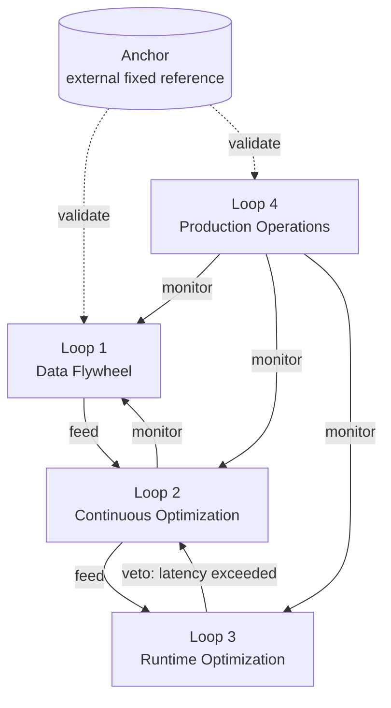

# Loop Networks and Anchors

## Overview

Eigent summarizes the relationship between [[en/AI/Engineering/Loop_Engineering/Loop_Engineering|Loop Engineering]] and Graph Engineering: *if loop engineering made "a single agent's behavior programmable — one iterative cycle of act, observe, reason, repeat," graph engineering is the next layer — "making a whole organization of loops and agents programmable."*



## Work Graph vs Improvement Graph

Eigent distinguishes two kinds of graphs:

| Type | Definition | Example |
|------|------------|---------|
| **Work Graph** | **What** the agent executes. Nodes = tools/skills/files/subtasks; edges = which tool produced which artifact and which artifact fed which step | The node/edge topology covered in [[en/AI/Engineering/Graph_Engineering/Multi_Agent_Topology|Multi-Agent Topology]] |
| **Improvement Graph** | **How** the agent changes itself over time. Nodes = measurement points, optimization targets (latency/quality/cost), actions; edges = directional relationships encoding trust, authority, and cadence — which loop feeds, owns, monitors, or vetoes which other | Each of the 4 sub-documents in [[en/AI/Engineering/Loop_Engineering/Loop_Engineering|Loop Engineering]] (Data Flywheel, Continuous Optimization, Runtime Optimization, Production Operations) is a single loop; this document is the layer that wires those 4 into a network |

## 4 Structural Failure Modes

When multiple loops become entangled in a network, failures appear that don't show up in a single loop.

| Failure Mode | Description |
|--------------|-------------|
| **Goodhart's Law** | The harder a metric is pushed, the more it detaches from the original goal — e.g. if the [[en/AI/Engineering/Loop_Engineering/Runtime_Optimization|Runtime Optimization]] loop optimizes only for latency, the quality goal pursued by the [[en/AI/Engineering/Loop_Engineering/Continuous_Optimization|Continuous Optimization]] loop is silently sacrificed. The original formulation traces to economist Goodhart (1975), who observed it while studying UK monetary policy; the phrasing most commonly used today — "when a measure becomes a target, it ceases to be a good measure" — comes from anthropologist Strathern (1997), analyzing the British university audit system |
| **Upward Blindness** | An individual loop cannot question whether its own target is wrong — target-setting must come from outside the loop |
| **Inter-loop Conflict** | Loops operating independently, without coordination, fight each other — e.g. a cost-reduction loop and a quality-improvement loop pull the system in opposite directions |
| **Measurement Decay** | Sensors (measurement pipelines) gradually degrade over time, yet the loop keeps acting on stale data — fundamentally the same pattern as benchmark contamination discussed in [[en/AI/Engineering/Harness_Engineering/Benchmarking|Benchmarking]] |

## Anchors: External Fixed Reference Points

The key device against these four failures is the **Anchor** — *"an external fixed node the internal machinery is forbidden to rewrite."*

```
Examples of Anchors:
  - Held-out test set: an evaluation set the training/optimization loop can never access or optimize against
  - Physical inventory: an actually countable quantity, not a number the system reports about itself
  - Safety spec: an externally defined constraint the loop cannot mitigate on its own
  - Human judgment: a final checkpoint that can intervene by bypassing the entire automated loop network
```

A loop network without Anchors drifts self-referentially — if every loop adjusts based on other loops' outputs, the whole network can drift away from reality while internally showing "all metrics improving." Self-reinforcing mechanisms — like LLM-as-a-Judge-based auto-filtering in [[en/AI/Engineering/Loop_Engineering/Data_Flywheel|Data Flywheel]] or the automated optimization loop in [[en/AI/Engineering/Loop_Engineering/Continuous_Optimization|Continuous Optimization]] — need Anchors more, not less.

## Practical Application: Loop Network Audits

```
Quarterly loop network audit checklist:
  1. Enumerate every loop in the system (Data Flywheel, Continuous Optimization, Runtime Optimization, Production Operations, etc.)
  2. Record the edges between each pair of loops — who feeds/monitors/vetoes whom?
  3. Verify every loop connects to at least one Anchor — otherwise it's at risk of Upward Blindness
  4. Check whether any two loops moved in opposite directions in the last 3 months — a sign of Inter-loop Conflict
  5. Verify the freshness of the Anchor data itself — Anchors aren't immune to Measurement Decay either
```

## Role in AI Engineering

Even a beautifully designed single loop from [[en/AI/Engineering/Loop_Engineering/Loop_Engineering|Loop Engineering]]'s 4 sub-documents is exposed to the failure modes covered here if it runs in parallel, disconnected from the others. Loop Networks and Anchors raises the question from "how well is one loop designed?" to "is the network of loops, as a whole, still anchored to reality?"

## Related Concepts
[[en/AI/Engineering/Loop_Engineering/Loop_Engineering|Loop Engineering]] · [[en/AI/Engineering/Loop_Engineering/Data_Flywheel|Data Flywheel]] · [[en/AI/Engineering/Loop_Engineering/Continuous_Optimization|Continuous Optimization]] · [[en/AI/Engineering/Graph_Engineering/Multi_Agent_Topology|Multi-Agent Topology]] · [[en/AI/Engineering/Harness_Engineering/Guardrail_Engineering|Guardrail Engineering]] · [[en/AI/Engineering/Harness_Engineering/Benchmarking|Benchmarking]]

## Sources
- Goodhart, C. (1975) "Problems of Monetary Management: The UK Experience" — Papers in Monetary Economics, Reserve Bank of Australia
- Strathern, M. (1997) "'Improving ratings': audit in the British University system" — European Review 5(3):305-321
- Eigent, ["Graph Engineering for AI Agents"](https://www.eigent.ai/blog/graph-engineering-ai-agents) (2026)
- LangChain, ["The Art of Loop Engineering"](https://www.langchain.com/blog/the-art-of-loop-engineering) (2026)
- BDTechTalks, ["Demystifying loop engineering: Get more from AI agents, avoid loopmaxxing"](https://bdtechtalks.com/2026/06/22/ai-loop-engineering/) (2026)
