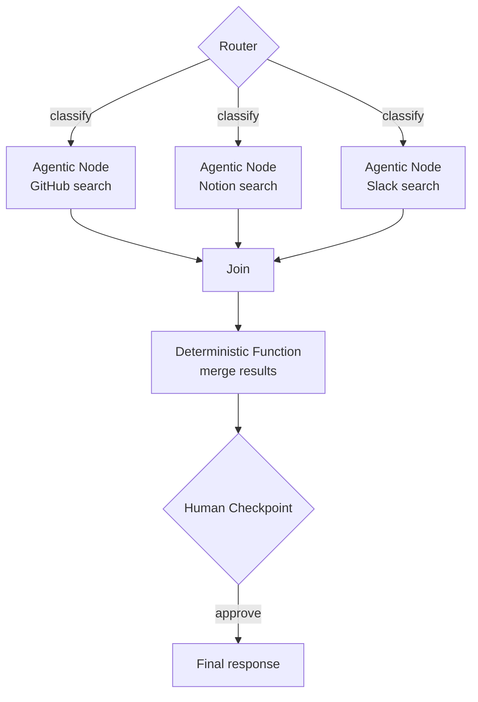

# Multi-Agent Topology

## Overview

TrueFoundry defines Graph Engineering as: *"designing which nodes exist (agents, deterministic functions, routers, human checkpoints), which transitions are permitted, and how the runtime work graph forms and mutates."* This differs from knowledge-graph engineering, which structures data — **topology** is about organizational structure.



## Node Types

| Node Type | Description |
|-----------|-------------|
| **Agentic Node** | A full agent running an observe-reason-act-verify loop. This is LangChain's "what's new" point — a node used to be a single LLM call, but can now be an entire agent system in itself (nested agency) |
| **Deterministic Function** | Non-agentic computation with fixed input/output rules |
| **Router** | A branch point deciding the next node |
| **Join** | Consolidates results from parallel paths |
| **Tool** | An MCP server or function call (→ [[en/AI/Engineering/Agent_Engineering/Agent_Skills_and_Protocols/MCP|MCP]]) |
| **Human Checkpoint** | An approval gate — the organizational-graph counterpart of [[en/AI/Engineering/Flow_Engineering/Graph_Flow/Human_in_the_Loop|Human-in-the-Loop]] |

Edges encode **delegation, trust, and data flow** between nodes — the direction and attributes of an edge express which node can monitor, own, or veto another.

## Runtime Formation of the Work Graph: Dynamic Routing

Statically predefined transitions aren't enough. LangGraph's `Send()` API dynamically creates worker nodes and distributes data at runtime (implementation details → [[en/AI/Engineering/Flow_Engineering/Graph_Flow/LangGraph|LangGraph]]):

```python
from langgraph.types import Send

def route_to_workers(state: OrchestratorState) -> list[Send]:
    """Fan out worker nodes dynamically, one per pending task"""
    return [
        Send("worker_node", {"task": task})
        for task in state["pending_tasks"]
    ]

builder.add_conditional_edges("orchestrator", route_to_workers)
```

In a static graph, transition paths are fixed at design time. With `Send()`-based routing, **the work graph itself takes a different shape on every run** — the number of node instances and the connection structure vary each time based on task count, priority, and retry behavior.

## Governance: Giving the Organizational Graph Identity and Budget

As node count grows, tracking "who can access what" and "who consumed what" becomes the central challenge. TrueFoundry's pattern:

**Identity & Access**: Each node has a unique identity as an independently governed caller. Virtual-account tokens propagate caller context.

**4 Guardrail Hooks**: `llm_input` (pre-request content screening) · `llm_output` (post-response filtering) · pre-tool-invoke · post-tool-invoke — different policies can apply per node (→ [[en/AI/Engineering/Harness_Engineering/Guardrail_Engineering|Guardrail Engineering]]).

**Node-level Correlation**: To attribute budget, cost, and latency at the node level, graph/run/node identifiers must be propagated with every request.

```
Authorization: Bearer <node-specific-virtual-account-token>
X-Graph-Metadata: {
  "graph_id": "release-review",
  "run_id": "run-8f31",
  "node_id": "security-reviewer"
}
```

When these identifiers let the orchestrator's recorded runtime topology correlate with the gateway's request logs, per-node cost, latency, model, and tool-usage analysis becomes possible (→ [[en/AI/Engineering/Harness_Engineering/Observability_and_Tracing|Observability & Tracing]]).

**Production checklist**: ① resolved identity for each independently governed target ② stable graph/run/node identifiers on gateway requests ③ the orchestrator records the actual runtime work graph ④ correlation between orchestration traces and gateway logs ⑤ budget rules mapped via virtual accounts or metadata ⑥ approval checkpoints on sensitive tool actions ⑦ model routing isolated behind a virtual-model layer.

## Academic Grounding: Graph-of-Agents

Graph-of-Agents (GoA, 2026) is a framework that models multi-LLM collaboration as a graph — an academic attempt to automate "who should participate and how should they be connected":

1. **Node Sampling**: Select only the most relevant agents using model cards (each model's domain/task specialization)
2. **Edge Construction**: Evaluate selected agents' responses against each other to build edges by relevance ordering
3. **Message Passing & Aggregation**: Directed message passing from highly relevant to less relevant agents, followed by reverse passing, then aggregation via graph-based pooling

On MMLU/MMLU-Pro/GPQA, GoA with only 3 selected agents outperformed baselines using all 6 agents — evidence that topology design (who participates) matters more than simply adding more agents.

## Role in AI Engineering

Once a node can contain a full agent, a multi-agent system stops being "a pipeline of LLM calls" and becomes closer to "an organization of autonomous actors." Multi-Agent Topology is the practice of designing and controlling this organization, and should be read alongside the coordination patterns and failure modes in [[en/AI/Engineering/Agent_Engineering/Multi_Agent_Coordination|Multi-Agent Coordination]] — where coordination patterns describe "how agents interact," topology first defines "what structure that interaction is allowed to take."

## Related Concepts
[[en/AI/Engineering/Flow_Engineering/Graph_Flow/LangGraph|LangGraph]] · [[en/AI/Engineering/Agent_Engineering/Multi_Agent_Coordination|Multi-Agent Coordination]] · [[en/AI/Engineering/Harness_Engineering/Observability_and_Tracing|Observability & Tracing]] · [[en/AI/Engineering/Harness_Engineering/AI_Governance_and_Compliance|AI Governance & Compliance]] · [[en/AI/Engineering/Agent_Engineering/Agent_Deployment|Agent Deployment]]

## Sources
- TrueFoundry, ["Graph Engineering for Multi-Agent Systems: Architecture, Governance, and Observability"](https://www.truefoundry.com/blog/graph-engineering-enterprise-guide) (2026)
- LangChain, ["3 Years of Graph Engineering with LangGraph"](https://www.langchain.com/blog/3-years-of-graph-engineering-with-langgraph) (2026)
- "Graph-of-Agents: A Graph-based Framework for Multi-Agent LLM Collaboration" (2026) — [arXiv:2604.17148](https://arxiv.org/abs/2604.17148)
- "Graph-Augmented Large Language Model Agents: Current Progress and Future Prospects" (2025) — [arXiv:2507.21407](https://arxiv.org/pdf/2507.21407)
