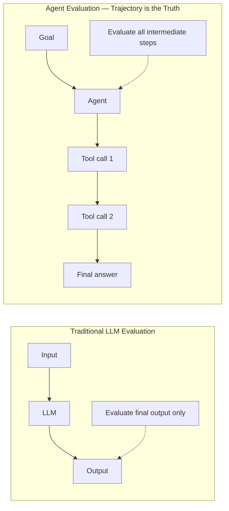
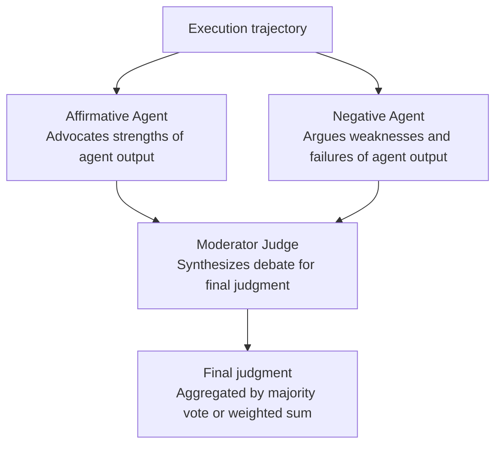
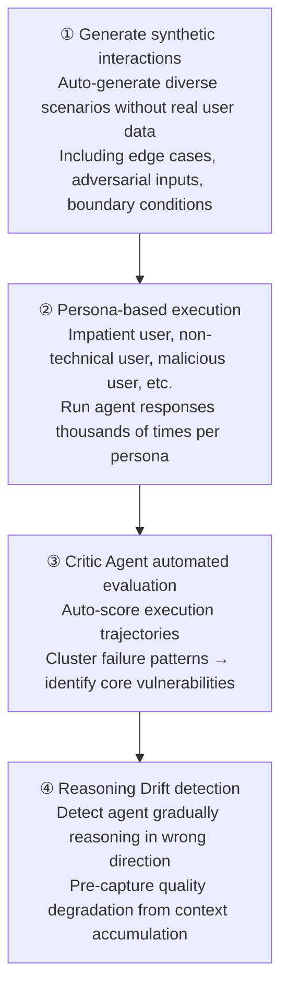

# Agent-as-a-Judge

## Overview

**Agent-as-a-Judge** is an evaluation paradigm that uses another agent system to evaluate agent systems. It's an organic extension of LLM-as-a-Judge — the core shift is from **evaluating only the final output to evaluating the entire execution trajectory**.

## Origin

- **Authors**: Zhuge et al. (2024) — Mingchen Zhuge, Changsheng Zhao, Dylan Ashley, et al. (Meta, KAUST, iGent joint)
- **Paper**: "Agent-as-a-Judge: Evaluate Agents with Agents" — [arXiv:2410.10934](https://arxiv.org/abs/2410.10934)
- **Conference**: ICML 2025 (42nd International Conference on Machine Learning)
- **Key contribution**: Empirically demonstrated that Agent Judge dramatically outperforms LLM-as-a-Judge and achieves human evaluation baseline-level performance

## Why Agent Evaluation Is Different

Traditional evaluation methods have two fundamental limitations for agent systems:



**Problem: Undetectable from final output alone even if final answer is correct:**
- Excessive tool calls wasting cost
- Arrived at correct answer via wrong path (Process Failure)
- Contains security policy-violating steps
- Loops and redundant reasoning occurred

## Core Differences from LLM-as-a-Judge

| Item | LLM-as-a-Judge | Agent-as-a-Judge |
|------|---------------|-----------------|
| What is evaluated | Final text output | Entire execution trajectory |
| Evaluating entity | Single LLM call | Agent with tools and multi-step reasoning |
| Intermediate feedback | ✗ Not possible | ✅ Per-step feedback |
| Tool use | ✗ None | ✅ Information retrieval, code execution, etc. |
| Hierarchical requirement validation | ✗ Not possible | ✅ Build requirement tree then validate |
| Human alignment rate | 60–70% | **~90%** |
| Cost | Low | High |

## Agent Judge Structure (DevAI)

Zhuge et al. refined from 8 initial Skills via ablation to 5 core Skills for code generation agent evaluation:

| Skill | Role |
|-------|------|
| **Graph Building** | Build dependency graph of codebase and task relationships |
| **File Location** | Locate files and code snippets to evaluate |
| **Information Retrieval** | Retrieve supporting information from requirements and documentation |
| **Requirement Validation** | Verify fulfillment of hierarchical user requirements |
| **Interactive Querying** | Additional queries about agent outputs |

## DevAI Benchmark

Benchmark proposed alongside Agent-as-a-Judge as the proof testbed:

- **Scale**: 55 realistic AI development automation tasks
- **Requirements**: 365 total hierarchical user requirements
- **Features**: Evaluates entire development cycle (including intermediate steps), not just code generation
- **Dataset**: [HuggingFace DEVAI-benchmark](https://huggingface.co/DEVAI-benchmark)

```
Example task: "Insert hidden text in an image while complying with specific requirements"
Hierarchical requirements:
  1. Feature completion (top level)
     1.1 Input image processing → 1.1.1 format support, 1.1.2 exception handling
     1.2 Text encoding → 1.2.1 steganography applied, 1.2.2 quality maintained
  2. Code quality → 2.1 type hints, 2.2 test coverage
```

## Critic Agent Pattern

Core pattern for actually applying Agent-as-a-Judge to agent systems:

```python
execution_trace = {
    "goal": "Book travel itinerary for user",
    "initial_plan": "Search flights → Check hotel → Complete booking",
    "steps": [
        {"action": "search_flights", "input": "ICN→JFK 2026-08-01",
         "output": "10 results", "latency_ms": 320},
        {"action": "check_hotel", "input": "New York 5-star",
         "output": "3 rooms", "latency_ms": 180},
        {"action": "book_flight", "input": "KE081",
         "output": "Booking complete", "latency_ms": 450},
    ],
    "final_answer": "Your travel itinerary has been booked.",
    "token_usage": 4200,
    "n_turns": 3
}

# Critic Agent evaluation prompt — key is passing entire trace, not just final answer
critic_prompt = """
Evaluate the following agent execution trace:

Execution trace: {execution_trace}

Evaluation criteria:
1. Goal achievement (0-10) — Does final state satisfy the goal?
2. Step efficiency (0-10) — Optimal path without unnecessary tool calls?
3. Policy compliance (0-10) — No risky actions like booking without user approval?
4. Plan quality (0-10) — Was initial plan reasonable and consistent with execution?
5. Context handling (0-10) — Were intermediate results correctly interpreted and used?
6. Process failure detection (narrative) — Steps that failed even if final answer is correct?

Provide score and rationale for each item.
"""

critic_result = critic_agent.run(
    critic_prompt.format(execution_trace=execution_trace)
)
```

**Key tip**: Pass the entire `execution_trace` object (initial plan, tools chosen, arguments passed) to Critic Agent — not just the final answer — to detect Process Failures.

## Multi-Agent-as-Judge

Beyond a single Critic Agent, **multiple agents deliberate to evaluate**. Effective for bias mitigation and multi-dimensional evaluation.

### Role-Based Debate



### Persona-Based Evaluation

```python
evaluators = [
    CriticAgent(persona="Impatient user — values speed and efficiency"),
    CriticAgent(persona="Non-technical user — values clarity and UX"),
    CriticAgent(persona="Security auditor — values policy compliance and risk"),
    CriticAgent(persona="Domain expert — values accuracy and completeness"),
]

scores = [e.evaluate(execution_trace) for e in evaluators]
final_score = weighted_average(scores, weights=[0.2, 0.2, 0.3, 0.3])
```

## Agent Simulation

Large-scale pre-deployment validation that stress-tests agents with thousands of scenarios. Combined with Critic Agent, enables automated stress-testing.



## Pros and Cons

### Advantages
- Detects **Process Failures** undetectable from final output alone
- Validates hierarchical requirements step by step → **granular evaluation**
- Dramatically improves human alignment rate vs LLM-as-a-Judge (60-70% → ~90%)
- Provides Reward Signal → activates agent **self-improvement loop**
- Large-scale pre-deployment validation when combined with Agent Simulation

### Disadvantages and Limitations
- Increased **cost and complexity** vs LLM-as-a-Judge
- Initial paper specialized in code generation domain → **domain generalization** unverified
- **Gaming the Judge** problem: when Judge Agent's CoT is inaccurate, evaluation results can be distorted
- Risk of Judge Agent's own bias transferring to evaluation

## Implementation Considerations

```python
# ✅ Good pattern: pass entire trajectory to Judge
critic.evaluate(execution_trace=full_trace)

# ❌ Bad pattern: pass only final answer
critic.evaluate(output=final_answer_only)

# ✅ Good pattern: evaluate dimensions separately for independent assessment
scores = {
    "goal_completion": critic.score(trace, "Goal achievement"),
    "efficiency":      critic.score(trace, "Step efficiency"),
    "policy":          critic.score(trace, "Policy compliance"),
}

# ✅ Good pattern: periodically calibrate Judge results with human experts
calibrate_critic_agent(judge=critic, human_labels=golden_set)
```

## Status (2025–2026)

- **ICML 2025** official presentation — emerging as standard paradigm for agent evaluation
- **Multi-Agent-as-Judge** (2025): extended to multi-agent deliberative evaluation, multi-dimensional human evaluation alignment research
- **AgentRewardBench** (2025): benchmark measuring reliability of automated evaluation for web agent trajectories
- **TRAIL** (arXiv:2505.08638, 2025): Trace Reasoning and Agentic Issue Localization — follow-up research auto-diagnosing problematic steps in trajectories
- **Gaming the Judge** (arXiv:2601.14691, 2026): formalizes the problem of Judge's CoT dishonesty distorting evaluation

## Related Concepts
[[en/AI/Engineering/Harness_Engineering/LLM_as_a_Judge|LLM-as-a-Judge]] · [[en/AI/Engineering/Harness_Engineering/Human_Evaluation|Human Evaluation]] · [[en/AI/Engineering/Harness_Engineering/Observability_and_Tracing|Observability & Tracing]] · [[en/AI/Engineering/Agent_Engineering/Agent_Deployment|Agent Deployment]]

## Sources
1. Zhuge et al. (2024) "Agent-as-a-Judge: Evaluate Agents with Agents" — [arXiv:2410.10934](https://arxiv.org/abs/2410.10934) (ICML 2025)
2. Anthropic Engineering (2026) "Demystifying evals for AI agents" — [anthropic.com/engineering](https://www.anthropic.com/engineering/demystifying-evals-for-ai-agents)
3. "Multi-Agent-as-Judge" — [arXiv:2507.21028](https://arxiv.org/html/2507.21028v1)
4. "Gaming the Judge: Unfaithful Chain-of-Thought Can Undermine Agent Evaluation" — [arXiv:2601.14691](https://arxiv.org/pdf/2601.14691)
