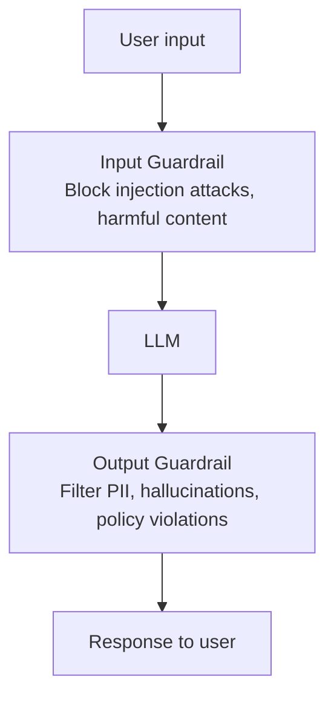
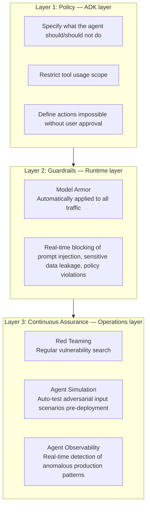
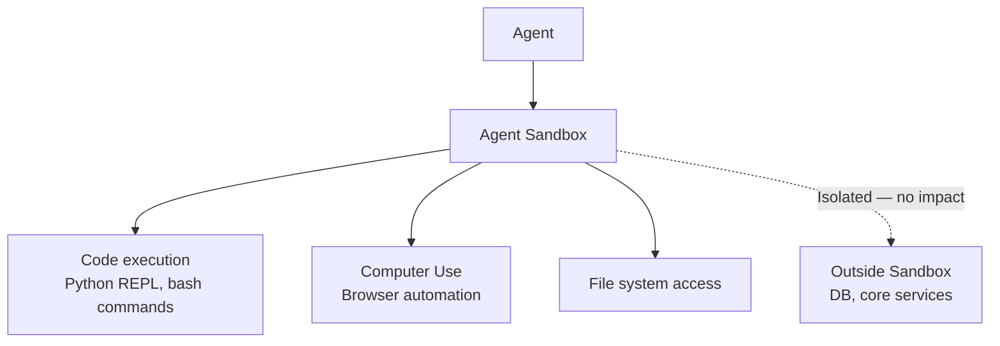

# Guardrail Engineering

## Overview

**Guardrail Engineering** is the field of designing and implementing **automated safety mechanisms** that prevent LLM systems from generating harmful, inaccurate, or policy-violating outputs. It covers both Safety and Alignment.

## Safety vs Alignment

```
Safety:
  Preventing physical and social harm
  e.g., blocking instructions for making explosives, filtering hate speech

Alignment:
  Model behaving as intended
  e.g., customer support bot not comparing competitors
      medical AI providing guidance only, not diagnosis
```

## Guardrail Layers

### Layer 1: Model-Built-In Safety (RLHF)

Internalize safe behavior in the model at training time:
- OpenAI's RLHF, Anthropic's Constitutional AI
- "I can't help with that as it could be harmful"
- **Advantages**: Automatically applied to all inputs
- **Disadvantages**: Over-refusal problem, possibility of bypassing

### Layer 2: Runtime Guardrails

External layer monitoring inputs/outputs:



## Key Guardrail Tools

### NVIDIA NeMo Guardrails

Open-source programmatic guardrails:

```python
from nemoguardrails import LLMRails, RailsConfig

config = RailsConfig.from_path("./config")
rails = LLMRails(config)

# Define rules in Colang language (config/rails.co)
"""
define user ask about competitor
  "How is the competitor's product?"
  "Is another company's product better?"

define bot refuse to compare competitor
  "I only handle information about our own products."

define flow competitor question
  user ask about competitor
  bot refuse to compare competitor
"""

response = await rails.generate_async(
    messages=[{"role": "user", "content": "How's the competitor's product?"}]
)
```

**NeMo Guardrails features**:
- Input Moderation (block harmful inputs)
- Output Moderation (verify response quality)
- Fact-checking (hallucination detection)
- Topical Rails (prevent topic drift)
- Jailbreak Detection (detect bypass attempts)

### Guardrails AI

Open-source specialized for output validation:

```python
from guardrails import Guard, OnFailAction
from guardrails.hub import ToxicLanguage, DetectPII

guard = Guard().use_many(
    ToxicLanguage(on_fail=OnFailAction.EXCEPTION),
    DetectPII(
        pii_entities=["EMAIL", "PHONE_NUMBER", "SSN"],
        on_fail=OnFailAction.FIX  # auto-mask
    )
)

validated_output = guard.validate(llm_output)
```

### LlamaGuard (Meta)

Llama-based input/output safety classifier:

```python
from transformers import AutoModelForCausalLM, AutoTokenizer

model = AutoModelForCausalLM.from_pretrained("meta-llama/Llama-Guard-3-8B")
tokenizer = AutoTokenizer.from_pretrained("meta-llama/Llama-Guard-3-8B")

def check_safety(conversation):
    input_ids = tokenizer.apply_chat_template(conversation, return_tensors="pt")
    output = model.generate(input_ids, max_new_tokens=100)
    result = tokenizer.decode(output[0][len(input_ids[0]):])
    return "safe" in result.lower()
```

## Guardrail Type Implementations

### 1. Input Validation

```python
def validate_input(user_input: str) -> tuple[bool, str]:
    if len(user_input) > 10000:
        return False, "Input too long"
    
    injection_patterns = ["ignore previous", "disregard instructions", "system:"]
    if any(p in user_input.lower() for p in injection_patterns):
        return False, "Input not allowed"
    
    moderation = openai_moderation_api(user_input)
    if moderation.flagged:
        return False, "Inappropriate content detected"
    
    return True, ""
```

### 2. Output Validation

```python
def validate_output(response: str, context: dict) -> tuple[str, bool]:
    response = mask_pii(response)
    
    if context.get("retrieved_docs"):
        faithfulness = check_faithfulness(response, context["retrieved_docs"])
        if faithfulness < 0.7:
            return "Sorry, I couldn't find accurate information.", False
    
    toxicity_score = toxicity_classifier(response)
    if toxicity_score > 0.8:
        return "Inappropriate content was detected and filtered.", False
    
    return response, True
```

### 3. Constitutional AI (Anthropic)

Model self-corrects responses according to principles:
```
Principle 1: Do not provide information harmful to safety
Principle 2: Do not make discriminatory or hateful statements
Principle 3: Respect personal privacy

Step 1: Generate initial response
Step 2: Critique response against each principle
Step 3: Revise response reflecting the critique
```

## Guardrail Design Principles

```
✅ Good guardrails:
  - Specific rules ("don't make medical diagnoses")
  - Measurable criteria (block if toxicity score > 0.8)
  - Graceful failure (indicate helpful direction on refusal)
  - Minimum refusal principle (only block what's necessary)

❌ Bad guardrails:
  - Vague rules ("don't do bad things")
  - Over-refusal (blocking safe questions)
  - Inconsistent application
  - Simple keyword filters that can be bypassed
```

## Agent Security Architecture

Agent systems need systematic security beyond simple input/output filters — 3 layers.

### 3-Layer Security Framework



### ADK SafetyPlugin Pattern

Pattern inserting safety checks at each stage of agent execution in Google ADK:

```python
from google.adk.agents import Agent
from google.adk.plugins import BasePlugin
from google.adk.types import CallbackContext, LlmRequest, LlmResponse

class SafetyPlugin(BasePlugin):
    async def before_model_callback(
        self, callback_ctx: CallbackContext, llm_request: LlmRequest
    ) -> LlmResponse | None:
        user_message = llm_request.contents[-1].parts[0].text
        
        if self._contains_policy_violation(user_message):
            return LlmResponse(content="Requested action not permitted by policy.")
        return None  # None = proceed with LLM call normally
    
    async def after_model_callback(
        self, callback_ctx: CallbackContext, llm_response: LlmResponse
    ) -> LlmResponse | None:
        response_text = llm_response.content.parts[0].text
        
        filtered = self._mask_pii(response_text)
        if self._is_policy_violation(filtered):
            return LlmResponse(content="Cannot provide a response.")
        
        return None  # None = use original response as-is

agent = Agent(
    model="gemini-3.2-pro",
    plugins=[SafetyPlugin()]
)
```

**Key point**: `before_model_callback` specializes in blocking dangerous inputs (also saves LLM call cost); `after_model_callback` specializes in filtering dangerous outputs.

### Agent Sandbox

Environment isolating the agent from core enterprise systems when performing risky operations like code execution and browser automation:



## Indirect Prompt Injection Defense: PVE

**Indirect Prompt Injection** (→ [[en/AI/Engineering/Harness_Engineering/Red_Teaming|Red Teaming]]) is an attack where agents misinterpret hidden instructions in external content observed via tools, documents, or web pages as execution commands. **PVE (Prompt Vaccination / Verification-based Defense)** class defenses structurally separate trust levels.

```
Core principle: Separate "data" and "instructions" by trust boundary

  System prompt (trusted)           → always treated as instructions
  User input (partially trusted)    → treated as instructions but constrained to policy scope
  Tool/web/document observations    → NEVER interpreted as instructions, treated only as "data"
  (untrusted)

Implementation patterns:
  - Wrap observations in separate tags when passing to model: <observation untrusted="true">...</observation>
  - Pre-scan imperative sentences found in observations with separate classifier
  - Before sensitive actions (payment, delete, external send): re-verify "is the immediate basis a trusted source"
```

## Watermarking

Technology for making AI-generated content identifiable after the fact. A trust mechanism on a different axis from alignment and safety — addresses "was this output made by AI?" rather than "is this output safe?"

| Technique | Method |
|-----------|--------|
| **SynthID** (Google DeepMind) | Inserts statistically undetectable patterns into token selection probabilities during text/image generation |
| **Stable Signature** (Meta) | Embeds watermark into image generation model weights — robust to post-generation editing |
| **C2PA** (Coalition for Content Provenance and Authenticity) | Attaches cryptographically signed provenance metadata to content (who, when, with what tool) |

## Differential Privacy

Technique that mathematically limits models from memorizing and leaking specific personal information from training data. Adds controlled noise to the training process, ensuring that model output distribution is statistically nearly indistinguishable whether a specific individual's data is included or not (ε-differential privacy). Especially important for fine-tuning in domains with strict personal data regulations like healthcare and finance — unlike pure guardrails (output filtering), it reduces the possibility of leakage at the **training stage** itself.

## Bias and Fairness

```
Representative bias types:
  - Demographic bias: Systematic differential treatment of specific genders, races, age groups
  - Confirmation bias amplification: Model learns and reproduces social prejudices from training data

3 fairness criteria (often mathematically impossible to satisfy simultaneously):
  - Group Fairness: Average outcomes must be equal across groups
  - Individual Fairness: Similar individuals must be treated similarly
  - Counterfactual Fairness: Results must be identical when only sensitive attribute (gender etc.) changes
```

In practice, which fairness criterion to prioritize must be explicitly chosen based on domain and legal requirements — a single solution satisfying all three criteria simultaneously often doesn't exist (Kleinberg et al. impossibility theorem, 2016).

## Role in AI Engineering

Guardrail Engineering is the **seatbelt of production AI systems**. Even the best-built LLM application can behave unintentionally due to malicious users or unexpected inputs. In agent systems, deep defense must be implemented beyond simple input/output filters using the 3-Layer framework (Policy/Guardrails/Continuous Assurance), SafetyPlugin pattern, and Agent Sandbox. In regulated industries (finance, healthcare, legal), guardrails are not optional but mandatory.

## Related Concepts
[[en/AI/Engineering/Harness_Engineering/Red_Teaming|Red Teaming]] · [[en/AI/Engineering/Flow_Engineering/Graph_Flow/Human_in_the_Loop|Human-in-the-Loop]] · [[en/AI/Engineering/Harness_Engineering/LLM_as_a_Judge|LLM-as-a-Judge]] · [[en/AI/Engineering/Harness_Engineering/Observability_and_Tracing|Observability & Tracing]] · [[en/AI/Engineering/Agent_Engineering/Agent_Deployment|Agent Deployment]] · [[en/AI/Engineering/Harness_Engineering/Alignment_Research|Alignment Research]]

## Sources
- NVIDIA NeMo Guardrails docs — [docs.nvidia.com](https://docs.nvidia.com/nemo/guardrails/latest/about/overview.html)
- Guardrails AI docs — [guardrailsai.com](https://guardrailsai.com/blog/nemoguardrails-integration)
- Meta LlamaGuard — [ai.meta.com](https://ai.meta.com/research/publications/llama-guard-llm-based-input-output-safeguard-for-human-ai-conversations/)
- Google DeepMind "SynthID" — [deepmind.google/technologies/synthid](https://deepmind.google/technologies/synthid/)
- C2PA official spec — [c2pa.org](https://c2pa.org)
- Kleinberg, Mullainathan & Raghavan (2016) "Inherent Trade-Offs in the Fair Determination of Risk Scores" — [arXiv:1609.05807](https://arxiv.org/abs/1609.05807)
