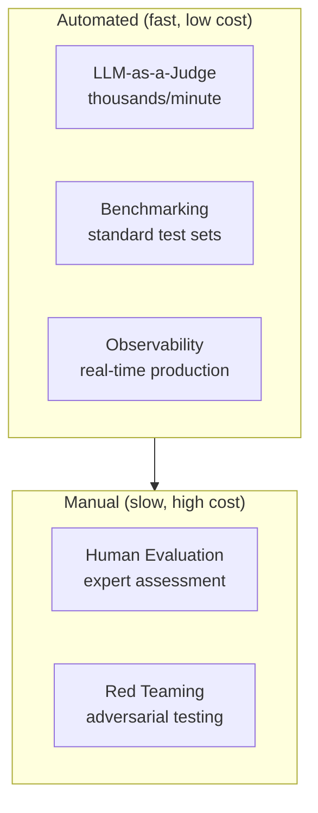

# Harness Engineering

## Overview

**Harness Engineering** encompasses all techniques for **safely controlling AI systems, measuring quality, and observing them during operation**. It's the seatbelt, dashboard, and black box of an AI system. The system works without it, but only becomes trustworthy with it.

```
Harness = Guardrails (safety) + Evaluation (quality) + Observability (observation)
```

## Sub-documents

| Document | Content |
|----------|---------|
| [[en/AI/Engineering/Harness_Engineering/Guardrail_Engineering\|Guardrail Engineering]] | NeMo Guardrails, Guardrails AI, LlamaGuard |
| [[en/AI/Engineering/Harness_Engineering/LLM_as_a_Judge\|LLM-as-a-Judge]] | Automated quality evaluation — MT-Bench, RAGAS |
| [[en/AI/Engineering/Harness_Engineering/Agent_as_a_Judge\|Agent-as-a-Judge]] | Execution trajectory evaluation, Critic Agent, DevAI |
| [[en/AI/Engineering/Harness_Engineering/Benchmarking\|Benchmarking]] | MMLU/HumanEval/SWE-bench, pass@k |
| [[en/AI/Engineering/Harness_Engineering/Human_Evaluation\|Human Evaluation]] | Preference Annotation, IAA, Chatbot Arena |
| [[en/AI/Engineering/Harness_Engineering/Observability_and_Tracing\|Observability & Tracing]] | LangSmith/Langfuse/Arize Phoenix |
| [[en/AI/Engineering/Harness_Engineering/Red_Teaming\|Red Teaming]] | HarmBench, PAIR, Jailbreak detection, Garak/PyRIT |
| [[en/AI/Engineering/Harness_Engineering/Alignment_Research\|Alignment Research]] | Reward Hacking, Sleeper Agents, Alignment Faking, AI Control |
| [[en/AI/Engineering/Harness_Engineering/AI_Governance_and_Compliance\|AI Governance & Compliance]] | RSP/Preparedness/FSF, METR external evaluation, EU AI Act, Model Cards |

## Evaluation Hierarchy



## Risks of Deploying Without a Harness

```
No guardrails     → harmful outputs reach users
No evaluation     → quality regressions go undetected after model updates
No observability  → "why did users churn?" unknown
No red teaming    → malicious users can abuse the system
```

## Role in AI Engineering

Harness Engineering is the **gateway for transitioning AI systems from experiment to production**. In regulated industries (finance, healthcare, legal), this layer is the core of compliance requirements; in B2C services, it's the foundation of brand trust.

## Related Concepts
[[en/AI/Engineering/Agent_Engineering/Agent_Engineering|Agent Engineering]] · [[en/AI/Engineering/Loop_Engineering/Data_Flywheel|Data Flywheel]]
