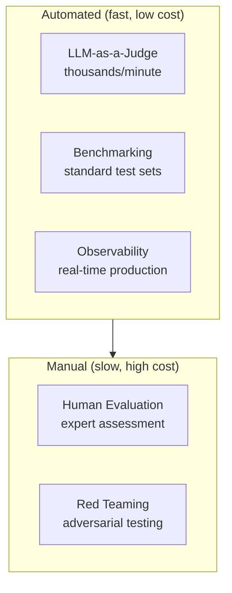

# Harness Engineering

## Overview

**Harness Engineering** encompasses all techniques for **safely controlling AI systems, measuring quality, and observing them during operation**. It's the seatbelt, dashboard, and black box of an AI system. The system works without it, but only becomes trustworthy with it.

```
Harness = Guardrails (safety) + Evaluation (quality) + Observability (observation)
```

## Sub-documents

The sub-documents are divided into three areas. **Safety** is a defense layer that prevents harmful or unfounded outputs, **Evaluation & Observability** is a layer that measures quality and tracks production behavior, and **Alignment & Governance** is the domain for researching and institutionally managing model-level risks.

### Safety

| Document | Content |
|------|------|
| [[en/AI/Engineering/Harness_Engineering/Harness_Safety/Harness_Safety\|Harness_Safety]] | Category Overview |
| [[en/AI/Engineering/Harness_Engineering/Harness_Safety/Guardrail_Engineering\|Guardrail_Engineering]] | NeMo Guardrails, Guardrails AI, LlamaGuard |
| [[en/AI/Engineering/Harness_Engineering/Harness_Safety/Prompt_Injection_Defense\|Prompt_Injection_Defense]] | Lethal Trifecta, Rule of Two, CaMeL, Dual-LLM, Spotlighting |
| [[en/AI/Engineering/Harness_Engineering/Harness_Safety/Red_Teaming\|Red_Teaming]] | HarmBench, PAIR, Jailbreaking Detection, OWASP LLM Top 10, Garak/PyRIT |
| [[en/AI/Engineering/Harness_Engineering/Harness_Safety/Hallucination_and_Grounding\|Hallucination_and_Grounding]] | Hallucination Detection/Groundedness Verification, Semantic Entropy, claim-level groundedness, Production Stack |

### Evaluation & Observability

| Document | Content |
|------|------|
| [[en/AI/Engineering/Harness_Engineering/Harness_Evaluation/Harness_Evaluation\|Harness_Evaluation]] | Category Overview |
| [[en/AI/Engineering/Harness_Engineering/Harness_Evaluation/LLM_as_a_Judge\|LLM_as_a_Judge]] | Automated Quality Evaluation — MT-Bench, RAGAS, G-Eval, Prometheus |
| [[en/AI/Engineering/Harness_Engineering/Harness_Evaluation/Agent_as_a_Judge\|Agent_as_a_Judge]] | Agent Execution Trajectory Evaluation, Critic Agent, Agent Simulation |
| [[en/AI/Engineering/Harness_Engineering/Harness_Evaluation/Benchmarking\|Benchmarking]] | MMLU/HumanEval/SWE-bench(Verified), pass@k |
| [[en/AI/Engineering/Harness_Engineering/Harness_Evaluation/Human_Evaluation\|Human_Evaluation]] | Preference Annotation, IAA, Chatbot Arena |
| [[en/AI/Engineering/Harness_Engineering/Harness_Evaluation/Observability_and_Tracing\|Observability_and_Tracing]] | LangSmith/Langfuse/Arize Phoenix |

### Alignment & Governance

| Document | Content |
|------|------|
| [[en/AI/Engineering/Harness_Engineering/Alignment_and_Governance/Alignment_and_Governance\|Alignment_and_Governance]] | Category Overview |
| [[en/AI/Engineering/Harness_Engineering/Alignment_and_Governance/Alignment_Research\|Alignment_Research]] | Reward Hacking, Sleeper Agents, Agentic Misalignment, Alignment Faking, AI Control |
| [[en/AI/Engineering/Harness_Engineering/Alignment_and_Governance/Mechanistic_Interpretability\|Mechanistic_Interpretability]] | Sparse Autoencoders, Circuit Tracing, Model Internal Circuit Analysis |
| [[en/AI/Engineering/Harness_Engineering/Alignment_and_Governance/AI_Governance_and_Compliance\|AI_Governance_and_Compliance]] | RSP/Preparedness/FSF, NIST AI RMF, ISO 42001, EU AI Act, Model Card |

## Naming Collision: Distinguishing from "Agent Harness"

Starting in 2026, part of the industry began using the term "agent harness (engineering)" with a **different meaning** than this chapter — in recent usage from LangChain, Anthropic, and others, it refers to the **execution scaffolding** around an agent (the five layers: execution runtime, context system, capability surface, governance layer, and protocol adapters). In other words, it's closer to the execution infrastructure concept spanning [[en/AI/Engineering/Flow_Engineering/Flow_Engineering|Flow Engineering]], [[en/AI/Engineering/Agent_Engineering/Agent_Engineering|Agent Engineering]], and [[en/AI/Engineering/Context_Engineering/Context_Engineering|Context Engineering]] — "all the code and configuration that gives a model state, tool execution, feedback loops, and constraints, turning it into an agent that actually works."

Here, **Harness Engineering** is used in the narrow sense the overview above defines — **safety, evaluation, and observability** (Guardrails + Evaluation + Observability). If you encounter the phrase "agent harness" in outside material, it usually refers not to this chapter but to the execution-scaffolding meaning above (mainly a combination of Agent Engineering, Flow Engineering, and Context Engineering) — read it with that distinction in mind.

## Evaluation Hierarchy


```mermaid
flowchart TD
    subgraph auto["Automated (fast, low cost)"]
        A1["LLM-as-a-Judge<br/>thousands/minute"]
        A2["Benchmarking<br/>standard test sets"]
        A3["Observability<br/>real-time production"]
    end
    subgraph manual["Manual (slow, high cost)"]
        M1["Human Evaluation<br/>expert assessment"]
        M2["Red Teaming<br/>adversarial testing"]
    end
    auto --> manual
```

## Risks of Deploying Without a Harness

```
No guardrails     → harmful outputs reach users
No evaluation     → quality regressions go undetected after model updates
No observability  → "why did users churn?" unknown
No red teaming    → malicious users can abuse the system
```

## Role in AI Engineering

Harness Engineering is the **gateway for transitioning AI systems from experiment to production**. In regulated industries (finance, healthcare, legal), this layer is the core of compliance requirements; in B2C services, it's the foundation of brand trust.

## Related Concepts
[[en/AI/Engineering/Agent_Engineering/Agent_Engineering|Agent Engineering]] · [[en/AI/Engineering/Loop_Engineering/Data_Flywheel|Data Flywheel]]
