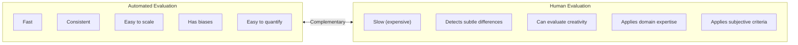

# Human Evaluation & Annotation

## Overview

**Human Evaluation** is the method where expert evaluators directly assess the quality of LLM outputs. It complements the limitations of automated evaluation (benchmarks, LLM-as-a-Judge), and aspects like creativity, subtle nuance, and cultural appropriateness can only be accurately measured by human evaluation. **Annotation** is the process of humans labeling training data.

## The Role of Human Evaluation



## Annotation Types

### 1. Preference Annotation

Core of RLHF. Select the better of two responses:

```
Evaluator guideline example:

[Response A]: "Python uses indentation to delimit code blocks."
[Response B]: "In Python, indentation is used instead of curly braces.
               This is a core Python feature that improves code readability."

Rate using the following criteria:
☐ A is much better
☐ A is slightly better
☐ Equal
☐ B is slightly better
☐ B is much better

Reasoning (required):
```

### 2. Absolute Rating

Likert scale (1-5 or 1-10):

```
Evaluation items:
  Accuracy:      1 - 2 - 3 - 4 - 5
  Completeness:  1 - 2 - 3 - 4 - 5
  Clarity:       1 - 2 - 3 - 4 - 5
  Helpfulness:   1 - 2 - 3 - 4 - 5

1 = very poor, 5 = very good
```

### 3. Categorical Annotation

Error type classification, intent classification, etc.:

```
Select the error type in the following response:
☐ Factual Error
☐ Reasoning Error
☐ Incomplete
☐ Irrelevant
☐ Safety Violation
☐ No Error
```

## Annotation Platforms

| Platform | Features | Best for |
|----------|---------|---------|
| **Scale AI** | Professional annotation team, high quality | Large-scale enterprise |
| **Labelbox** | Multipurpose ML data platform | Mixed image+text |
| **Argilla** | Open-source, LLM-specialized | Prefer self-hosting |
| **Label Studio** | Open-source, flexible configuration | Internal team annotation |
| **Prolific / MTurk** | Crowdsourcing | Fast large-scale collection |

## Annotator Quality Control

### Guideline Consistency

```markdown
# Annotator guidelines example

## Accuracy evaluation criteria
5 (perfect): All facts accurate and verifiable
4 (good): Mostly accurate, minor omissions
3 (adequate): Core is correct but some errors
2 (poor): Contains major errors
1 (very poor): Mostly wrong or completely irrelevant

## Handling ambiguous cases
- When in doubt, give lower score
- Consider cultural context (apply Korean cultural standards for Korean evaluation)
- Use "skip" option when difficult to evaluate
```

### Inter-Annotator Agreement (IAA)

Measuring agreement between evaluators:

```python
from sklearn.metrics import cohen_kappa_score
import krippendorff

# Cohen's Kappa (2 annotators, categorical)
kappa = cohen_kappa_score(annotator_1_ratings, annotator_2_ratings)
# kappa > 0.6: substantial agreement / > 0.8: almost perfect agreement

# Krippendorff's Alpha (multiple annotators, various scales)
alpha = krippendorff.alpha(
    reliability_data=ratings_matrix,  # shape: (annotators, items)
    level_of_measurement='ordinal'
)
# alpha > 0.667: reliable / > 0.800: high reliability

if kappa < 0.4:
    print("Guideline review needed")
    # → Add examples, clarify ambiguous criteria
```

### Gold Standard Items

Insert "trap questions" with known answers in the middle of evaluation:
```python
def create_evaluation_batch(real_samples: list, gold_items: list) -> list:
    """Mix 90% real samples + 10% gold items with known answers"""
    batch = real_samples[:90] + gold_items[:10]
    random.shuffle(batch)
    return batch

def check_annotator_quality(results: list, gold_positions: list) -> float:
    gold_correct = sum(
        results[pos]['label'] == GOLD_LABELS[pos]
        for pos in gold_positions
    )
    accuracy = gold_correct / len(gold_positions)
    if accuracy < 0.8:
        flag_for_review(annotator_id)
    return accuracy
```

## Chatbot Arena

Large-scale human preference collection platform operated by LMSYS:
- Compare two model responses → user selects
- Millions voluntarily participate (crowdsourcing)
- ELO score for model ranking

```
User → question → [Model A response] vs [Model B response] → select
                   (model names hidden)
→ Reliable human preference rankings from accumulated data
```

## Annotation Pipeline for RLHF

```
Step 1: Initial SFT data collection
  Experts directly write high-quality responses (thousands to tens of thousands of samples)

Step 2: Preference data collection
  Model generates multiple responses for the same question
  → Evaluators select preferred response via pairwise comparison

Step 3: Reward Model training
  Train reward model on collected preference data

Step 4: PPO fine-tuning of LLM
  Train to maximize Reward Model's score
```

## Role in AI Engineering

Human Evaluation is the **final quality gate for AI systems**. A cycle of rapid iteration with automated evaluation, regularly validated with human evaluation, is recommended. Human preference data collected through RLHF is the most direct input for model improvement, and the quality of this data determines final model quality.

## Related Concepts
[[en/AI/Engineering/Harness_Engineering/LLM_as_a_Judge|LLM-as-a-Judge]] · [[en/AI/Engineering/Harness_Engineering/Benchmarking|Benchmarking]] · [[en/AI/Engineering/Loop_Engineering/Data_Flywheel|Data Flywheel]] · [[en/AI/Engineering/Model_Engineering/Full_Fine-Tuning|Full Fine-Tuning]]

## Sources
- Ouyang et al. (2022) "InstructGPT (RLHF)" — [arXiv:2203.02155](https://arxiv.org/abs/2203.02155)
- LMSYS Chatbot Arena — [chat.lmsys.org](https://chat.lmsys.org)
- Argilla docs — [docs.argilla.io](https://docs.argilla.io)
