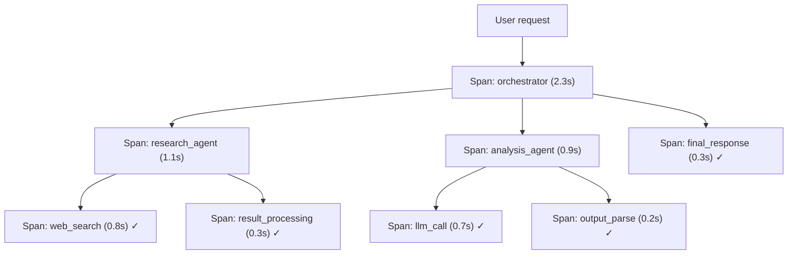
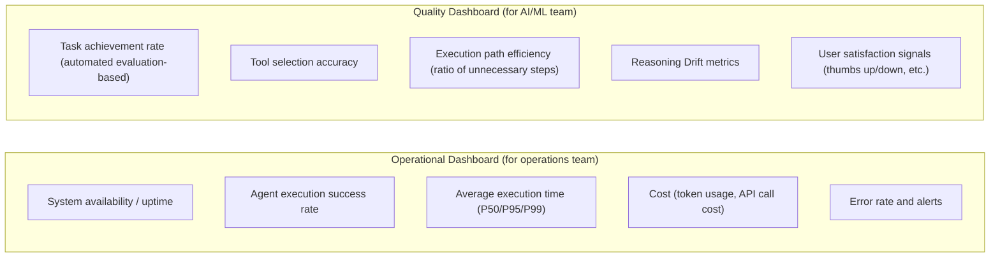

# Observability & Tracing

## Overview

**LLM Observability** is the practice of real-time monitoring, tracing, and analyzing the behavior of LLM-based applications. It's the concept of traditional APM (Application Performance Monitoring) enhanced with LLM-specific metrics (token usage, hallucination rate, response quality, etc.).

## Why It's Needed

```
Limits of traditional APM:
  Server CPU 100% → "overloaded"
  Response time 5 seconds → "slow"

Why LLM Observability is needed:
  "Is the model hallucinating?"
  "Which prompts are expensive?"
  "Which step is failing?"
  "Do users find responses useful?"
```

## Core Tracking Metrics

### Cost Tracking
```python
response = openai.chat.completions.create(...)
usage = response.usage
cost = (usage.prompt_tokens / 1000 * 0.01 +   # input token cost
        usage.completion_tokens / 1000 * 0.03)  # output token cost

metrics.record({
    "cost_usd": cost,
    "prompt_tokens": usage.prompt_tokens,
    "completion_tokens": usage.completion_tokens
})
```

### Latency Tracking
```python
import time

start = time.time()
response = llm.invoke(prompt)
latency = time.time() - start

metrics.record({
    "latency_ms": latency * 1000,
    "ttfb_ms": time_to_first_token * 1000  # Time to First Token (streaming)
})
```

### Quality Metrics
```python
# Automated quality scoring via LLM-as-a-Judge
quality_score = judge_llm.evaluate(
    query=user_input,
    response=llm_output
)
metrics.record({"quality_score": quality_score})
```

## Major Platforms

### LangSmith (LangChain)

Tightest integration with the LangChain ecosystem:

```python
import os
os.environ["LANGCHAIN_TRACING_V2"] = "true"
os.environ["LANGCHAIN_API_KEY"] = "lsv2_..."
os.environ["LANGCHAIN_PROJECT"] = "my-rag-project"

# All subsequent LangChain code automatically traced
result = rag_chain.invoke({"question": "What is an LLM?"})
# → Full execution trace, per-step I/O, token cost viewable in LangSmith
```

**Features**:
- Polly AI Assistant: debug traces in natural language
- Topic Clustering: auto-classify usage patterns
- Prompt version management

### Langfuse (Open-source)

Fully open-source, self-hostable:

```python
from langfuse import Langfuse
from langfuse.decorators import observe

langfuse = Langfuse(public_key="pk-lf-...", secret_key="sk-lf-...")

@observe()  # auto-trace entire function
def generate_response(user_query: str) -> str:
    docs = retriever.invoke(user_query)
    response = llm.invoke(user_query, context=docs)
    return response

# Manual tracing
with langfuse.trace(name="rag_pipeline") as trace:
    with trace.span(name="retrieval") as span:
        docs = retriever.invoke(query)
        span.update(output={"docs_count": len(docs)})
    
    with trace.span(name="generation") as span:
        response = llm.invoke(query)
        span.update(output={"response": response})
```

**Features (2026)**:
- Acquired by Clickhouse (January 2026)
- Self-hosting free
- Strengths in cost analysis and prompt management

### Arize Phoenix (Open-source)

Observation platform specialized for RAG evaluation:

```python
import phoenix as px
from phoenix.otel import register

tracer_provider = register(project_name="my-llm-app", endpoint="http://localhost:6006")

from phoenix.evals import HallucinationEvaluator, RelevanceEvaluator

hallucination_eval = HallucinationEvaluator(model=eval_model)
relevance_eval = RelevanceEvaluator(model=eval_model)

px.run_evals(
    dataframe=production_traces,
    evaluators=[hallucination_eval, relevance_eval]
)
```

**Features**: 50+ research-based metrics, strengths in Faithfulness and Hallucination detection.

## Distributed Tracing

Tracking the entire flow for multi-step systems like agent systems:



**OpenTelemetry**: Standard distributed tracing framework. All LLM observability tools support it.

## Alerts and Monitoring

```python
monitoring_config = {
    "alerts": [
        {
            "name": "high_latency",
            "condition": "avg_latency_p99 > 10s",
            "action": "slack_notify"
        },
        {
            "name": "high_error_rate",
            "condition": "error_rate > 5%",
            "action": "pagerduty"
        },
        {
            "name": "quality_degradation",
            "condition": "avg_quality_score < 0.7",
            "action": "email_team"
        },
        {
            "name": "cost_spike",
            "condition": "hourly_cost > $100",
            "action": "slack_notify"
        }
    ]
}
```

## Platform Selection Guide (2026)

| Criteria | Recommendation |
|----------|---------------|
| LangChain ecosystem | LangSmith |
| Self-hosting required | Langfuse |
| RAG evaluation focus | Arize Phoenix |
| Experiments and prompt research | W&B Weave |
| Enterprise RAG | Arize AX |

## Agent Observability

Agent systems require much more complex observation than simple LLM calls. Multi-step execution, tool calls, and inter-agent communication are all tracked.

### Three Pillars of Agent Observability

| Pillar | Role and agent-specific content |
|--------|-------------------------------|
| **Logs** | Record agent decision and tool call events. Descriptive record of when, which tool, and why it was chosen |
| **Traces** | Visualize entire execution trajectory. Layer-by-layer tracking of Orchestrator → Sub-Agent → Tool calls. Identify where delays/failures occurred |
| **Metrics** | Quantitative performance and quality indicators. Tool call success rate, task completion rate, retry count. Beyond simple latency/cost to "is the agent working well?" |

### Dynamic Sampling Strategy

Sampling all executions equally causes cost explosion. Importance-based differential sampling:

```python
def sampling_strategy(execution: dict) -> bool:
    """Decide whether to sample this execution trace"""
    
    # Errors captured 100% (never miss)
    if execution.get("has_error"):
        return True
    
    # Unusual patterns captured 100%
    if execution.get("tool_retry_count", 0) > 2:
        return True
    if execution.get("latency_ms", 0) > 30_000:  # over 30 seconds
        return True
    
    # Normal successful executions sampled 10%
    import random
    return random.random() < 0.10
```

### Dual Operational vs Quality Dashboard System

Since agent monitoring serves two different purposes, separating dashboards is best practice:



## Role in AI Engineering

Observability is the **nervous system of production AI systems**. It enables data-driven answers to questions like "why are user complaints increasing?", "which queries are expensive?", "did fine-tuning improve performance?" For agent systems, observing beyond simple LLM tracing to agent quality requires Three Pillars + Dynamic Sampling + dual dashboards. Without it, operations become a black box and improvement becomes impossible.

## Related Concepts
[[en/AI/Engineering/Harness_Engineering/LLM_as_a_Judge|LLM-as-a-Judge]] · [[en/AI/Engineering/Harness_Engineering/Benchmarking|Benchmarking]] · [[en/AI/Engineering/Harness_Engineering/Guardrail_Engineering|Guardrail Engineering]] · [[en/AI/Engineering/Loop_Engineering/Data_Flywheel|Data Flywheel]]

## Sources
- MLflow "Top 5 LLM and Agent Observability Tools in 2026" — [mlflow.org](https://mlflow.org/top-5-agent-observability-tools/)
- Langfuse official docs — [langfuse.com](https://langfuse.com)
- Arize Phoenix docs — [docs.arize.com/phoenix](https://docs.arize.com/phoenix)
