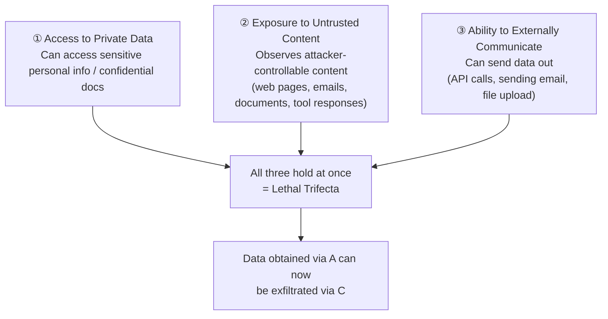

# Prompt Injection Defense

## Overview

**Prompt Injection** is an attack where the model mistakes attacker-controlled text for instructions and acts on it. It has held the #1 spot on the OWASP LLM Top 10 since 2024, and as of 2026 it is still considered an "architecturally unsolved problem."

Where [[en/AI/Engineering/Harness_Engineering/Red_Teaming|Red Teaming]] covers **how injections are discovered** and [[en/AI/Engineering/Harness_Engineering/Guardrail_Engineering|Guardrail Engineering]] covers the **general-purpose defense stack** including content safety, this document covers the **framing that defines the risk condition itself** (Lethal Trifecta, Rule of Two) and the **architecture-level defense patterns** (CaMeL, Dual-LLM) that became industry-standard in 2025–2026.

## Lethal Trifecta — When It Becomes Deadly

A concept formalized by Simon Willison. Prompt injection escalates into a devastating attack only when an agent has all three of the following properties **at the same time**.



Removing **any one** of the three properties breaks the trifecta — if the agent can't reach sensitive data (①), never observes untrusted content at all (②), or has no ability to communicate externally (③), a successful injection no longer translates into real harm. The practical value of this framing is that it reframes the goal from the impossible "block 100% of injections" to the achievable "never let all three properties hold at once."

## Meta's Rule of Two

A rule that turns the Lethal Trifecta into an operational policy: **"An agent action that satisfies more than 2 of the three properties at once must not execute without human approval."**

```
Within a session, allow at most 2 of the following without human approval:
  □ Access to private/sensitive data
  □ Exposure to untrusted content
  □ Ability to communicate externally

A task requiring all 3 (e.g. "read my inbox, summarize it, and post it to Slack" —
inbox = untrusted content, Slack post = external communication, and if the
inbox contains sensitive info, private data as well → all 3 properties satisfied)
  → must pass through a HITL approval gate
```

## Why Sandboxing and Allow-Lists Alone Fall Short

Intuitively, "lock it in a sandbox and only open an allow-list" sounds safe, but two failure patterns recur in practice.

```
Failure pattern 1 — the allow-list simplified the attack:
  An agent's executable commands were restricted to a whitelist,
  yet the attacker didn't need to inject a new command at all —
  simply combining the already-allowed commands in an attacker-favorable order/arguments was enough
  → an allow-list restricts "what can be done" but not "for what purpose things are combined"

Failure pattern 2 — the agent's own output redefines its sandbox boundary:
  When the sandbox configuration itself is managed via files/environment variables,
  if the agent executes a command that modifies that config file (per an injected instruction),
  it operates within the "modified" sandbox boundary starting the next turn
  → isolation is defeated when the isolation mechanism sits on the same privilege plane as what it isolates
```

**Conclusion**: sandboxing/allow-lists are necessary but not sufficient. They must be combined with architecture-level trust separation.

## Architectural Defense Patterns

### CaMeL (Capability-based Machine Learning agents)

Attaches a **capability** (permission token) to tool-call results, enforcing at the dataflow level which sinks (file writes, external transmission, etc.) a value derived from a given data source is allowed to reach.

```
Traditional approach: instruct the LLM in the prompt "don't trust this data" (relies on trust, can be bypassed)
CaMeL approach: tag values originating from untrusted sources
                → when such a value is about to reach a sensitive sink, a policy engine intervenes and blocks it
                → the dataflow itself is enforced even if the LLM "forgets or is fooled" by the instruction
```

### Dual-LLM Pattern (Willison)

Instead of concentrating all privileges in a single LLM, roles are split.

```
Privileged LLM
  - Talks directly with the user, decides whether to invoke tools
  - Never directly views untrusted content

Quarantined LLM
  - Only processes untrusted content (web pages, documents, etc.)
  - Passes only summarized results (in structured form) to the Privileged LLM
  - Even if this model falls to an injection, it has no tool-invocation privileges, so damage is contained
```

### Spotlighting (Marking Trust Boundaries Explicitly)

A technique for explicitly marking content of differing trust levels within a prompt so the model can distinguish them. The `<observation untrusted="true">` tagging proposed by PVE in `Guardrail_Engineering.md` belongs to this family. Extended forms — including encoding transformations (e.g. wrapping untrusted content in special Unicode) — are also being researched.

## MCP's Unique Attack Surface

[[en/AI/Engineering/Agent_Engineering/Agent_Skills_and_Protocols/MCP|MCP]] standardizes tool/resource access while simultaneously opening new injection paths. Among the "5 security threats" listed in the MCP document (Tool Poisoning, Rug Pull, Excessive Permissions, etc.), the ones directly tied to prompt injection are **Tool Poisoning** (a malicious server disguises itself as legitimate and embeds hidden instructions in the tool's own description) and **Rug Pull** (server behavior changes after trust has been established). Both share, from a Lethal Trifecta perspective, the common trait of injecting Untrusted Content through a channel — the tool description — that users typically never review.

## Boundaries

| Document | Covers |
|------|-----------|
| [[en/AI/Engineering/Harness_Engineering/Red_Teaming\|Red Teaming]] | Methodologies for **discovering and automating** attacks such as injection and jailbreaking (PAIR, TAP, Garak) |
| [[en/AI/Engineering/Harness_Engineering/Guardrail_Engineering\|Guardrail Engineering]] | The **general-purpose defense stack** covering content safety, bias, watermarking, and more |
| **This document (Prompt_Injection_Defense)** | **Architecture defense specific to prompt injection** — defining the risk condition (Trifecta/Rule of Two) and structural countermeasures (CaMeL/Dual-LLM/Spotlighting) |

## Role in AI Engineering

Prompt injection is an area where "just train the model to be safer" has repeatedly failed — because the attack is mediated through natural language itself, and as long as there's a ceiling on a model's ability to perfectly separate instructions from data, a purely model-level solution remains out of reach. So the center of gravity in practice has shifted from "make the model safer" to "design the system so that even a compromised model doesn't cause harm." The Lethal Trifecta and Rule of Two turn this design principle into a deployable policy, while CaMeL and Dual-LLM are implementation patterns that enforce that policy at the code level.

## Related Concepts
[[en/AI/Engineering/Harness_Engineering/Red_Teaming|Red Teaming]] · [[en/AI/Engineering/Harness_Engineering/Guardrail_Engineering|Guardrail Engineering]] · [[en/AI/Engineering/Agent_Engineering/Agent_Skills_and_Protocols/MCP|MCP]] · [[en/AI/Engineering/Agent_Engineering/Autonomous_Systems|Autonomous Systems]] · [[en/AI/Engineering/Agent_Engineering/Computer_Use_and_Voice_Agents|Computer Use & Voice Agents]]

## Sources
- Willison, S. (2025) "The lethal trifecta for AI agents" — [simonwillison.net](https://simonwillison.net/2025/Jun/16/the-lethal-trifecta/)
- Meta (2026) "Agents Rule of Two" — [ai.meta.com](https://ai.meta.com/blog/practical-ai-agent-security/)
- Debenedetti et al. (2025) "Defeating Prompt Injections by Design (CaMeL)" — [arXiv:2503.18813](https://arxiv.org/abs/2503.18813)
- Willison, S. (2023) "The Dual LLM Pattern for Building AI Assistants That Can Resist Prompt Injection" — [simonwillison.net](https://simonwillison.net/2023/Apr/25/dual-llm-pattern/)
- OWASP "LLM01:2025 Prompt Injection" — [owasp.org](https://genai.owasp.org/llmrisk/llm01-prompt-injection/)
