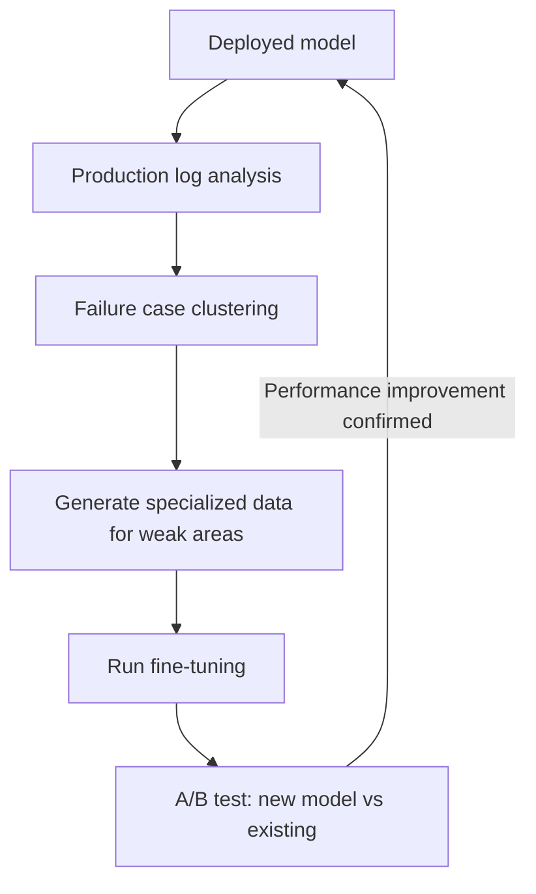

# Continuous Optimization

## Overview

**Continuous Optimization** is the process of continuously improving AI system performance after deployment. It includes automated prompt optimization (DSPy), iterative fine-tuning, A/B testing, and production data-driven improvement.

## DSPy: Automated Prompt Optimization

### Overview

**DSPy** (Declarative Self-Improving Language Programs) is a framework published by Stanford NLP's Omar Khattab in 2023. Instead of manually engineering LLM program prompts, it **automatically finds optimal prompts and few-shot examples, like a compiler**.

```
Traditional approach:
  Developer manually writes prompt → test → iterate revision
  "You are an expert summarizer. Summarize the following text in 3 lines..."

DSPy approach:
  Declare goal: summarize(text) → summary
  Define evaluation criteria: rouge_score(summary, reference) > 0.8
  → Compiler automatically generates optimal prompt
```

### Core Concepts

```python
import dspy

# 1. Signature declaration (I/O specification)
class SummarizeSignature(dspy.Signature):
    """Summarize text into 3 sentences or fewer with key content"""
    text: str = dspy.InputField(desc="Source text to summarize")
    summary: str = dspy.OutputField(desc="Key summary in 3 sentences or fewer")

# 2. Module definition
class Summarizer(dspy.Module):
    def __init__(self):
        self.summarize = dspy.ChainOfThought(SummarizeSignature)
    
    def forward(self, text: str) -> str:
        return self.summarize(text=text).summary

# 3. Evaluation metric definition
def rouge_metric(example, pred, trace=None) -> float:
    from rouge_score import rouge_scorer
    scorer = rouge_scorer.RougeScorer(['rouge2', 'rougeL'])
    scores = scorer.score(example.summary, pred.summary)
    return scores['rougeL'].fmeasure

# 4. Optimization (compile)
train_data = [dspy.Example(text=t, summary=s).with_inputs("text") 
              for t, s in training_pairs]

optimizer = dspy.MIPROv2(metric=rouge_metric, auto="medium")
optimized_summarizer = optimizer.compile(
    Summarizer(),
    trainset=train_data
)

# Optimized module contains auto-discovered prompt + few-shot examples
optimized_summarizer.summarize.show_instructions()
```

### MIPROv2 (2024)

DSPy's core optimization algorithm:

```
MIPROv2 process:
1. Generate meta-prompt (analyze task characteristics)
2. Generate multiple candidate Instructions
3. Few-shot example selection (Bayesian Optimization)
4. Greedy search for optimal combination
5. Final selection with validation set

Vs. BootstrapFewShot:
  - Also optimizes prompt instructions
  - Efficient Bayesian search
  - Reports +10-40% performance improvement (structured tasks)
```

### DSPy 3.0 (2025) — New Optimizers

Major optimizers added in DSPy 3.0:

| Optimizer | Features | Best situation |
|-----------|---------|---------------|
| **SIMBA** | Stochastic mini-batch + self-reflection | Large data, large LLMs |
| **GEPA** | Genetic-Pareto search, +20% performance at 1/35 computation vs RL | Computation efficiency priority |
| **GRPO** | Group Relative Policy Optimization (RL-based) | Optimize model weights together |

```python
# SIMBA: self-reflection-based optimization on large data
optimizer = dspy.SIMBA(metric=my_metric, num_candidates=6)
optimized = optimizer.compile(MyModule(), trainset=train_data)

# GEPA: genetic algorithm-based, computation efficiency first
optimizer = dspy.GEPA(metric=my_metric)
optimized = optimizer.compile(MyModule(), trainset=train_data)
```

DSPy 3.0 extended its scope from prompt optimization to **model weight optimization**, and added `dspy.Image` / `dspy.Audio` types to support multimodal pipelines.

## Iterative Fine-tuning Cycle



```python
class ContinuousImprovementPipeline:
    def __init__(self, base_model, eval_benchmark):
        self.model = base_model
        self.benchmark = eval_benchmark
        self.iteration = 0
    
    def analyze_failures(self, production_logs: list) -> list:
        """Automated failure case analysis"""
        failures = [log for log in production_logs if log["quality_score"] < 0.6]
        
        # Classify failure patterns with clustering
        failure_clusters = cluster_by_topic(failures)
        
        return [
            {
                "category": cluster["topic"],
                "count": len(cluster["samples"]),
                "representative_examples": cluster["samples"][:5]
            }
            for cluster in sorted(failure_clusters, key=lambda x: -len(x["samples"]))
        ]
    
    def generate_synthetic_data(self, failure_categories: list) -> list:
        """Generate synthetic training data for failure categories"""
        synthetic_data = []
        for cat in failure_categories[:3]:  # Focus on top 3 categories
            new_samples = generator_llm.generate_training_data(
                topic=cat["category"],
                examples=cat["representative_examples"],
                n_samples=200
            )
            synthetic_data.extend(new_samples)
        return synthetic_data
    
    def run_iteration(self, production_logs: list):
        self.iteration += 1
        print(f"=== Iteration {self.iteration} ===")
        
        # 1. Analysis
        failures = self.analyze_failures(production_logs)
        
        # 2. Data generation
        new_data = self.generate_synthetic_data(failures)
        
        # 3. Fine-tuning
        new_model = finetune(self.model, new_data)
        
        # 4. Evaluation
        baseline_score = self.benchmark.evaluate(self.model)
        new_score = self.benchmark.evaluate(new_model)
        
        # 5. Deployment decision
        if new_score > baseline_score * 1.02:  # 2%+ improvement
            self.model = new_model
            print(f"Deployment approved: {baseline_score:.3f} → {new_score:.3f}")
        else:
            print(f"Deployment held: {baseline_score:.3f} vs {new_score:.3f}")
```

## A/B Testing

Safely verifying model/prompt changes in production:

```python
import random

class ABTestRunner:
    def __init__(self, model_a, model_b, traffic_split=0.1):
        self.model_a = model_a  # current model (90% traffic)
        self.model_b = model_b  # new model (10% traffic)
        self.traffic_split = traffic_split
        self.results = {"a": [], "b": []}
    
    def route(self, user_query: str) -> tuple[str, str]:
        """Branch traffic to A/B"""
        model_choice = "b" if random.random() < self.traffic_split else "a"
        model = self.model_b if model_choice == "b" else self.model_a
        response = model.generate(user_query)
        return response, model_choice
    
    def record(self, model_choice: str, quality_score: float):
        self.results[model_choice].append(quality_score)
    
    def analyze(self) -> dict:
        """Statistical significance testing"""
        from scipy import stats
        t_stat, p_value = stats.ttest_ind(self.results["a"], self.results["b"])
        
        return {
            "model_a_avg": sum(self.results["a"]) / len(self.results["a"]),
            "model_b_avg": sum(self.results["b"]) / len(self.results["b"]),
            "p_value": p_value,
            "significant": p_value < 0.05,
            "winner": "b" if self.results["b"] > self.results["a"] else "a"
        }
```

## Prompt Version Management

```python
# Using LangSmith prompt hub
from langsmith import Client

client = Client()

# Save prompt version
client.push_prompt("rag-qa-v1", 
    prompt=ChatPromptTemplate.from_template(template_v1))

# Pull prompt
prompt = client.pull_prompt("rag-qa-v1")

# Compare performance across versions
# rag-qa-v1: RAGAS 0.82
# rag-qa-v2: RAGAS 0.87 ← deployed
# rag-qa-v3: RAGAS 0.85 ← regression, rolled back
```

## RLVR: Reinforcement Learning with Verifiable Rewards *(2025)*

**RLVR** is a paradigm that directly trains models with RL in domains where answer correctness can be automatically verified (math, code, logical reasoning). Unlike RLHF which uses subjective preference, it uses **objective, automated feedback**.

```
RLHF vs RLVR comparison:

RLHF:
  Response A vs Response B → human selects preference → reward model training → PPO
  Drawbacks: subjective, expensive, slow

RLVR:
  Generate response → verify answer (formula/code execution/rules) → instant reward
  Advantages: fully automated, scalable, emergent reasoning capabilities
```

**DeepSeek-R1 (2025)**: Used GRPO (Group Relative Policy Optimization) + RLVR to bring math/coding reasoning to OpenAI o1 level. The key: training is possible with only an answer verifier, no separate reward model needed.

```python
# RLVR core structure
def rlvr_reward(response: str, ground_truth: str) -> float:
    """Verifiable reward: 1 for correct, 0 for incorrect"""
    # Math: formula evaluator
    # Code: unit test execution
    # Logic: rule-based verifier
    return 1.0 if verify(response, ground_truth) else 0.0

# GRPO: update based on relative quality among multiple candidate responses
# (no separate critic model needed)
```

RLVR is a new axis of Continuous Optimization that, especially for **verifiable tasks**, improves the model's own reasoning capability beyond prompt optimization.

## Test-Time Compute Scaling *(2025)*

A paradigm that **invests more computation at inference time** rather than training time to improve quality. Since 2025, this has emerged as a new axis of AI scaling.

```
Traditional scaling laws:
  Bigger model = higher performance (parameter increase)

Test-Time Compute Scaling:
  Same model + more inference time = higher performance
  → Increase "thinking time" instead of model size
```

| Technique | Description | Representative models |
|-----------|-------------|----------------------|
| **Chain-of-Thought** | Generate step-by-step reasoning chain | GPT-4o |
| **Extended Thinking** | Generate hidden reasoning tokens | OpenAI o1/o3, Claude 3.7 |
| **Best-of-N** | Generate N responses, select best | General purpose |
| **Tree Search** | Search reasoning paths as a tree | MCTS-based |

```
OpenAI o-series pattern:
  o1 (2024): extended thinking → AIME math 83.3%
  o3 (2025): more test-time compute → ARC-AGI 87.5%

Loop perspective:
  Thinking more is itself an optimization loop
  → Good reasoning traces → RLVR training data → better model
```

## Role in AI Engineering

Continuous Optimization is the **engine that keeps AI systems always up-to-date**. DSPy transforms prompt optimization from manual to automated, RLVR improves the model's own reasoning capability in verifiable domains, and A/B testing safely validates improvements. Since 2025, Test-Time Compute Scaling has established itself as a new optimization loop at the inference stage rather than training.

## Related Concepts
[[en/AI/Engineering/Loop_Engineering/Data_Flywheel|Data Flywheel]] · [[en/AI/Engineering/Loop_Engineering/Runtime_Optimization|Runtime Optimization]] · [[en/AI/Engineering/Harness_Engineering/LLM_as_a_Judge|LLM-as-a-Judge]] · [[en/AI/Engineering/Harness_Engineering/Benchmarking|Benchmarking]] · [[en/AI/Engineering/Model_Engineering/PEFT_LoRA_QLoRA|PEFT/LoRA/QLoRA]]

## Sources
- Khattab et al. (2023) "DSPy: Compiling Declarative Language Model Calls" — [arxiv.org/abs/2310.03714](https://arxiv.org/abs/2310.03714)
- DSPy official docs — [dspy.ai](https://dspy.ai)
- DSPy 3.0 release (2025) — [dspy.ai/roadmap](https://dspy.ai/roadmap/)
- DeepSeek-R1 (2025) "Incentivizing Reasoning Capability in LLMs via RL" — [arxiv.org/abs/2501.12948](https://arxiv.org/abs/2501.12948)
- "Inference-Time Scaling for Complex Tasks" (2025) — [arxiv.org/abs/2504.00294](https://arxiv.org/abs/2504.00294)
