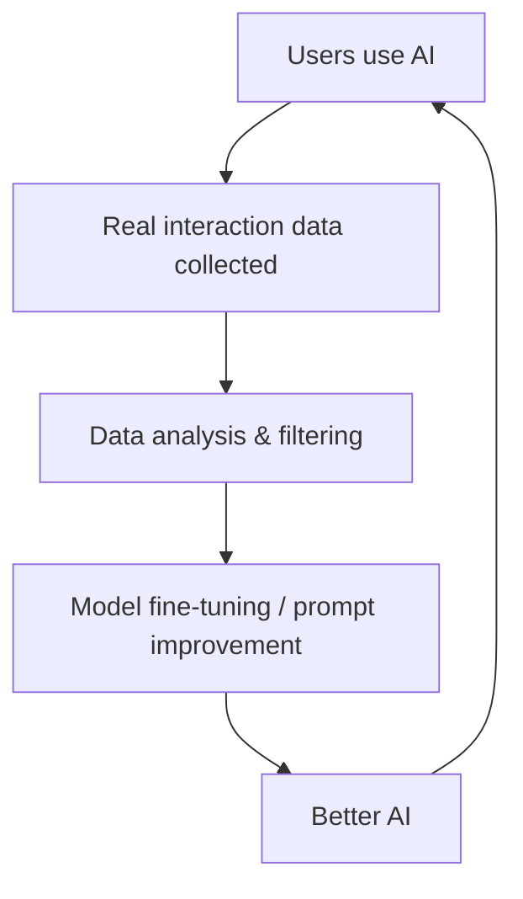
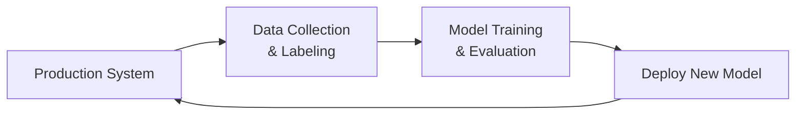
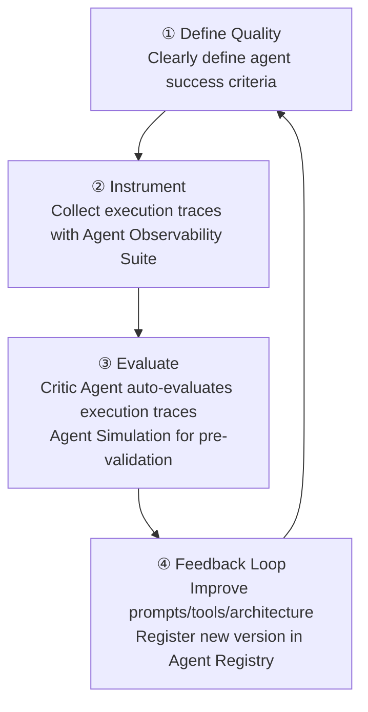
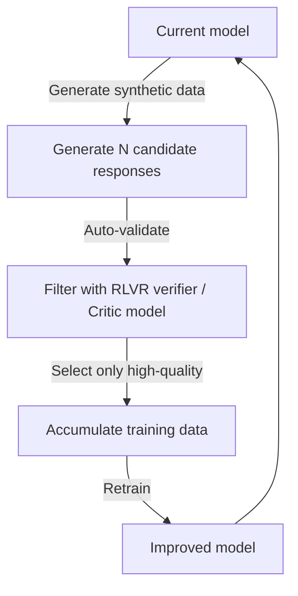

# Data Flywheel

## Overview

A **Data Flywheel** is a **self-reinforcing cycle** where the more an AI system is used, the more high-quality data accumulates, and improving the model with that data drives more usage. It applies the Flywheel Effect from business strategy to AI.



## Agent-in-the-Loop Framework

**Core idea**: Agents don't just execute tasks — they also automatically generate training data during execution.

```python
from langchain_core.runnables import RunnableLambda
from langsmith import Client

class AgentInTheLoop:
    """Agent that simultaneously generates training data while executing"""
    
    def __init__(self, agent, evaluator, data_store):
        self.agent = agent
        self.evaluator = evaluator
        self.data_store = data_store
    
    def run_and_collect(self, user_query: str) -> dict:
        # 1. Execute agent
        response = self.agent.run(user_query)
        
        # 2. Automatic quality evaluation
        quality_score = self.evaluator.score(
            query=user_query,
            response=response
        )
        
        # 3. Add only high-quality responses to dataset
        if quality_score >= 0.8:
            self.data_store.add({
                "input": user_query,
                "output": response,
                "quality_score": quality_score,
                "timestamp": datetime.now().isoformat()
            })
        
        return {"response": response, "score": quality_score}
    
    def trigger_finetuning_if_ready(self, threshold=1000):
        """Trigger fine-tuning when enough data accumulates"""
        if len(self.data_store) >= threshold:
            finetune_model(self.data_store.get_all())
            self.data_store.clear()
```

## Data Collection Strategies

### 1. Implicit Feedback

Extracting quality signals from user behavior:

```python
# User behavior → quality signals
behavior_signals = {
    "copy response": 0.8,        # judged as useful
    "no follow-up": 0.7,         # likely satisfied
    "thumbs up": 1.0,            # explicit positive
    "follow-up question": -0.3,  # dissatisfaction signal
    "session exit": -0.5,        # abandonment
    "thumbs down": -1.0,         # explicit negative
}

def compute_quality_signal(session_events: list) -> float:
    score = 0.5  # baseline
    for event in session_events:
        score += behavior_signals.get(event["type"], 0)
    return max(0, min(1, score))
```

### 2. Explicit Feedback

```python
# RLHF-style preference collection
def collect_preference(query: str, response_a: str, response_b: str) -> str:
    """Ask user to choose between two responses"""
    return display_pairwise_comparison(response_a, response_b)
    # → Selected response becomes training data
```

### 3. LLM-as-a-Judge Automated Filtering

```python
from ragas import evaluate
from ragas.metrics import faithfulness, answer_relevancy

def auto_filter_high_quality(samples: list) -> list:
    """Select only high-quality samples using LLM judge"""
    results = evaluate(dataset=samples, metrics=[faithfulness, answer_relevancy])
    
    high_quality = [
        sample for sample, score in zip(samples, results.scores)
        if score["answer_relevancy"] > 0.8 and score["faithfulness"] > 0.9
    ]
    return high_quality
```

## RAG Data Flywheel Real Example

**Goal**: Make the retrieval system progressively more accurate

```
Week 1: Basic RAG deployed
  → 1,000 user queries collected

Week 2: Retrieval failure pattern analysis
  → "Cannot find" responses = retrieval misses
  → Top 20% query patterns identified

Week 3: Chunking strategy optimization
  → Chunk size adjusted based on failed queries
  → +11.7% Recall improvement (internal measurement)

Week 4: Query Expansion introduced
  → Frequently failing queries → expanded with Multi-Query
  → Additional +8.3% Recall improvement

→ Continue iterating
```

## Data Flywheel Components



4 core elements:
1. Data collection pipeline (automation essential)
2. Quality filtering (LLM-as-a-Judge or human)
3. Training trigger (when data threshold is reached)
4. Deployment gating (prevent performance regression)

## Data Quality Management

```python
class DataQualityPipeline:
    def process(self, raw_sample: dict) -> Optional[dict]:
        # 1. Basic filter
        if len(raw_sample["output"]) < 50:  # remove too-short responses
            return None
        
        # 2. Deduplication
        if self.is_duplicate(raw_sample):
            return None
        
        # 3. Toxicity filter
        if self.toxicity_score(raw_sample["output"]) > 0.3:
            return None
        
        # 4. Quality score
        quality = self.llm_judge(raw_sample)
        if quality < 0.7:
            return None
        
        return {**raw_sample, "quality_score": quality}
```

## Agent Quality Flywheel *(May 2026)*

A Data Flywheel structure specialized for agent systems. Unlike general LLM flywheels, **execution trace** data is the core:



```
Data Flywheel vs Agent Quality Flywheel comparison:

Data Flywheel:
  User interaction → text data → fine-tuning → better responses

Agent Quality Flywheel:
  Agent execution → execution trace → Critic Agent evaluation
  → Failure pattern identification → improvement → Agent Simulation validation
  → Deploy → repeat
  
  Key difference: data is "execution traces" not text
```

Infrastructure for the agent flywheel to work: Agent Observability Suite (instrumentation) + Critic Agent (evaluation) + Agent Simulation (validation) + Agent Registry (version management). Details → [[en/AI/Engineering/Agent_Engineering/Agent_Deployment|Agent Deployment]] · [[en/AI/Engineering/Harness_Engineering/LLM_as_a_Judge|LLM-as-a-Judge]]

## Self-Evolving Data Flywheel *(2025-2026)*

A **self-evolving** flywheel where the model itself generates training data. The model improves on its own without external human data.



**RLVR + Self-Play combination**: In domains where answer verification is possible — math and code — the model solves problems autonomously, and the verifier immediately provides reward signals. DeepSeek-R1 was trained this way.

```
Self-Distilled RLVR (2025):
  1. Generate large volume of Chain-of-Thought responses with existing model
  2. Verify answers with verifier → select only correct responses
  3. Retrain same model on selected responses (self-distillation)
  4. Repeat → gradually improve reasoning capability
  
  Advantage: No external stronger model needed
  Applicable domains: math, code, logic puzzles
```

**AgenticQwen Dual Flywheel (2025)**: Dual flywheel for tool-using agents. Trains small agent models at industrial scale by simultaneously leveraging both real execution traces and synthetically generated traces.

```
Dual Data Flywheel:
  Flywheel 1 (Real): Production agent execution → trace collection → quality filter → training
  Flywheel 2 (Synthetic): Simulator generates synthetic traces → validation → training
  → Combining both flywheels secures data diversity + scale
```

## Role in AI Engineering

The Data Flywheel is the core mechanism that allows AI systems to evolve **from static products into living systems**. Since 2025, the Self-Evolving pattern has been spreading — where models themselves generate and validate training data without external human labels. In agent systems, the Agent Quality Flywheel and Dual Flywheel must be built to create improvement loops at the execution trace level.

## Related Concepts
[[en/AI/Engineering/Loop_Engineering/Continuous_Optimization|Continuous Optimization]] · [[en/AI/Engineering/Harness_Engineering/LLM_as_a_Judge|LLM-as-a-Judge]] · [[en/AI/Engineering/Harness_Engineering/Human_Evaluation|Human Evaluation]] · [[en/AI/Engineering/Harness_Engineering/Observability_and_Tracing|Observability & Tracing]] · [[en/AI/Engineering/Agent_Engineering/Agent_Deployment|Agent Deployment]]

## Sources
- Lilian Weng (2023) "LLM-powered Autonomous Agents" — [lilianweng.github.io](https://lilianweng.github.io/posts/2023-06-23-agent/)
- "Self-Evolving Data Flywheel" — [emergentmind.com](https://www.emergentmind.com/topics/self-evolving-data-flywheel-d6bab9fb-b333-4f84-a20a-5dcf55ee8dbd)
- "AgenticQwen: Training Small Agentic LMs with Dual Data Flywheels" (2025) — [arxiv.org/abs/2604.21590](https://arxiv.org/abs/2604.21590)
- "Self-Distilled RLVR" (2025) — [arxiv.org/abs/2604.03128](https://arxiv.org/abs/2604.03128)
