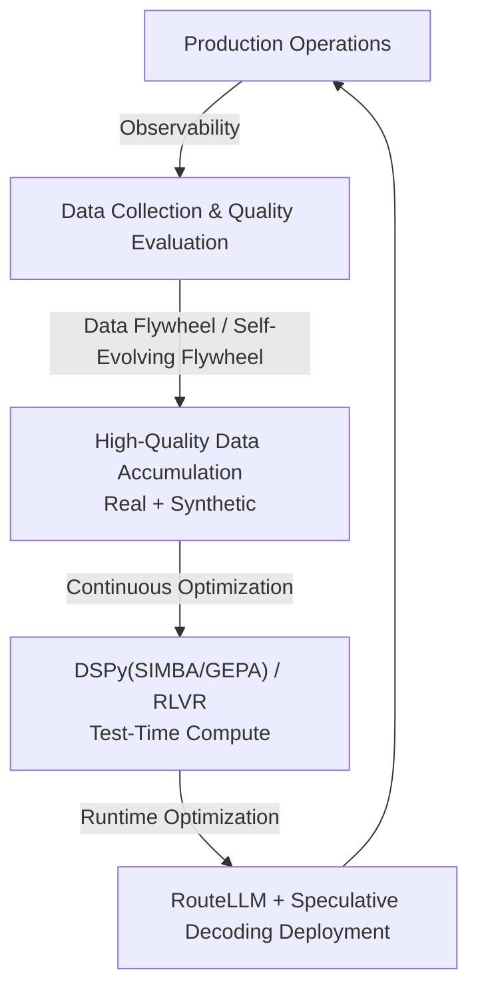

# Loop Engineering

## Overview

**Loop Engineering** is the practice of designing **self-improving cycles** for AI systems even after deployment. Under the principle "deployment is not the end but the beginning," it builds feedback loops that feed production data back into system improvement.



## Sub-documents

| Document | Content |
|----------|---------|
| [[en/AI/Engineering/Loop_Engineering/Data_Flywheel\|Data Flywheel]] | Self-reinforcing data cycles, Self-Evolving Flywheel, RLVR + synthetic data |
| [[en/AI/Engineering/Loop_Engineering/Continuous_Optimization\|Continuous Optimization]] | DSPy 3.0 (SIMBA/GEPA/GRPO), RLVR, Test-Time Compute Scaling |
| [[en/AI/Engineering/Loop_Engineering/Runtime_Optimization\|Runtime Optimization]] | Semantic Cache, RouteLLM, Speculative Decoding, vLLM/SGLang serving internals |
| [[en/AI/Engineering/Loop_Engineering/Production_Operations\|Production Operations]] | AI Gateways, deployment strategies, A/B testing, SRE/Chaos Engineering, FinOps |

## What Goes Wrong Without a Loop

```
Static AI system:
  Month 1 — User complaints increase (unknown reason)
  Month 2 — Competitor model improves
  Month 3 — System becomes outdated

With Loop Engineering:
  Month 1 — Failure patterns auto-detected → prompt improved
  Month 2 — Fine-tuned on accumulated data
  Month 3 — Faster improvement than competitors
```

## Role in AI Engineering

Loop Engineering is the **top-level layer that gives AI systems the ability to evolve**. When the data flywheel spins, a network effect occurs where larger user bases drive faster improvement. This becomes the core moat in competition between AI startups and large platforms.

## Related Concepts
[[en/AI/Engineering/Harness_Engineering/Observability_and_Tracing|Observability & Tracing]] · [[en/AI/Engineering/Harness_Engineering/LLM_as_a_Judge|LLM-as-a-Judge]] · [[en/AI/Engineering/Model_Engineering/PEFT_LoRA_QLoRA|PEFT/LoRA/QLoRA]]
