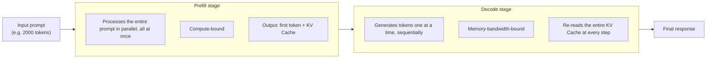

# Serving Engineering

## Overview

**Serving Engineering** covers the techniques for processing inference by maximizing GPU resource utilization inside a self-hosted serving engine. It is Loop Engineering's **infrastructure tier** — not a separate layer introducing a new object of control, but runtime optimization specialized to an infrastructure perspective.

Both share the goal of reducing cost and latency, but they intervene at different points — where [[en/AI/Engineering/Loop_Engineering/Runtime_Optimization|Runtime Optimization]] covers **how the application calls the API less often and more cheaply** (caching, routing, batching), this chapter covers **how an already-arrived request is processed as efficiently as possible on the GPU.**

## The Two-Stage Prefill/Decode Structure

LLM inference consists of two stages with entirely different characteristics. This is the single most important premise running through this whole chapter.



Processing both stages on the same GPU pool causes them to interfere with each other, since their resource demands differ — while compute-bound Prefill is running, memory-bandwidth-bound Decode requests suffer delays (head-of-line blocking). How to ease this structural tension is the core topic of [[en/AI/Engineering/Loop_Engineering/Serving_Engineering/Inference_Internals|Inference Internals]] (easing it on the same GPU) and [[en/AI/Engineering/Loop_Engineering/Serving_Engineering/Distributed_Serving|Distributed Serving]] (physically separating them).

## Key Metrics: TTFT / TPOT / Goodput

```
TTFT (Time To First Token)
  Time from request arrival to the first output token
  Determined mainly by Prefill-stage performance + queueing delay

TPOT (Time Per Output Token)
  Average time between generating each token from the second one onward
  Determined mainly by Decode-stage performance (governed by memory bandwidth)

Goodput
  Not raw throughput, but throughput that "meets SLA"
  e.g. only counting requests where TTFT < 1s and TPOT < 50ms
  → scheduling that achieves high throughput but violates latency SLAs is a failure from a goodput perspective
```

## Self-Hosted Serving Option Comparison

| Engine | Strengths | Best for |
|------|------|------------|
| **vLLM** | PagedAttention, broad model support, mature ecosystem | The default choice for general-purpose production serving |
| **SGLang** | RadixAttention, strong on structured output | Agent/multi-turn workloads with heavy prefix sharing |
| **TensorRT-LLM** | NVIDIA GPU optimization, FP8/NVFP4 | When maximum throughput is needed on the latest NVIDIA hardware |
| **llama.cpp** | Runs on CPU/edge too, low resource requirements | Local/edge deployment, small models |
| **Ollama** | Built on llama.cpp, very easy to install/manage | Developer local environments, prototyping |
| **TGI** (HuggingFace) | Integrated with the HuggingFace ecosystem | Quickly serving HF Hub models |

## Sub-documents

| Document | Contents |
|------|------|
| [[en/AI/Engineering/Loop_Engineering/Serving_Engineering/Inference_Internals\|Inference Internals]] | Optimization within a single GPU (pool) — KV Cache, PagedAttention, Continuous Batching, Chunked Prefill, RadixAttention, FlashAttention |
| [[en/AI/Engineering/Loop_Engineering/Serving_Engineering/Speculative_Decoding\|Speculative Decoding]] | Draft-model-based acceleration — EAGLE-3, Medusa, n-gram/Prompt Lookup, acceptance rate |
| [[en/AI/Engineering/Loop_Engineering/Serving_Engineering/Distributed_Serving\|Distributed Serving]] | Multi-GPU/multi-region — Disaggregated Prefill/Decode, KV Cache Transfer, TP/PP/EP parallelism, goodput scheduling, cold start |

## Boundaries

| Document | Covers |
|------|-----------|
| [[en/AI/Engineering/Loop_Engineering/Runtime_Optimization\|Runtime Optimization]] | Reducing the **number of requests/tokens on the API-calling side** itself — Semantic Cache, model routing, batching, streaming |
| **This chapter (Serving_Engineering)** | Processing already-arrived requests **inside the serving engine** as efficiently as possible from a GPU-resource standpoint |
| [[en/AI/Engineering/Loop_Engineering/Cost_Engineering/Cost_Engineering\|Cost Engineering]] | A watcher agent that **autonomously monitors and adjusts** the cost metrics of both layers above |
| [[en/AI/Engineering/Loop_Engineering/Production_Operations\|Production Operations]] | **Organization-level** production operations — gateways, deployment strategy, etc. |

## Role in AI Engineering

For organizations that have reached the scale where self-hosting becomes more cost-effective than API calls (the point where request volume is high enough that self-hosted GPU infrastructure costs less than metered API pricing), optimization at this layer directly shows up in total cost of ownership (TCO). As techniques like PagedAttention and RadixAttention become built into serving engines by default, practitioners implement them less often themselves, but "which engine to choose and why" remains an architectural decision.

## Related Concepts
[[en/AI/Engineering/Loop_Engineering/Runtime_Optimization|Runtime Optimization]] · [[en/AI/Engineering/Model_Engineering/Quantization|Quantization]] · [[en/AI/Engineering/Loop_Engineering/Cost_Engineering/Cost_Engineering|Cost Engineering]] · [[en/AI/Engineering/Loop_Engineering/Production_Operations|Production Operations]]

## Sources
- Kwon et al. (2023) "Efficient Memory Management for LLM Serving with PagedAttention" — [arXiv:2309.06180](https://arxiv.org/abs/2309.06180)
- Zheng et al. (2024) "SGLang: Efficient Execution of Structured Language Model Programs" — [arXiv:2312.07104](https://arxiv.org/abs/2312.07104)
- NVIDIA "TensorRT-LLM" docs — [nvidia.github.io/TensorRT-LLM](https://nvidia.github.io/TensorRT-LLM/)
- AI Engineering from Scratch, Phase 17 · Lessons 04-18 (serving engine internals, disaggregated serving, self-hosting) — [GitHub](https://github.com/rohitg00/ai-engineering-from-scratch/tree/main/phases/17-infrastructure-and-production)
