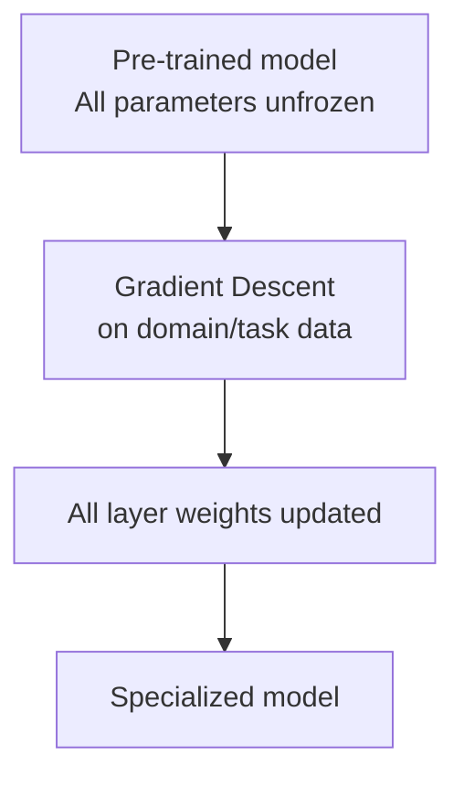
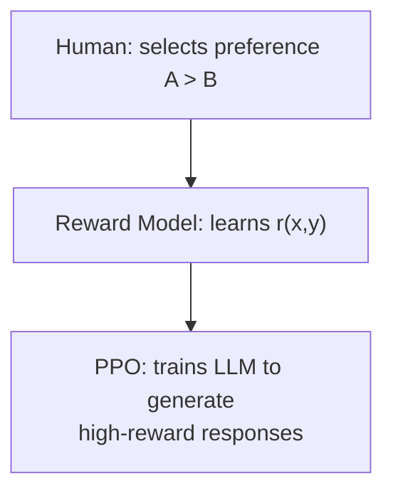

# Full Fine-Tuning

## Overview

**Full Fine-Tuning** is a technique that retrains **all parameters** of a pre-trained model on task- or domain-specific data. The most powerful but most expensive form of fine-tuning.

## How It Works



### SFT (Supervised Fine-Tuning)

The most common form of Full FT. Supervised learning with input→output pairs:

```python
# Training data example (Instruction Tuning format)
{
    "instruction": "Review the following contract and identify risky clauses.",
    "input": "<contract content>",
    "output": "Risk clause 1: Article 5, Section 3 - Unilateral termination conditions..."
}
```

### RLHF (Reinforcement Learning from Human Feedback)

The technique used in OpenAI's InstructGPT and ChatGPT:

1. **SFT stage**: Train base model on high-quality demonstration data
2. **Reward Model training**: Human evaluators compare response pairs → preference labels → Reward Model training
3. **PPO optimization**: Fine-tune LLM via RL (PPO algorithm) to maximize reward



**DPO (Direct Preference Optimization)**: Skips Reward Model training from RLHF and optimizes directly from preference data. More stable and simpler.

## Full FT vs PEFT Comparison

| Criteria | Full Fine-Tuning | PEFT (LoRA, etc.) |
|------|-----------------|---------------|
| **Trainable params** | 100% (billions) | 0.01~1% |
| **GPU memory** | Very high (tens of GB × multiple GPUs) | Low |
| **Performance** | Maximum | Close to Full FT |
| **Training time** | Long | Fast |
| **Catastrophic Forgetting** | High risk | Low risk |
| **Best for** | Complete behavior change | Rapid domain adaptation |

## When to Use

- When the model's fundamental behavior patterns must change (safety, policy compliance)
- When sufficient compute resources are available
- When millions+ of high-quality training samples exist
- When special output formats or languages must be deeply internalized

## Cost Optimization

```
Full FT memory = params × (weights + gradients + optimizer states)
  = 7B params × (2 + 2 + 8 bytes) = ~84 GB (FP32 Adam)

→ Reduce via BF16 training + Gradient Checkpointing + ZeRO-3 distributed training
```

- **Gradient Checkpointing**: Discard intermediate activations and recompute during backprop → memory savings
- **DeepSpeed ZeRO**: Distribute optimizer states, gradients, and parameters across multiple GPUs

## Role in AI Engineering

Full FT is the most powerful tool in the Model Engineering layer, but in most practical applications it is replaced by LoRA/QLoRA (→ [[en/AI/Engineering/Model_Engineering/PEFT_LoRA_QLoRA|PEFT_LoRA_QLoRA]]). RLHF is the core training pipeline for commercial models like GPT-4, Claude, and Gemini.

## Related Concepts
[[en/AI/Engineering/Model_Engineering/Pre-training_and_Continual_Learning|Pre-training & Continual Learning]] · [[en/AI/Engineering/Model_Engineering/PEFT_LoRA_QLoRA|PEFT_LoRA_QLoRA]] · [[en/AI/Engineering/Model_Engineering/Model_Distillation|Model Distillation]]

## Sources
- Ouyang et al. (2022) "Training language models to follow instructions with human feedback" (InstructGPT) — [arXiv:2203.02155](https://arxiv.org/abs/2203.02155)
- Rafailov et al. (2023) "Direct Preference Optimization" — [arXiv:2305.18290](https://arxiv.org/abs/2305.18290)
- Karpathy, A. "Let's reproduce GPT-2" — [YouTube](https://www.youtube.com/watch?v=l8pRSuU81PU)
