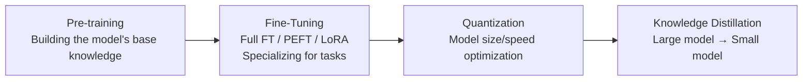
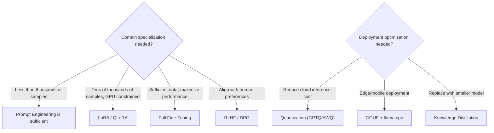

# Model Engineering

## Overview

**Model Engineering** is the bottom-most layer of the AI Engineering stack, covering all techniques for **creating, adjusting, and optimizing the model itself**. It answers the question: "What model, and how do we train/fine-tune/compress it?"

## Technical Domains

## Sub-documents

| Document | Content |
|------|------|
| [[en/AI/Engineering/Model_Engineering/Pre-training_and_Continual_Learning\|Pre-training & Continual Learning]] | Large-scale pre-training, Chinchilla law, catastrophic forgetting |
| [[en/AI/Engineering/Model_Engineering/Full_Fine-Tuning\|Full Fine-Tuning]] | SFT, RLHF(PPO), DPO — full weight updates |
| [[en/AI/Engineering/Model_Engineering/PEFT_LoRA_QLoRA\|PEFT / LoRA / QLoRA]] | Parameter-efficient fine-tuning, LoRA/QLoRA math |
| [[en/AI/Engineering/Model_Engineering/Quantization\|Quantization]] | INT8/INT4 quantization, GPTQ/AWQ/GGUF |
| [[en/AI/Engineering/Model_Engineering/Model_Distillation\|Knowledge Distillation]] | Teacher-Student, DistilBERT/Phi series |

## When to Choose Which Technique

## Role in AI Engineering

Model Engineering is the **layer that builds the brain of an AI system**. Most teams use foundation models (GPT-4, Claude, Llama) as-is or apply lightweight LoRA tuning, but specialized domains or strict cost/latency requirements demand working through this entire layer.

## Related Concepts
[[en/AI/Engineering/Prompt_Engineering/Prompt_Engineering|Prompt Engineering]] · [[en/AI/Engineering/Harness_Engineering/Benchmarking|Benchmarking]] · [[en/AI/Engineering/Loop_Engineering/Continuous_Optimization|Continuous Optimization]]
