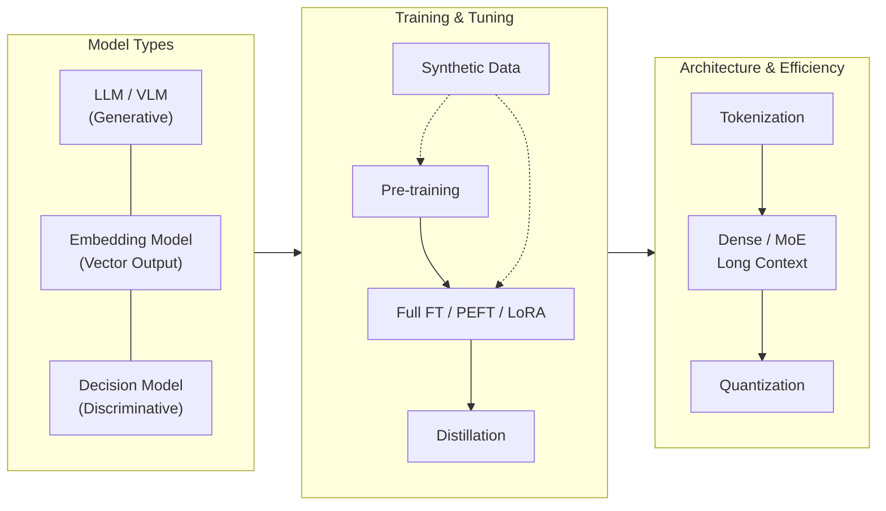
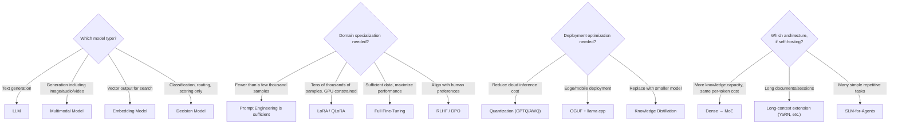

# Model Engineering

## Overview

**Model Engineering** is the lowest layer of the AI Engineering stack, covering all techniques for **building, tuning, and optimizing the model itself**. It answers three questions: what **model types** to use (Model Types), how to **build and modify** their weights (Training and Tuning), and how to **structure and streamline** them (Architecture and Efficiency).

## Included Technology Areas

```mermaid
flowchart LR
    subgraph MT["Model Types"]
        LLM["LLM / VLM<br/>(Generative)"] --- EMB["Embedding Model<br/>(Vector Output)"]
        EMB --- DEC["Decision Model<br/>(Discriminative)"]
    end
    subgraph TT["Training & Tuning"]
        P["Pre-training"] --> F["Full FT / PEFT / LoRA"] --> D["Distillation"]
        SD["Synthetic Data"] -.-> P
        SD -.-> F
    end
    subgraph AE["Architecture & Efficiency"]
        TOK["Tokenization"] --> ARCH["Dense / MoE<br/>Long Context"] --> Q["Quantization"]
    end
    MT --> TT
    TT --> AE
```

## Sub-documents

It is divided into three subcategories. **Model Types** covers model classification based on output format (token/vector/judgment), **Training & Tuning** covers methods for creating and modifying weights, and **Architecture & Efficiency** covers methods for determining capacity and cost through structural choices.

### Model Types

| Document | Content |
|------|------|
| [[en/AI/Engineering/Model_Engineering/Model_Types/Model_Types\|Model_Types]] | Category Overview |
| [[en/AI/Engineering/Model_Engineering/Model_Types/Large_Language_Models\|Large_Language_Models]] | Decoder-only Transformer-based general generation models — base/instruct/reasoning, open/closed weight |
| [[en/AI/Engineering/Model_Engineering/Model_Types/Multimodal_Models\|Multimodal_Models]] | VLM Architectures (Adapter-based vs Native), Image Tokenization, Audio/Video, MMMU/DocVQA |
| [[en/AI/Engineering/Model_Engineering/Model_Types/Embedding_Models\|Embedding_Models]] | The embedding/reranker models themselves — Bi/Cross-encoder/Late Interaction, Matryoshka, MTEB |
| [[en/AI/Engineering/Model_Engineering/Model_Types/Multimodal_Embeddings\|Multimodal_Embeddings]] | Multimodal Embedding Models — Alignment Learning, modality gap, EmbeddingGemma 2 · Gemini Embedding 2 |
| [[en/AI/Engineering/Model_Engineering/Model_Types/Decision_Models\|Decision_Models]] | System One Models such as Jev · OpenAI Decisions · Microsoft-Decision-1, Choice/Score/Noul Primitives, logprob wrapper vs Learned, calibration(ECE) |

### Training and Tuning

| Document | Content |
|------|------|
| [[en/AI/Engineering/Model_Engineering/Training_and_Tuning/Training_and_Tuning\|Training_and_Tuning]] | Category Overview |
| [[en/AI/Engineering/Model_Engineering/Training_and_Tuning/Pre-training_and_Continual_Learning\|Pre-training_and_Continual_Learning]] | Large-scale Pre-training, Chinchilla Law, Catastrophic Forgetting |
| [[en/AI/Engineering/Model_Engineering/Training_and_Tuning/Full_Fine-Tuning\|Full_Fine-Tuning]] | SFT, RLHF(PPO), DPO, GRPO/RLVR — Full Weight Update |
| [[en/AI/Engineering/Model_Engineering/Training_and_Tuning/PEFT_LoRA_QLoRA\|PEFT_LoRA_QLoRA]] | Parameter-Efficient Fine-tuning, LoRA/QLoRA Math |
| [[en/AI/Engineering/Model_Engineering/Training_and_Tuning/Model_Distillation\|Model_Distillation]] | Teacher-Student, DistilBERT/Phi Series |
| [[en/AI/Engineering/Model_Engineering/Training_and_Tuning/Synthetic_Data_and_Curation\|Synthetic_Data_and_Curation]] | Self-Instruct/Evol-Instruct, Judge Filtering, Dedup/Decontamination, Model Collapse |

### Architecture and Efficiency

| Document | Content |
|------|------|
| [[en/AI/Engineering/Model_Engineering/Architecture_and_Efficiency/Architecture_and_Efficiency\|Architecture_and_Efficiency]] | Category Overview |
| [[en/AI/Engineering/Model_Engineering/Architecture_and_Efficiency/Tokenization\|Tokenization]] | BPE/WordPiece/SentencePiece, Vocabulary Size Trade-off, Multilingual/Korean Token Efficiency |
| [[en/AI/Engineering/Model_Engineering/Architecture_and_Efficiency/Model_Architectures_and_MoE\|Model_Architectures_and_MoE]] | Dense vs MoE, RoPE/YaRN Long Context, SLM-for-Agents |
| [[en/AI/Engineering/Model_Engineering/Architecture_and_Efficiency/Quantization\|Quantization]] | INT8/INT4 Quantization, GPTQ/AWQ/GGUF |

## When to Choose Which Technique

```mermaid
flowchart TD
    D0{Which model type?} -->|"Text generation"| D1["LLM"]
    D0 -->|"Generation including image/audio/video"| D2["Multimodal Model"]
    D0 -->|"Vector output for search"| D3["Embedding Model"]
    D0 -->|"Classification, routing, scoring only"| D4["Decision Model"]

    A{Domain specialization needed?} -->|"Fewer than a few thousand samples"| PE[Prompt Engineering is sufficient]
    A -->|"Tens of thousands of samples, GPU constrained"| LR["LoRA / QLoRA"]
    A -->|"Sufficient data, maximize performance"| FF[Full Fine-Tuning]
    A -->|"Align with human preferences"| RL["RLHF / DPO"]

    B{Deployment optimization needed?} -->|"Reduce cloud inference cost"| QT["Quantization (GPTQ/AWQ)"]
    B -->|"Edge/mobile deployment"| GG["GGUF + llama.cpp"]
    B -->|"Replace with smaller model"| KD[Knowledge Distillation]

    C{"Which architecture,<br/>if self-hosting?"} -->|"More knowledge capacity, same per-token cost"| MOE["Dense → MoE"]
    C -->|"Long documents/sessions"| YARN["Long-context extension (YaRN, etc.)"]
    C -->|"Many simple repetitive tasks"| SLM["SLM-for-Agents"]
```

## Role in AI Engineering

Model Engineering is the **layer that builds the brain of an AI system**. Most teams use foundation models (GPT-4, Claude, Llama) as-is or apply lightweight LoRA tuning, but specialized domains or strict cost/latency requirements demand working through this entire layer.

## Related Concepts
[[en/AI/Engineering/Prompt_Engineering/Prompt_Engineering|Prompt Engineering]] · [[en/AI/Engineering/Harness_Engineering/Harness_Evaluation/Benchmarking|Benchmarking]] · [[en/AI/Engineering/Loop_Engineering/Continuous_Optimization|Continuous Optimization]]
