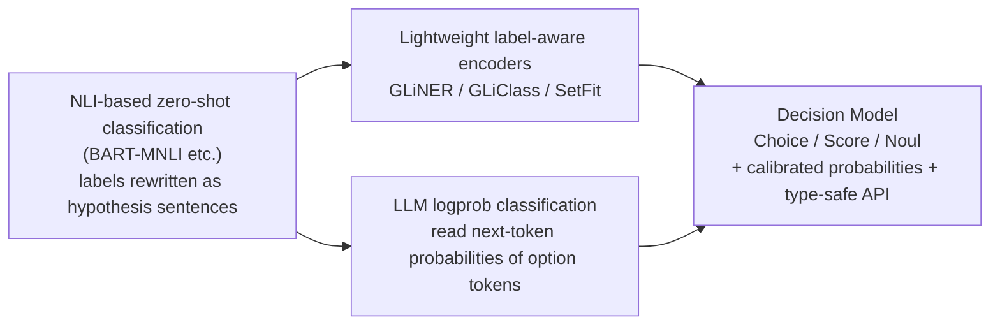
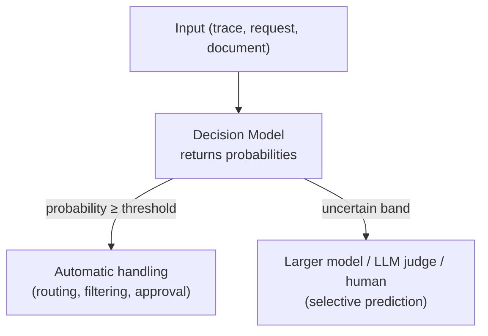

# Decision Models (System One Models)

## Overview

A **Decision Model** is a discriminative model that does not generate text. Given user-specified options, scales, or statements, it returns only **typed values together with probabilities and confidence scores**. Its purpose is to strip the long output, high latency, and unstable formatting of generative LLMs out of tasks where the job is to look at a short input and quickly pick one answer: classification, routing, scoring, and filtering.

When TypeSafe AI released **Jev** in September 2026, the category began to be called "System One Models" (a name borrowed from Kahneman's fast, intuitive thinking). Open-weight projects then rapidly produced reproductions in three forms: (a) newly trained models, (b) existing LLMs tuned with a head or LoRA, and (c) wrappers that simply read an existing LLM's next-token **logprobs**. From late September, frontier labs such as OpenAI and Microsoft also began offering their own Decision Models as APIs. None of the ideas is new on its own (NLI-based zero-shot classification, scoring options from logits). What is new is delivering **zero-shot flexibility, calibrated probabilities, and a type-safe API** as one package.

Where [[en/AI/Engineering/Prompt_Engineering/Structured_Output|Structured_Output]] is about fitting generated text to a schema, this document covers **a model class that never generates text in the first place**.

## Generative vs Discriminative

| Aspect | Generative LLM (System Two style) | Decision Model (System One style) |
|--------|-----------------------------------|-----------------------------------|
| Output | Free text → parsing | Per-option probabilities / scores / true-probability |
| Inference | Sequential token decoding (incl. CoT) | One prefill pass, no decoding |
| Latency / cost | Scales with output token count | Typically billed on input tokens only |
| Format errors | Possible (retries needed) | Values outside the options are structurally impossible |
| Explanation | Can provide reasoning | No rationale — probabilities only |
| Best suited for | Complex reasoning, generation, explanation | Routing, classification, moderation, scoring |

## Jev

TypeSafe AI's Jev (early access released 2026-09-15) exposes **three question primitives**.

| Primitive | Input | Returns |
|-----------|-------|---------|
| **Choice** | State + list of options | Probability per option |
| **Score** | State + ordered scale | Probability/score per scale level |
| **Noul** | State + true/false statement | Probability that the statement is true (0–1) |

Multiple questions can be sent in parallel in one request, and responses are schema-constrained so **values outside the options cannot occur**. Training is reported to use synthetic data and **RLCD** (Reinforcement Learning for Calibrated Decisions), which optimizes **the accuracy of stated probabilities against outcomes** (a higher stated probability should mean a higher hit rate) rather than human preference. The architecture and a technical report have not been published.

TypeSafe's self-reported figures are 70–500ms responses, $0.042 per million input tokens (output free), and 40–400x cheaper and 40–200x faster than frontier LLMs. These numbers come from **the vendor's own benchmarks** and should be read as near-best-case results.

## Frontier Labs Enter

Within two weeks of Jev's release, OpenAI and Microsoft shipped APIs of the same shape. The question primitives of all three products have converged on essentially the same three kinds (true/false · choice · scale).

| Aspect | Jev (TypeSafe AI) | OpenAI Decisions API | Microsoft-Decision-1 |
|------|-------------------|----------------------|----------------------|
| Release | 2026-09-15 early access | 2026-09-30 limited preview → 2026-10-06 public beta | 2026-10-09 Microsoft Foundry |
| Model | Undisclosed | `gpt-6-luna` only | Qwen3.5-9B post-training |
| Primitives | Noul / Choice / Score | `predicate` / `choice` / `score` | Yes/no / multiple choice / scoring |
| Returns | Probability per option | Per-option `probabilities` + separate `confidence`; `refusal` possible | Probability per option |
| Input | Text | Text + images (up to 128) | Text |
| Price (1M input) | $0.042, output free | $0.10, output free | $0.042, output free |
| Weights | Closed (hosted API) | Closed | Closed (API only) |

### OpenAI Decisions API

Sam Altman announced it at DevDay (2026-09-30), saying that "by focusing the model on that choice, we can make it extremely fast", and it opened as a public beta for all developers on October 6 (no GA date yet). A single `POST /v1/decisions` request can carry several independent questions; questions that depend on each other must go in separate requests. `score` returns the probability-weighted average of the level indices.

**How `confidence` is computed and how the per-option distribution is produced have not been disclosed.** Speed is backed only by vendor figures — "about 10x faster than the Responses API" and 150ms (a DevDay slide) — while p50/p95, rate limits, and the maximum number of options are unpublished. Any question can come back as a `refusal`, a behavior Jev does not have, so automated pipelines must treat refusals as a separate branch. Besides text it accepts image input, and a guide for calling Decisions from GPT-Live voice sessions was released alongside it.

### Microsoft-Decision-1

Microsoft post-trains the open-weight Qwen3.5-9B and offers it only as an API on Microsoft Foundry. It is a large-cloud product built on the "trained Decision Model" approach in the implementation table below (layering decision training onto an existing LLM). It is priced the same as Jev at $0.042 per 1M input tokens, and Microsoft has announced future versions based on MAI and OpenAI models. The headline uses are task classification, prioritization, verification, and agent workflow control.

As in-house case studies, Microsoft reports classifying 10,000+ pieces of Xbox feedback by topic at quality similar to GPT-6 Sol for about 1/200 of the cost and more than 14x faster, and running Copilot response-quality evaluation about 100x faster. All of these are **internal measurements**; there are no public benchmark scores.

### Early Comparison and Implications

One developer compared OpenAI Decisions (beta) and Jev (v1.13.0) under identical conditions on BANKING77 77-way intent classification (770 items).

| API | Guidance | Accuracy | ECE ↓ | Brier ↓ | Mean latency |
|-----|------|--------|-------|---------|-----------|
| Decisions | Label definitions only | 78.96% | 4.35% | 0.3163 | 144ms |
| Jev | Label definitions only | 81.17% | 9.33% | 0.3078 | 298ms |
| Decisions | Definitions + 2 examples per label | 84.16% | 4.63% | 0.2472 | 194ms |
| Jev | Definitions + 2 examples per label | 85.32% | 6.50% | 0.2206 | 520ms |

- **The calibration metrics disagree**: Decisions is better on ECE, Jev on Brier score. This is why a vendor's "calibrated" claim should not be judged on a single metric.
- **With labels, trained classifiers still lead**: a MiniLM classifier fine-tuned on the same data reached 89.87%, beating both APIs.
- **Limitations**: a single sample, a beta service, and measurements taken on different dates, so the latency comparison is not controlled. Decisions' refusals (2–7 items) were counted as wrong.

As the primitives converge, an interface that is swappable across vendors is taking shape, but **how probabilities are produced and what `confidence` means differ by vendor.** When switching vendors or upgrading versions, do not carry thresholds over as-is — re-measure calibration on your own data.

## Lineage



## Four Implementation Approaches

| Approach | Method | Examples | Calibration | Notes |
|----------|--------|----------|-------------|-------|
| **Trained Decision Model** | Attach a decision head to an encoder/LLM, LoRA-tune it, or train from scratch | Laya (ModernBERT-based), Kev (Qwen3.5 LoRA + pointer head), NanoJev (0.6B scratch), pplx-decider / Clef (27B class), Microsoft-Decision-1 (Qwen3.5-9B post-training, API only) | Some report post-hoc calibration such as temperature scaling | Whether training code and data are released varies by project |
| **Logprob wrapper** | Model stays frozen. List options in the prompt and softmax the option-token logits | mini-jev (Qwen3-4B), SemIf, openjev-sglang (prefill-only server), AnyJev (Nokia) | Most **make no calibration claim** (AnyJev is an exception — see below) | No retraining needed; can be sensitive to option order |
| **Classic zero-shot classifier** | An NLI model or label-aware encoder takes labels at runtime | NLI-head models, GLiClass, SetFit (few-shot) | Scores are often not calibrated probabilities | Runs on CPU; suited to short-input classification |
| **Structured output library** | Constrain any LLM's output to a schema or grammar | Outlines, Instructor, DSPy | Not applicable (no probabilities) | Types are guaranteed, but no calibrated confidence |

The project list above is a snapshot as of October 2026, and most are newly created projects only a few weeks old. Performance and license claims for individual projects should be verified directly before adoption.

### Minimal Logprob Wrapper

The simplest way to imitate the Choice primitive with an existing open-weight LLM. Attach letter labels to the options, then take **only the label tokens' logits from the next-token distribution** at the answer position and softmax them.

```python
import torch
from transformers import AutoModelForCausalLM, AutoTokenizer

model_id = "Qwen/Qwen3-4B-Instruct"  # Example model — replace with an instruct model you can actually use
tok = AutoTokenizer.from_pretrained(model_id)
model = AutoModelForCausalLM.from_pretrained(model_id, torch_dtype=torch.bfloat16)

def choose(state: str, question: str, options: list[str]) -> dict[str, float]:
    labels = [chr(ord("A") + i) for i in range(len(options))]
    listing = "\n".join(f"{l}. {o}" for l, o in zip(labels, options))
    prompt = f"{state}\n\n{question}\n{listing}\nAnswer with a single letter.\nAnswer:"

    ids = tok(prompt, return_tensors="pt")
    with torch.no_grad():
        logits = model(**ids).logits[0, -1]  # Next-token logits at the last position (no decoding)

    # Keep only the label token ids and softmax → values outside the options are structurally impossible
    label_ids = [tok.encode(" " + l, add_special_tokens=False)[-1] for l in labels]
    probs = torch.softmax(logits[label_ids].float(), dim=-1)
    return dict(zip(options, probs.tolist()))
```

This approach has three limitations. ① The **order and label bias** (position bias) of the options in the prompt leaks into the probabilities. ② Softmax only normalizes within the options, so the result is **relative dominance among options, not the probability of being correct**. ③ Without separate calibration it tends toward over-confidence. Order bias can be reduced by shuffling the options and averaging over several runs, and some projects claim to guarantee option-order invariance by design.

**AnyJev** (Apache-2.0) from Nokia Applied Research starts from this wrapper and closes these gaps in stages. Every result carries its level, and `require=` rejects results below a given level.

- **L0 (zero labels)**: rotate the options through K cyclic shifts and combine in log space (removing position bias), then divide out the label prior with batch calibration or contextual calibration. On Qwen3-8B / BANKING77 20-way, the rate at which the answer flips when the options are reversed drops from 0.230 to 0.073.
- **L1 (100–500 labels)**: temperature scaling on top of L0. The ranking is unchanged; only the confidence is calibrated.
- **L2 (100–300 labels)**: a per-question **closed-form linear head** (shrunk LDA or ridge) on the hidden state of a block at about 2/3 of the model's depth. No gradients and no weight changes, and the forward pass stops at that block, so it costs 0.68–0.84× a plain forward. It sits between trained Decision Models and wrappers, close to a linear probe.

Labels are "(input, correct answer) pairs for one fixed question", collected from human review, downstream outcomes, or the verdicts of the LLM being replaced. A head is needed per question and per model, but when the wording or option order changes it follows by re-estimating only the feature mean and variance from about 30 unlabelled requests. Zero-label L0 accuracy is below Jev's published figure; only L2 exceeds it. L2 needs hidden states, so it runs only with local transformers or vLLM serving; commercial APIs that expose only logprobs can in principle reach L1 at most (there is currently no backend for commercial APIs).

## Calibration

The value of a Decision Model lies less in accuracy than in **whether the probabilities can be trusted enough to put a threshold on them**.

- **ECE** (Expected Calibration Error): the average gap between predicted confidence and actual hit rate per confidence bin. Lower is better calibrated.
- **Brier score**: squared error between probabilistic predictions and outcomes. Reflects accuracy and calibration together.
- **Temperature scaling**: learn a single temperature on the logits using a small validation set for post-hoc calibration. Used with both logprob wrappers and trained models; one project reports ECE dropping from 0.466 to 0.081.
- **Coverage@risk**: when items are handled in order of confidence, the share that can be handled before the error rate exceeds a target (e.g. 5%). It shows the practical value of calibration directly — AnyJev reports 7.7% for raw logits → 52.0% at L1 (Qwen3-8B, BANKING77 20-way).
- **Pitfall**: the probability is often merely "concentration of the distribution", not "likelihood of being correct". Using the confidence of a wrapper that makes no calibration claim directly as a threshold is risky.

This problem shares a root with the score inconsistency of LLM rerankers ([[en/AI/Engineering/Context_Engineering/Retrieval_Strategies/RAG/Advanced_Retrieval|Advanced_Retrieval]]) and the uncertainty estimation in cascade routing ([[en/AI/Engineering/Loop_Engineering/Cost_Engineering/Complexity_Aware_Model_Routing|Complexity_Aware_Model_Routing]]).

## Independent Evaluation of Jev (Deußer et al., 2026)

A University of Bonn team evaluated Jev v1.13.0 on 37 public datasets (sentiment, intent/topic, NLI, reading comprehension, commonsense reasoning, safety/moderation, rubric scoring). The baselines were the open-weight Qwen3.8-27B and Gemma-4-E4B, using **their next-token probabilities read directly** (i.e. the logprob wrapper approach).

| Item | Result |
|------|--------|
| Accuracy | Ahead of Qwen on 27 of 37 datasets, ahead of Gemma on all |
| Choice probability calibration | Pooled ECE 0.028 across 22 datasets — good |
| Noul (true/false) probability | Slightly under-confident → lower recall, ranking metric (AUROC) still good |
| Multi-label | Over-predicts positives (mean probability 0.209 vs actual 0.041). Tuning thresholds on 1,000 training examples improves F₁ substantially |
| Weaknesses | Low-resource languages, noisy labels, fine-grained 5-class sentiment, legal judgments needing domain knowledge, rubric scoring of generated text |
| Caveat | Anomalous pattern on MMLU calculation subjects → the authors could not rule out data contamination |

The authors state as limitations that the open models were scored in a single pass without reasoning, so their performance may be understated, and that the results are specific to one version (1.13.0).

## Usage Patterns



- **Routing and intent classification**: decide which tool, model, or workflow to send a request to at the front of an agent. Escalate to a larger model when probability is low. Microsoft-Decision-1 and OpenAI Decisions both present agent action selection and workflow control as headline uses, and OpenAI also documents a setup where a voice agent calls Decisions mid-conversation.
- **Moderation and guardrails**: judge whether input/output violates policy using Noul.
- **Exhaustive eval + sampled deep review**: run the cheap judgment on every trace and send only a sample to an LLM judge for careful review. Arize notes that Jev cannot fully replace an LLM judge (no rationale, accuracy slightly behind frontier models) and recommends this kind of hybrid.
- **Selective prediction**: use calibrated probabilities to split "bands to handle automatically" from "bands to hand to a human" via thresholds.

## Boundary Definitions

| Document | What it covers |
|------|-----------|
| **This document (Decision_Models)** | Model classes and implementation methods that **return calibrated probabilities** without generating text |
| [[en/AI/Engineering/Model_Engineering/Model_Types/Large_Language_Models\|Large_Language_Models]] | Defining the types of generative LLMs themselves (base/instruct/reasoning) — Decision Models are an alternative that does not use that generation path |
| [[en/AI/Engineering/Prompt_Engineering/Structured_Output\|Structured_Output]] | Techniques for conforming generative LLM outputs to a schema — Guarantees type but not probability |
| [[en/AI/Engineering/Harness_Engineering/Harness_Evaluation/LLM_as_a_Judge\|LLM_as_a_Judge]] | Evaluating generative LLMs with evidence — Slow and expensive, but explainable |
| [[en/AI/Engineering/Model_Engineering/Model_Types/Embedding_Models\|Embedding_Models]] | Pair scoring models like Cross-encoder — Discriminative models specialized in search relevance |
| [[en/AI/Engineering/Loop_Engineering/Cost_Engineering/Complexity_Aware_Model_Routing\|Complexity_Aware_Model_Routing]] | Model selection strategies based on difficulty — Decision Models can be used as the router itself |
| [[en/AI/Engineering/Harness_Engineering/Harness_Safety/Guardrail_Engineering\|Guardrail_Engineering]] | Designing input/output safety mechanisms — Decision Models are candidates for that judge |

## Role in AI Engineering

A Decision Model is a component that replaces the "short judgment" calls scattered through agent and RAG pipelines (routing, relevance checks, policy checks, evaluation scoring) with **low-latency, low-cost, calibrated probabilities**. However, it cannot replace the reasoning and explanation abilities of a generative LLM, so it must be designed together with a structure that hands uncertain cases outside the threshold to a larger model or a human. Before adoption, it is essential to **measure calibration (ECE) and threshold performance yourself on your own domain data**.

## Related Concepts
[[en/AI/Engineering/Prompt_Engineering/Structured_Output|Structured_Output]] · [[en/AI/Engineering/Harness_Engineering/Harness_Evaluation/LLM_as_a_Judge|LLM_as_a_Judge]] · [[en/AI/Engineering/Harness_Engineering/Harness_Safety/Guardrail_Engineering|Guardrail_Engineering]] · [[en/AI/Engineering/Loop_Engineering/Cost_Engineering/Complexity_Aware_Model_Routing|Complexity_Aware_Model_Routing]] · [[en/AI/Engineering/Model_Engineering/Model_Types/Embedding_Models|Embedding_Models]] · [[en/AI/Engineering/Model_Engineering/Training_and_Tuning/Model_Distillation|Model_Distillation]]

## Sources
- Deußer, Sparrenberg, Sifa (2026) "Evaluating and Benchmarking the System One Model Jev" — [arXiv:2609.37647](https://arxiv.org/html/2609.37647v1)
- Arize, "TypeSafe Jev: Can Decision Models Replace LLM Judges?" — [arize.com](https://arize.com/blog/typesafe-jev-llm-judge/)
- Glean, "Jev and the return of the zero-shot classifier" — [glean.com](https://www.glean.com/blog/jev-zero-shot-classifier)
- "Jev (AI model)" — [Wikipedia](https://en.wikipedia.org/wiki/Jev_(AI_model))
- TechCrunch, "OpenAI's Jev clone could help the frontier lab stop its swarming agents" (2026-09-30) — [techcrunch.com](https://techcrunch.com/2026/09/30/openais-jev-clone-could-help-the-frontier-lab-stop-its-swarming-agents/)
- Evalgent, "OpenAI Decisions API vs Jev: Pricing, Probabilities, Voice" (summary of OpenAI's official guides as of 2026-10-07) — [evalgent.com](https://www.evalgent.com/blog/openai-decisions-api-vs-jev-voice-agents)
- "OpenAI Decisions API: How Does Jev's Big-Lab Competitor Fare?" (2026-10-08, BANKING77 comparison — single sample, beta) — [stacktoheap.com](https://stacktoheap.com/blog/2026/10/08/jev-the-decisions-strike-back/)
- Microsoft, "Introducing Microsoft-Decision-1 in Microsoft Foundry for decision and classification workloads" — [techcommunity.microsoft.com](https://techcommunity.microsoft.com/blog/azure-ai-foundry-blog/introducing-microsoft-decision-1-in-microsoft-foundry-for-decision-and-classific/4562742)
- Digital Today, "Microsoft joins decision-focused AI model race with Microsoft-Decision-1" (2026-10-09; performance figures are Microsoft's internal measurements) — [digitaltoday.co.kr](https://www.digitaltoday.co.kr/en/view/112711/microsoft-joins-decision-focused-ai-model-race-unveils-microsoft-decision-1)
- systemonemodels.org, "Jev alternatives: open-source reproductions, local models and classifiers" — [systemonemodels.org](https://systemonemodels.org/examples/alternatives/) (community-curated — re-verify per-project figures in each repo)
- Zhang et al. (2026), AnyJev — [github.com/nokia-applied-research/AnyJev](https://github.com/nokia-applied-research/AnyJev) (figures are the authors' own measurements; the gold labels of the typed-decisions benchmark are teacher-LLM outputs)
