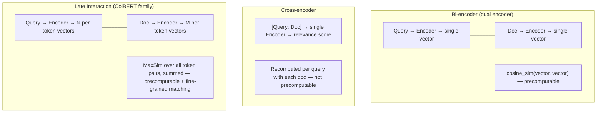

# Embedding & Reranker Models

## Overview

Everything RAG, GraphRAG, and semantic search do rests on **embedding models**. Retrieval pipeline design — chunking, vector storage, reranking — is usually discussed on the assumption that "good embeddings already exist." This document addresses that assumption itself — **how to choose an embedding model, why a particular architecture is chosen, and how to divide labor with rerankers.**

```
Embedding = lossy compression that maps heterogeneous data (text/image/audio) into a shared vector space
  Semantic similarity = geometric distance (the same principle as latitude/longitude being a 2D embedding of location)
  Embeddings produced by different models are not compatible with each other → the entire pipeline must pin one version
```

## 3 Architectures: Bi-encoder vs Cross-encoder vs Late Interaction



| | Bi-encoder | Cross-encoder | Late Interaction (ColBERT) |
|---|---|---|---|
| **When computed** | Query/doc encoded independently (precomputed) | Query+doc fed together (real-time) | Query/doc encoded independently, per-token vectors kept |
| **Speed** | Very fast (ANN index possible) | Slow (one forward pass per candidate) | Medium (more storage/compute than bi-encoder) |
| **Accuracy** | Medium (whole sentence collapsed to one vector) | High (token-level interaction) | High (token-level interaction + precomputable) |
| **Use** | First-pass retrieval (Top-K from a large candidate pool) | Reranking (reorder a small candidate set) | First-pass retrieval + fine-grained matching at once |
| **Representative models** | Sentence-BERT, E5, BGE, Qwen3-Embedding, gemini-embedding-001, EmbeddingGemma, OpenAI text-embedding-3 | Cohere Rerank, bge-reranker, Qwen3-Reranker, evolutions of Vertex's two-tower encoder | ColBERT (Khattab & Zaharia, 2020), XTR (Lee, 2023), ColPali (Faysse, 2024) |

**Practical pattern**: first-pass retrieval over a large candidate pool with a bi-encoder (Top-100~500) → reorder with a cross-encoder or late-interaction model (Top-5~20). See [[en/AI/Engineering/Context_Engineering/Retrieval_Strategies/RAG/Advanced_Retrieval|Advanced Retrieval]] for where the reranking stage sits in the pipeline.

## Matryoshka Representation Learning — Choosing Dimensions

**Matryoshka Embedding** (Kusupati et al., 2022) trains multiple resolutions of representation nested inside a single embedding vector. Like a Russian nesting doll, truncating just the first N dimensions of the vector still yields a valid embedding on its own.

```
Full vector: [d1, d2, d3, ..., d3072]  (e.g. a 3072-dim model)
  Using only the first 1024 dims → 1/3 the storage, ~2% quality drop
  Using only the first 256 dims  → 1/12 the storage, larger quality drop but still usable

→ Different truncation points can be used at different serving stages:
  Coarse first-pass filtering = 256 dims (fast, cheap)
  Final reranking             = full dims (accurate)
```

Truncating from 3072→1024 dims cuts vector-DB storage cost to roughly 1/3 while quality drops only about 2% — a trade-off repeatedly observed in practice. Since 2025, Matryoshka Quantization has combined this with quantization to push storage costs down further.

## Learning Principles: Contrastive Learning and InfoNCE

Embedding models are mostly trained with **contrastive learning**. `(query, positive)` pairs are grouped into a batch, and the **InfoNCE** loss is minimized so that each query is pulled close to its own positive and pushed away from every other document in the batch (**in-batch negatives**).

```
loss = -log( exp(sim(q, d+) / τ) / Σ_j exp(sim(q, d_j) / τ) )    # τ: temperature
```

- Larger batches lead to more negatives, resulting in more refined representations → Large batch size and gradient caching are key variables for learning quality.
- Pre-training (large-scale weak-label pairs) → Fine-tuning (high-quality pairs + hard negatives) → The order of distillation in large models is common. Smaller models distill the scores of large embedders or re-rankers to boost performance relative to their size.
- The triplet learning in the "Domain Fine-tuning" section below is the application of the same loss to domain data.

## LLM-based Embedders and Instruction Prefix

Top-tier models since 2024 use **decoder-only LLMs as the backbone** instead of BERT-like encoders. A single vector is extracted using the last token or mean pooling and is L2-normalized. Qwen3-Embedding, Gemini Embedding, Microsoft harrier-oss-v1, and EmbeddingGemma 2 are examples of this structure, inheriting the multilingual, code, and long-context capabilities of the pre-trained LLM.

This class is sensitive to **instruction/task prefixes**. Since they are trained to produce different vectors depending on the purpose of the same document, many models adhere to the convention of attaching task instructions only to the query side.

```
query   : "Instruct: Retrieve documents that answer the given question\nQuery: What is the refund policy?"
document: "Refunds are available within 7 days of purchase ..."   # many models do not attach a prefix to the document
```

If the prefix convention specified in the model card (`query:`/`passage:`, `task_type=RETRIEVAL_QUERY`, etc.) is violated, performance drops noticeably. Some models, like harrier-oss-v1, also specify "performance degradation if instructions are not attached to the query."

## Dense·Sparse·Multi-vector Integrated Model

When one model outputs multiple representations simultaneously, index design becomes simpler.

| Model | Output |
|------|------|
| **BGE-M3** | outputs dense + sparse (lexical weights) + multi-vector (ColBERT-style) in a single forward pass, 100+ languages, 8K context |
| **SPLADE** | trained sparse vectors over a vocabulary — searched via inverse index, including term expansion |
| **UEmbed** (2026) | multimodal model that outputs dense + sparse from a single checkpoint |

The retrieval design that combines Dense (semantic) and sparse (exact term matching) is discussed in [[en/AI/Engineering/Context_Engineering/Retrieval_Strategies/RAG/Hybrid_RAG|Hybrid_RAG]].

## Embedding Quantization

Vector DB cost is determined by `number of documents × dimensions × precision`, so both the dimensions (MRL) and the precision are reduced.

| Method | Storage | Notes |
|------|--------|------|
| float32 | 1× | Baseline |
| int8 (scalar) | 1/4 | Almost no quality loss |
| binary (1-bit) | 1/32 | Two-stage configuration is common: ultra-fast 1st search using Hamming distance → rescoring with original precision |

If the model supports both MRL and quantization training (e.g., Matryoshka Quantization in 2025), the quality degradation is reduced in the combination of low dimension + low precision. Index-level compression (PQ, ScaNN) is covered in [[en/AI/Engineering/Context_Engineering/Retrieval_Strategies/RAG/Vector_Storage|Vector_Storage]].

## Representative Models (As of October 2026)

| Model | Release Date | Features |
|------|------|------|
| **gemini-embedding-001** (Google) | 2025-03 | MTEB Multilingual task mean 68.32 (Reported in paper, 1st at the time). Subsequent **Gemini Embedding 2** is multimodal → [[en/AI/Engineering/Model_Engineering/Model_Types/Multimodal_Embeddings\|Multimodal_Embeddings]] |
| **Qwen3-Embedding** 0.6B/4B/8B (Alibaba) | 2025-06 | Open weights, 8B achieved MTEB Multilingual 70.58 at release. Paired with Qwen3-Reranker of the same family |
| **EmbeddingGemma** (Google) | 2025 | 308M on-device text embedder. Second generation (740M, multimodal, 2026-10) is referenced in [[en/AI/Engineering/Model_Engineering/Model_Types/Multimodal_Embeddings\|Multimodal_Embeddings]] |
| **harrier-oss-v1** 270M/0.6B/27B (Microsoft) | 2026-03~04 | MIT License, decoder-only + last-token pooling. Based on Microsoft reports, 27B achieved MTEB Multilingual v2 74.3, 0.6B 69.0, 270M 66.5. Instruction is required for queries |
| **BGE-M3** (BAAI) | 2024 | Integrated dense+sparse+multi-vector, multilingual |

**Note on Ranking Interpretation**: The top rankings on the 2026 leaderboard are frequently changing with new models like KaLM-Embedding-Gemma3-12B and QZhou-Embedding. Rankings also vary depending on the aggregation site, as subsets (English v2 / Multilingual v2 / Code) and metrics (task mean / task-type mean) differ. The scores above are self-reported values from each vendor/paper, and a final comparison should be made using the HF MTEB leaderboard for the same subset just before selection.

## Operation: Model Version Fixing and Re-embedding

Vectors generated by different models (including different versions of the same model or different dimensions) cannot be compared. Therefore:

- Store **Model ID, Version, Dimension, Prefix Convention, and Normalization Status** together in the index metadata.
- Since API models have deprecation schedules, the cost of **re-embedding the entire corpus + building a new index after replacement (blue/green)** must be factored into the initial calculation.
- "Partial replacement," where only the query embedding is switched to the new model, is not possible.
- Self-hosting open-weight models makes version fixing and reproducibility easy, but incurs GPU serving costs.

## Benchmarks: MTEB / BEIR and Their Limits

- **BEIR** (Benchmarking IR, zero-shot retrieval): the standard for measuring domain-transfer performance
- **MTEB** (Massive Text Embedding Benchmark): a leaderboard combining retrieval with classification, clustering, similarity, and more. Original BERT's BEIR score of ~10.6 has climbed to a top-model average of 55.7 as of 2025
- **Metrics**: Precision@k (fraction of retrieved items that are relevant), Recall@k (fraction of all relevant items that were retrieved), nDCG (a normalized score that also accounts for ranking order)

**Limits**: MTEB/BEIR are based on public benchmark datasets, so their distribution can differ from a real domain (internal legal documents, medical records, etc.). It's common for the leaderboard's #1 model to underperform a lower-ranked model on a specific domain — **benchmarks are for shortlisting candidates, not for the final decision.** Always re-validate on your own golden set (see [[en/AI/Engineering/Agent_Engineering/Agent_Infrastructure/Eval_Driven_Development_and_Agent_Workbench|Eval-Driven Development & Agent Workbench]] for how to build one).

## Domain Fine-Tuning

General-purpose embedding models degrade on specialized terminology, internal jargon, and legal/medical domains. Countermeasures:

```python
# Contrastive fine-tuning conceptual flow
# Trained on <anchor(query), positive(correct doc), [negatives(wrong docs)]> triples
# Goal: pull positive close to anchor, push negative away

# Hard negative mining: instead of random wrong answers,
# find documents that "look similar on the surface but are semantically wrong" and use them as negatives
# → the decision boundary becomes far more precise
```

- **Data sources**: human-labeled query-document pairs, synthetic data (LLM-generated queries — the Gecko paper's approach of LLM-synthesized Q-D pairs), extraction from existing search logs
- **Considerations for non-English/Korean embeddings**: multilingual models (BGE-M3, multilingual-e5) tend to have lower token efficiency and ambiguous morpheme boundaries for languages like Korean compared to English, which affects chunking and embedding quality. Language-specific models (e.g. KoSimCSE, KURE for Korean) or multilingual models re-fine-tuned on a language-specific corpus are often more reliable in practice.

## Reranker Models

| Model | Approach | Notes |
|------|------|------|
| **Cohere Rerank** | Cross-encoder (API) | Multilingual, no separate infrastructure needed |
| **bge-reranker** | Cross-encoder (open source) | Self-hosted, multiple sizes (base/large) |
| **Qwen3-Reranker** | Cross-encoder (open source) | Latest generation, multilingual, long-context support |
| **ColBERT/ColPali family** | Late Interaction | Same model can handle first-pass retrieval and reranking |

Where a reranker sits in the pipeline and how it combines with techniques like RRF (Reciprocal Rank Fusion) is covered in [[en/AI/Engineering/Context_Engineering/Retrieval_Strategies/RAG/Advanced_Retrieval|Advanced Retrieval]] — this document focuses on **the selection criteria for the reranker model itself**.

## Boundary Definitions

| Document | Scope |
|------|-----------|
| **This Document (Embedding_Models)** | Architecture classification of embedding/re-ranker **models**, benchmark interpretation, dimension selection, fine-tuning |
| [[en/AI/Engineering/Model_Engineering/Model_Types/Multimodal_Embeddings\|Multimodal_Embeddings]] | **Multimodal embedding models** that map images, audio, and video into a single space — alignment learning, modality gap, EmbeddingGemma 2, etc. |
| [[en/AI/Engineering/Context_Engineering/Retrieval_Strategies/RAG/Vector_Storage\|Vector_Storage]] | Infrastructure for **storing** embeddings — ANN indexes (HNSW/FAISS/ScaNN), vector DB product selection |
| [[en/AI/Engineering/Context_Engineering/Retrieval_Strategies/RAG/Advanced_Retrieval\|Advanced_Retrieval]] | How to place re-ranking and query transformation into the search **pipeline** |

## Role in AI Engineering

RAG, GraphRAG, semantic cache, and Agentic RAG all ultimately rest on the premise that "good embeddings already exist." If that premise goes unexamined while only the retrieval pipeline is refined, no amount of improvement to reranking, chunking, or query transformation can lift the ceiling set by the embedding model's representational power. Choosing an embedding model is a decision that RAG projects tend to make first and revisit last — often the wrong order.

## Related Concepts
[[en/AI/Engineering/Context_Engineering/Retrieval_Strategies/RAG/Vector_Storage|Vector_Storage]] · [[en/AI/Engineering/Context_Engineering/Retrieval_Strategies/RAG/Advanced_Retrieval|Advanced_Retrieval]] · [[en/AI/Engineering/Model_Engineering/Model_Types/Multimodal_Embeddings|Multimodal_Embeddings]] · [[en/AI/Engineering/Context_Engineering/Retrieval_Strategies/RAG/Multimodal_RAG|Multimodal_RAG]] · [[en/AI/Engineering/Context_Engineering/Retrieval_Strategies/RAG/Hybrid_RAG|Hybrid_RAG]] · [[en/AI/Engineering/Model_Engineering/Architecture_and_Efficiency/Quantization|Model_Engineering/Quantization]]

## Sources
- [[en/AI/sources/whitepaper_emebddings_vectorstores_v2|Embeddings & Vector Stores]] (Google, Nawalgaria/Ren/Sugnet, February 2025 — Existing sources for this wiki)
- Kusupati et al. (2022) "Matryoshka Representation Learning" — [arXiv:2205.13147](https://arxiv.org/abs/2205.13147)
- Khattab & Zaharia (2020) "ColBERT: Efficient and Effective Passage Search via Contextualized Late Interaction over BERT" — [arXiv:2004.12832](https://arxiv.org/abs/2004.12832)
- Faysse et al. (2024) "ColPali: Efficient Document Retrieval with Vision Language Models" — [arXiv:2407.01449](https://arxiv.org/abs/2407.01449)
- Lee et al. (2024) "Gecko: Versatile Text Embeddings Distilled from Large Language Models" — [arXiv:2403.20327](https://arxiv.org/abs/2403.20327)
- Zhang et al. (2025) "Qwen3 Embedding: Advancing Text Embedding and Reranking Through Foundation Models" — [arXiv:2506.05176](https://arxiv.org/abs/2506.05176)
- Lee et al. (2025) "Gemini Embedding: Generalizable Embeddings from Gemini" — [arXiv:2503.07891](https://arxiv.org/abs/2503.07891)
- Chen et al. (2024) "BGE M3-Embedding: Multi-Lingual, Multi-Functionality, Multi-Granularity Text Embeddings Through Self-Knowledge Distillation" — [arXiv:2402.03216](https://arxiv.org/abs/2402.03216)
- Microsoft Bing, "Microsoft Open Sources Industry Leading Embedding Model" (harrier-oss-v1, April 2026) — [blogs.bing.com](https://blogs.bing.com/search/April-2026/Microsoft-Open-Sources-Industry-Leading-Embedding-Model)
- Google, "EmbeddingGemma 2" (October 6, 2026) — [blog.google](https://blog.google/innovation-and-ai/technology/developers-tools/embeddinggemma-2/)
- MTEB Leaderboard — [huggingface.co/spaces/mteb/leaderboard](https://huggingface.co/spaces/mteb/leaderboard)
