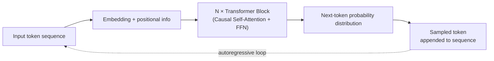

# Large Language Models

## Overview

An **LLM (Large Language Model)** is a **decoder-only Transformer** pretrained to predict the next token over a large text corpus. Most of the upper layers of this wiki — [[en/AI/Engineering/Prompt_Engineering/Prompt_Engineering|Prompt Engineering]], [[en/AI/Engineering/Context_Engineering/Context_Engineering|Context Engineering]], [[en/AI/Engineering/Agent_Engineering/Agent_Engineering|Agent Engineering]] — are written on the assumption that this model type exists. This document covers that assumption itself — **what defines an LLM as a model type**: an overview of the decoder-only architecture, the base/instruct/reasoning stage distinction, and the open-weight vs. closed API deployment axis. The concrete methods for making and changing the weights are covered in [[en/AI/Engineering/Model_Engineering/Training_and_Tuning/Training_and_Tuning|Training_and_Tuning]], and structural/efficiency choices like Dense/MoE, tokenization, and quantization are covered in [[en/AI/Engineering/Model_Engineering/Architecture_and_Efficiency/Architecture_and_Efficiency|Architecture_and_Efficiency]].

## Architecture at a Glance: Decoder-only Transformer

A **causal mask** lets each position attend only to the tokens before it, so the model can train on an entire sequence in a single forward pass while still generating autoregressively — pulling out one token at a time — at inference. How text becomes tokens is covered in [[en/AI/Engineering/Model_Engineering/Architecture_and_Efficiency/Tokenization|Tokenization]], and whether the Transformer blocks stay Dense or sparsify into MoE, and how the context window is extended, is covered in [[en/AI/Engineering/Model_Engineering/Architecture_and_Efficiency/Model_Architectures_and_MoE|Model_Architectures_and_MoE]].

## Base → Instruct → Reasoning

Starting from the same pretrained weights, the model ends up with completely different behavior depending on what adaptation follows — three distinct stages.

| Stage | Adaptation method | Behavioral characteristics |
|------|-----------|-----------|
| **Base** | Pretraining only (next-token prediction) | A "continuation" model with no chat format — it statistically continues the input rather than following instructions |
| **Instruct / Chat** | SFT + RLHF (PPO) or DPO | Follows instructions, maintains conversational format, and is tuned to refuse harmful requests |
| **Reasoning** | Long CoT data + RLVR/GRPO | Generates long internal reasoning tokens before the final answer — this category includes the OpenAI o-series, DeepSeek-R1, Claude's extended thinking, and Gemini's Thinking mode |

The concrete training techniques that produce these three stages (SFT, RLHF, DPO, GRPO/RLVR) are covered in [[en/AI/Engineering/Model_Engineering/Training_and_Tuning/Full_Fine-Tuning|Full_Fine-Tuning]] — this document focuses on **the resulting behavioral axis**.

## Scaling

The basic premise of LLM development is that increasing pretraining data, parameters, and compute reduces loss along a predictable curve. The concrete scaling law (Chinchilla) and operational issues like catastrophic forgetting during pretraining are covered in [[en/AI/Engineering/Model_Engineering/Training_and_Tuning/Pre-training_and_Continual_Learning|Pre-training_and_Continual_Learning]]. For techniques like RoPE/YaRN that extend the context window to hundreds of thousands or millions of tokens, see [[en/AI/Engineering/Model_Engineering/Architecture_and_Efficiency/Model_Architectures_and_MoE|Model_Architectures_and_MoE]].

## Open-weight vs. Closed (API) Models

| | Open-weight | Closed (API) |
|---|---|---|
| **Deployment** | Weights are downloadable; self-host and modify directly | API calls only; weights are not public |
| **Example families** | Llama, Qwen, DeepSeek, Gemma | GPT, Claude, Gemini |
| **Advantages** | Full deployment control, meets on-prem/privacy requirements, free to fine-tune and quantize within the license | No operational burden, continuous model updates, no infrastructure investment needed |
| **Constraints** | Must check license terms per model (commercial-use restrictions, etc.), must build serving infrastructure yourself | Vendor lock-in, no weight access so certain optimizations (quantization, etc.) are limited |

Techniques that touch the weights directly, like [[en/AI/Engineering/Model_Engineering/Architecture_and_Efficiency/Quantization|Quantization]] and [[en/AI/Engineering/Model_Engineering/Training_and_Tuning/PEFT_LoRA_QLoRA|PEFT_LoRA_QLoRA]], can only be fully applied to open-weight models.

## Evaluation

Base models are typically evaluated by perplexity or few-shot completion accuracy, while instruct/reasoning models are evaluated on instruction-following, conversational quality, and reasoning accuracy — because the evaluation axes differ, directly comparing the same benchmark score between a base and an instruct model is easy to misread. Standard benchmarks (MMLU, HumanEval, SWE-bench, etc.) and LLM-as-a-Judge methodology are covered in [[en/AI/Engineering/Harness_Engineering/Harness_Evaluation/Benchmarking|Benchmarking]] and [[en/AI/Engineering/Harness_Engineering/Harness_Evaluation/LLM_as_a_Judge|LLM_as_a_Judge]].

## Scope

| Document | What it covers |
|------|-----------|
| **This document (Large_Language_Models)** | The **LLM model type itself** — decoder-only overview, base/instruct/reasoning distinction, open/closed deployment |
| [[en/AI/Engineering/Model_Engineering/Model_Types/Multimodal_Models\|Multimodal_Models]] | Architectures that process images, audio, and video in addition to text |
| [[en/AI/Engineering/Model_Engineering/Model_Types/Decision_Models\|Decision_Models]] | Discriminative models that return only calibrated probabilities instead of generating text |
| [[en/AI/Engineering/Model_Engineering/Model_Types/Embedding_Models\|Embedding_Models]] | Models that output vectors instead of tokens |
| [[en/AI/Engineering/Model_Engineering/Training_and_Tuning/Training_and_Tuning\|Training_and_Tuning]] | Concrete methods for making and changing an LLM's weights (Pre-training/Full FT/PEFT/Distillation) |
| [[en/AI/Engineering/Model_Engineering/Architecture_and_Efficiency/Architecture_and_Efficiency\|Architecture_and_Efficiency]] | Structural/efficiency choices like Dense/MoE, tokenization, and quantization |

## Role in AI Engineering

The LLM is the foundation model that most of the upper layers covered in this wiki assume. The choice of which stage (base/instruct/reasoning) to use, and whether to self-host an open-weight model or use a closed API, constrains the design of all the Prompt, Context, Agent, and Harness Engineering layers that follow — for example, reasoning models have a different latency/cost profile because of their long internal reasoning tokens, and open-weight models allow self-fine-tuning and quantization but come with serving infrastructure responsibility.

## Related Concepts
[[en/AI/Engineering/Model_Engineering/Model_Types/Model_Types|Model_Types]] · [[en/AI/Engineering/Model_Engineering/Training_and_Tuning/Training_and_Tuning|Training_and_Tuning]] · [[en/AI/Engineering/Model_Engineering/Architecture_and_Efficiency/Architecture_and_Efficiency|Architecture_and_Efficiency]] · [[en/AI/Engineering/Model_Engineering/Model_Types/Multimodal_Models|Multimodal_Models]] · [[en/AI/Engineering/Prompt_Engineering/Prompt_Engineering|Prompt_Engineering]] · [[en/AI/Engineering/Harness_Engineering/Harness_Evaluation/Benchmarking|Benchmarking]]

## Sources
- Vaswani et al. (2017) "Attention Is All You Need" — [arXiv:1706.03762](https://arxiv.org/abs/1706.03762)
- Radford et al. (2019) "Language Models are Unsupervised Multitask Learners (GPT-2)" — [openai.com](https://cdn.openai.com/better-language-models/language_models_are_unsupervised_multitask_learners.pdf)
- Ouyang et al. (2022) "Training language models to follow instructions with human feedback (InstructGPT)" — [arXiv:2203.02155](https://arxiv.org/abs/2203.02155)
- [[en/AI/sources/whitepaper_Foundational_Large_Language_models_&_text_generation_v2|Foundational LLMs]] (Google, an existing source in this wiki) — Transformer formulas, the GPT-to-DeepSeek-R1 evolution overview
