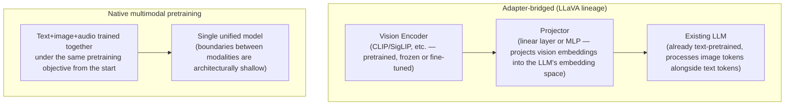

# Multimodal Models

## Overview

The preceding documents in this chapter (from Pre-training through Model Architectures) effectively assume a text-only model. But most production LLMs today are **multimodal models** that handle images, audio, and video alongside text. This wiki already covers multimodality from a retrieval angle ([[en/AI/Engineering/Context_Engineering/Retrieval_Strategies/RAG/Multimodal_RAG|Multimodal RAG]]) and a behavioral angle ([[en/AI/Engineering/Agent_Engineering/Computer_Use_and_Voice_Agents|Computer Use & Voice Agents]]), but had no document on **the model architecture itself**. This page fills that gap.

## Two VLM Architecture Lineages



| | Adapter-bridged (LLaVA lineage) | Native multimodal pretraining |
|---|---|---|
| **Composition** | Separately trained Vision Encoder + Projector + existing LLM | Trained jointly from scratch |
| **Training cost** | Low (reuses existing components, only the projector is trained) | Very high (full retraining) |
| **Performance ceiling** | Bounded by the pretraining limits of the Vision Encoder and LLM individually | Higher ceiling, since cross-modal interaction is learned from the start |
| **Representative examples** | LLaVA, many early open-source VLMs | GPT-4o, Gemini, Claude's (native image processing) family |

## Image Tokenization and Resolution Tiling

Images don't have natural token boundaries the way text does. Most VLMs split an image into fixed-size patches and treat each patch as one "image token."

```
Low resolution (e.g. 512×512) → fewer patches → less token consumption, loss of fine detail
High resolution (e.g. 2048×2048) → split into multiple pieces via tiling → each tile gets its own patch set
  → a single image can consume far more context budget than several sentences of text

Practical implications:
  - For agents handling screenshots/document images (Computer Use), image
    token cost can make up a substantial share of total cost
  - Raising resolution unconditionally improves accuracy but increases context/cost non-linearly
```

## Audio: From Whisper to Native Speech

```
Generation 1: Cascade approach
  Speech → ASR (Whisper, etc.) → text → LLM → text → TTS → speech
  Drawback: latency and information loss (lost intonation/emotional nuance) accumulate at each pipeline stage

Generation 2: Native speech-to-speech models
  Speech input → model processes audio tokens directly → generates audio tokens directly
  Advantage: reduced latency, preserved paralinguistic information like tone and interruption
```

Voice agent latency and turn-taking design are covered in [[en/AI/Engineering/Agent_Engineering/Computer_Use_and_Voice_Agents|Computer Use & Voice Agents]] — this section focuses on **how the model processes audio itself**.

## Video: The Frame-Sampling Trade-off

Video is in principle just a sequence of images, so tokenizing every frame as an image would work, but feeding in dozens of frames per second exhausts the context immediately.

```
Sampling strategies:
  - Uniform sampling: 1 frame every N seconds (simple, but can miss fast scene changes)
  - Scene-change-detection sampling: selectively extract only high-change points
  - Keyframes + subtitle/speech text combined: reduce frame count while supplementing with text from the audio track
```

## Multimodal Evaluation Benchmarks

| Benchmark | Measures |
|---|---|
| **MMMU** | College-level multimodal reasoning (image+text problems across subjects) |
| **MathVista** | Solving math problems that include visual elements |
| **DocVQA** | Question answering over document images (including table/form understanding) |

These benchmarks are generally tracked separately from the text-only benchmarks in [[en/AI/Engineering/Harness_Engineering/Benchmarking|Benchmarking]] (MMLU, GSM8K, etc.) — because text-reasoning ability and visual-understanding ability don't necessarily improve together.

## Boundaries

| Document | Covers |
|------|-----------|
| **This document (Multimodal_Models)** | The **architecture itself** of VLM/audio/video models — encoder-bridging approach, tokenization, evaluation |
| [[en/AI/Engineering/Context_Engineering/Retrieval_Strategies/RAG/Multimodal_RAG|Multimodal RAG]] | **Retrieval** using multimodal embeddings — CLIP shared embeddings, ColPali OCR-free retrieval |
| [[en/AI/Engineering/Agent_Engineering/Computer_Use_and_Voice_Agents|Computer Use & Voice Agents]] | **Action space** built on multimodal models (screenshot-based manipulation, voice conversation) — agent-level usage |

## Role in AI Engineering

Multimodal support is no longer a "special feature" — it's the default for frontier models. The fact that image tokens can consume far more context than text tokens has a direct impact on both Cost Engineering and Context Engineering — an agent design that repeatedly feeds screenshots into context has a much steeper cost curve than a text-only design.

## Related Concepts
[[en/AI/Engineering/Context_Engineering/Retrieval_Strategies/RAG/Multimodal_RAG|Multimodal RAG]] · [[en/AI/Engineering/Agent_Engineering/Computer_Use_and_Voice_Agents|Computer Use & Voice Agents]] · [[en/AI/Engineering/Model_Engineering/Model_Architectures_and_MoE|Model Architectures & MoE]] · [[en/AI/Engineering/Harness_Engineering/Benchmarking|Benchmarking]]

## Sources
- Liu et al. (2023) "Visual Instruction Tuning (LLaVA)" — [arXiv:2304.08485](https://arxiv.org/abs/2304.08485)
- Radford et al. (2021) "Learning Transferable Visual Models From Natural Language Supervision (CLIP)" — [arXiv:2103.00020](https://arxiv.org/abs/2103.00020)
- Yue et al. (2023) "MMMU: A Massive Multi-discipline Multimodal Understanding Benchmark" — [arXiv:2311.16502](https://arxiv.org/abs/2311.16502)
- Radford et al. (2022) "Robust Speech Recognition via Large-Scale Weak Supervision (Whisper)" — [arXiv:2212.04356](https://arxiv.org/abs/2212.04356)
