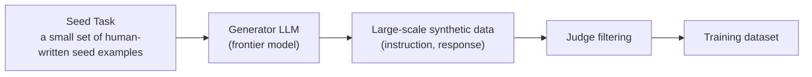

# Synthetic Data & Curation

## Overview

If **Fine-Tuning** ([[en/AI/Engineering/Model_Engineering/Full_Fine-Tuning|Full Fine-Tuning]], [[en/AI/Engineering/Model_Engineering/PEFT_LoRA_QLoRA|PEFT/LoRA/QLoRA]]) covers "how to train" and [[en/AI/Engineering/Model_Engineering/Model_Distillation|Model Distillation]] covers "how to compress weights," this document covers the step before either — **how to build and clean the dataset used for training.** As of 2025–2026, the dominant source of SFT data is no longer humans writing it by hand, but synthetic data **generated by frontier models and filtered by a separate judge**.

## Synthetic Data Generation Techniques



| Technique | Method | Notes |
|------|------|------|
| **Self-Instruct** | A handful of seed tasks → LLM generates new instructions/responses on its own | The original method for generating synthetic instruction-tuning data (Wang et al., 2022) |
| **Evol-Instruct** | An LLM "evolves" existing instructions (increasing complexity, adding constraints, deepening) | WizardLM lineage, artificially widens the difficulty distribution |
| **Frontier model distillation** | Using responses from a top-tier model (GPT-5/Claude/Gemini) directly as SFT data | The most common path in 2025–2026 practice — better on both quality and cost than human writers |
| **Function-calling trace generation** | Synthesizing tool-call trajectories as training tasks | The core data source for agent SFT/RLVR, connects to [[en/AI/Engineering/Loop_Engineering/RL_Environments|RL Environments]] |
| **RAG QA pair generation** | Auto-generating (question, evidence passage, answer) triples from a document corpus via LLM | Retrieval-grounded fine-tuning data |
| **Constitutional AI data** | Using a model's own record of critiquing and revising harmful responses as training data | Generating safety-alignment data, see [[en/AI/Engineering/Harness_Engineering/Guardrail_Engineering|Guardrail Engineering]] |

## Judge Filtering — the Single Biggest Lever

**Unfiltered large-scale synthetic data < filtered small-scale synthetic data.** This is the single most repeatedly confirmed principle in 2025–2026 data curation practice.

```
Pipeline:
  Generate at scale (10,000 samples) → LLM Judge scores them → discard the bottom 70% → keep the top 30% (3,000 samples)

  Training on 10,000 unfiltered samples → noise/low-quality responses get baked directly into the model
  Training on 3,000 filtered samples    → higher final performance despite less data
```

The judge here applies the same techniques covered in [[en/AI/Engineering/Harness_Engineering/LLM_as_a_Judge|LLM-as-a-Judge]] (pairwise/reference-based grading) to the data-generation pipeline — the difference is that the judge's output isn't "product quality assessment" but a binary gate: does this sample go into the training set or not.

## Data Hygiene

```
1. Deduplication
   MinHash/LSH-based approximate duplicate detection — removes not just
   exact duplicate sentences but near-duplicates down to the paraphrase level

2. Decontamination
   If evaluation benchmark problems (MMLU, GSM8K, etc.) leak directly into training
   data, benchmark scores become inflated → removed in advance via n-gram overlap checks
   (see the contamination section of [[en/AI/Engineering/Harness_Engineering/Benchmarking|Benchmarking]] for benchmark-reliability issues)

3. PII/secrets/toxicity hygiene
   Personal information (national ID numbers, emails, phone numbers), API-key/password
   patterns, and harmful content are scanned, masked, and removed via regex + classifiers
```

## Model Collapse — the Risk of Synthetic Data

When a model is repeatedly trained on data generated by itself (or an earlier generation of itself), the **model collapse** phenomenon has been reported — across generations, the tails of the distribution (rare but important patterns) get lost and the model converges toward the mean. Mitigations:

```
- Keep a minimum proportion of original human data in every generation (never train on fully synthetic data alone)
- Sampling strategies that artificially increase generation diversity (temperature, generate-many-then-diversity-filter)
- Track per-generation data provenance — record how many generations a given piece of data has been reproduced through
```

## Licensing and Provenance Tracking

Using a frontier model's outputs to train another model can be restricted by the vendor's terms of service (e.g. clauses prohibiting use for training competing models). A synthetic data pipeline must track, as metadata, which generator model and which license conditions produced each sample.

## Boundaries

| Document | Covers |
|------|-----------|
| **This document (Synthetic_Data_and_Curation)** | **Generating and cleaning the training dataset itself** — Self-Instruct, judge filtering, dedup, decontamination |
| [[en/AI/Engineering/Loop_Engineering/Data_Flywheel|Data Flywheel]] | The loop that recycles **feedback data generated during production operation** back into training |
| [[en/AI/Engineering/Model_Engineering/Model_Distillation|Model Distillation]] | Transferring Teacher→Student knowledge at the **weight level**, not the data level |

## Role in AI Engineering

Fine-tuning, RLVR, and distillation all presuppose "good training data." No matter how carefully the model architecture or training algorithm is chosen, quality can't exceed the ceiling set by the input data ("garbage in, garbage out"). This is why data curation split off into its own specialized area in 2025–2026 — the data generation/filtering pipeline itself has become an independent variable that determines model performance.

## Related Concepts
[[en/AI/Engineering/Loop_Engineering/Data_Flywheel|Data Flywheel]] · [[en/AI/Engineering/Model_Engineering/Model_Distillation|Model Distillation]] · [[en/AI/Engineering/Harness_Engineering/LLM_as_a_Judge|LLM-as-a-Judge]] · [[en/AI/Engineering/Harness_Engineering/Benchmarking|Benchmarking]] · [[en/AI/Engineering/Loop_Engineering/RL_Environments|RL Environments]]

## Sources
- Wang et al. (2022) "Self-Instruct: Aligning Language Models with Self-Generated Instructions" — [arXiv:2212.10560](https://arxiv.org/abs/2212.10560)
- Xu et al. (2023) "WizardLM: Empowering Large Language Models to Follow Complex Instructions (Evol-Instruct)" — [arXiv:2304.12244](https://arxiv.org/abs/2304.12244)
- Bai et al. (2022) "Constitutional AI: Harmlessness from AI Feedback" — [arXiv:2212.08073](https://arxiv.org/abs/2212.08073)
- Shumailov et al. (2024) "AI models collapse when trained on recursively generated data" — [Nature](https://www.nature.com/articles/s41586-024-07566-y)
- CuratorKIT (2026) "Data Curation and Synthetic Data Generation for LLM Post-Training" — [arXiv:2606.21631](https://arxiv.org/abs/2606.21631)
