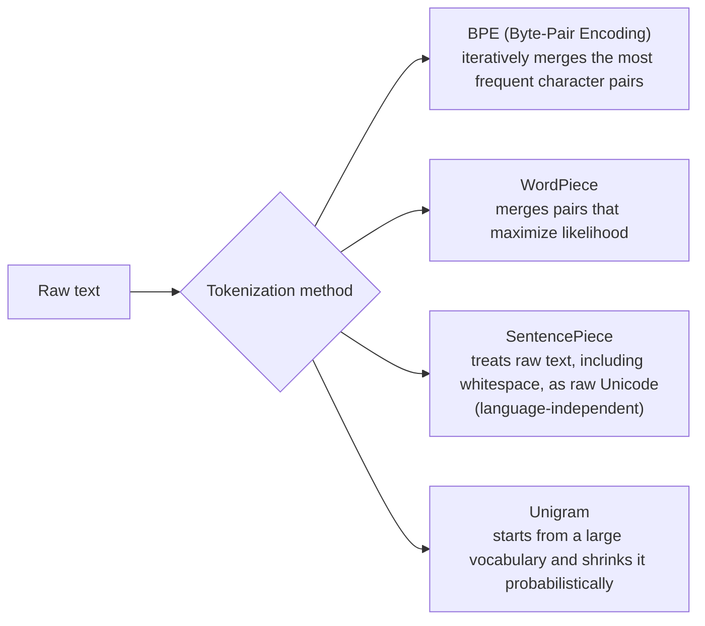

# Tokenization

## Overview

Both [[en/AI/Engineering/Loop_Engineering/Cost_Engineering/Cost_Engineering|Cost Engineering]] and [[en/AI/Engineering/Prompt_Engineering/Prompt_Caching|Prompt Caching]] start their discussions from the premise of "the cost of a single token," but this wiki had no document covering **how a token is actually produced**. The tokenizer shapes cost, context budget, and multilingual performance just as much as the model architecture does, yet it's often taken for granted in prompt/cost optimization discussions.

## Subword Tokenization Methods



| Method | Merge criterion | Representative use |
|------|-----------|-----------|
| **BPE** | Repeatedly merges the most frequent adjacent character/byte pair | GPT family (tiktoken), most open-source LLMs |
| **WordPiece** | Chooses the pair that maximizes language-model likelihood when merged | BERT family |
| **SentencePiece** | Treats raw text, including whitespace, in a language-independent way (built on top of a unigram or BPE algorithm) | Multilingual models, T5, LLaMA |
| **Byte-level fallback** | Characters not in the vocabulary are decomposed into UTF-8 bytes | The safety net in most modern tokenizers — eliminates "untokenizable strings" |

## The Vocabulary Size Trade-off

```
Larger vocab_size
  Pro: represents the same text in fewer tokens (shorter sequences, saves context budget)
  Con: the embedding table (vocab_size × d_model) grows, increasing parameters/memory

Smaller vocab_size
  Pro: smaller embedding table
  Con: the same text splits into more tokens (longer sequences, higher inference cost)

Practical sweet spot: large models typically use a vocabulary between 50K and 250K
  (models with stronger multilingual support tend toward larger vocabularies)
```

## The Multilingual / Non-English Token Efficiency Penalty

A tokenizer's vocabulary reflects the language distribution of its training corpus. A tokenizer trained predominantly on English represents English words in 1-2 tokens, but the same meaning in a non-English language — Korean being a common example — often takes noticeably more tokens.

```
Illustrative pattern (exact ratios vary by tokenizer/model):
  English "I love you" → roughly 3 tokens
  The equivalent Korean "사랑해" → often decomposes into more tokens on the
                                     same tokenizer, depending on morpheme
                                     boundaries and syllable composition

Practical implications:
  - For the same amount of "work," non-English/Korean input-output can cost
    more than English (a direct cost penalty under token-based pricing)
  - Since the context window is also measured in tokens, the same window size
    may hold less actual information in Korean than in English
  - Language-specific tokenizers (built on morphological-analysis vocabularies)
    or tokenizers retrained with a higher proportion of the target-language corpus
    mitigate this penalty
```

This penalty is a variable that must be factored in when designing the cost structure of a multilingual service from a [[en/AI/Engineering/Loop_Engineering/Cost_Engineering/Cost_Engineering|Cost Engineering]] perspective — the same routing/caching strategy produces a different real-world cost curve when per-language token density differs.

## How Number/Code Tokenization Affects Arithmetic and Coding Performance

```
Number tokenization problem:
  If "12345" collapses into a single token, the model has a harder time
  learning digit-level operations (addition, digit comparison)
  → some modern tokenizers split numbers by digit or chunk them consistently
    (e.g. fixed groups of three digits) to improve arithmetic reasoning accuracy

Code tokenization problem:
  Indentation (spaces/tabs) and special symbols (braces, semicolons) have a
  statistical distribution different from natural-language text
  → code-specialized tokenizers, or a training corpus with a higher proportion
    of code data, have a meaningful effect on coding performance
```

## Tokenizer Mismatch and Token-Counting Practice

```
Common practical issues:
  - You estimate token count using Vendor A's tokenizer, but actual billing
    is based on Vendor B's tokenizer → pre-estimated cost doesn't match the actual bill
  - A model upgrade changes the tokenizer itself (e.g. vocabulary expansion)
    → the same prompt now has a different token count, throwing off caching/cost predictions
  - To get an accurate token count client-side, you must use the vendor's official
    tokenizer library (tiktoken, a vendor SDK's count_tokens API, etc.)
    — approximations (heuristics like word count × 1.3) are inaccurate for billing predictions
```

## Boundaries

| Document | Covers |
|------|-----------|
| **This document (Tokenization)** | The algorithm of the tokenizer **itself**, vocabulary-size trade-offs, per-language efficiency |
| [[en/AI/Engineering/Loop_Engineering/Cost_Engineering/Cost_Engineering|Cost Engineering]] | Routing/caching/auditing strategies that **optimize** per-token cost |
| [[en/AI/Engineering/Prompt_Engineering/Prompt_Caching|Prompt Caching]] | How to design cache breakpoints using token **boundaries** |

## Role in AI Engineering

The tokenizer is a layer that invisibly intervenes from the moment a prompt is written to the moment API cost is billed. When designing a multilingual service — Korean in particular — ignoring the token-efficiency penalty means cost and context-budget estimates made on an English baseline diverge sharply from actual operation. When choosing a model or routing strategy, "how efficient is this model's tokenizer for our service's language" is as practical a selection criterion as any benchmark score.

## Related Concepts
[[en/AI/Engineering/Loop_Engineering/Cost_Engineering/Cost_Engineering|Cost Engineering]] · [[en/AI/Engineering/Prompt_Engineering/Prompt_Caching|Prompt Caching]] · [[en/AI/Engineering/Model_Engineering/Model_Architectures_and_MoE|Model Architectures & MoE]]

## Sources
- Sennrich et al. (2016) "Neural Machine Translation of Rare Words with Subword Units (BPE)" — [arXiv:1508.07909](https://arxiv.org/abs/1508.07909)
- Kudo & Richardson (2018) "SentencePiece: A simple and language independent subword tokenizer" — [arXiv:1808.06226](https://arxiv.org/abs/1808.06226)
- Kudo (2018) "Subword Regularization (Unigram)" — [arXiv:1804.10959](https://arxiv.org/abs/1804.10959)
- OpenAI `tiktoken` — [github.com/openai/tiktoken](https://github.com/openai/tiktoken)
