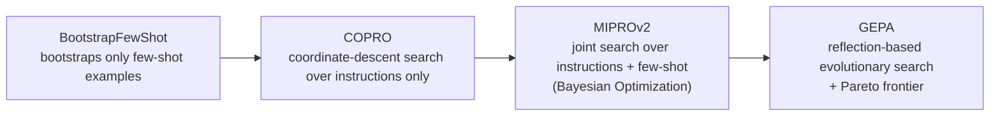

# Automatic Prompt Optimization

## Overview

**Automatic Prompt Optimization** is the approach where prompts are not hand-written: you declare only a goal and an evaluation metric, and an optimizer automatically searches over prompt wording, few-shot examples, and instruction structure. It took hold in practice starting in late 2024, and it carries a shift in perspective — a prompt becomes something you *compile* rather than something you *write*.

This document covers that paradigm shift and **which optimizer to use when**. The actual compilation pipeline and its connection to the operating loop are covered in [[en/AI/Engineering/Loop_Engineering/Continuous_Optimization|Continuous Optimization]].

## Why Hand-Written Prompting Has Structural Limits

```
Structural problems with manual prompt engineering:
  - Human intuition can diverge from a model's actual response patterns
    (the intuition "asking politely will make it comply better" isn't always right)
  - Every small change to a prompt requires manually re-evaluating the whole pipeline
  - When the model changes (GPT-4→GPT-5, Claude 3.5→4.5), the old prompt is no longer optimal
    → manual retuning is needed at every model upgrade
  - In multi-step pipelines (RAG, agents), prompts at different stages interact with each
    other, making it hard for a human to intuit the globally optimal combination
```

## Landscape of Automatic Optimization Techniques

| Technique | Method | Notes |
|------|------|------|
| **APE** (Automatic Prompt Engineer) | Has an LLM reverse-generate candidate instructions from demonstration examples, then scores them | The first-generation "an LLM writes LLM prompts" approach (Zhou et al., 2022) |
| **OPRO** (Optimization by PROmpting) | Uses the LLM itself as a meta-optimization algorithm — feeds the history of prior attempt-score pairs back into the prompt to generate the next candidate | Optimizes purely through a natural-language feedback loop, with no gradients |
| **TextGrad** | "Text-based backpropagation" — treats evaluation feedback like a differentiable loss and propagates it to the prompt at each node of the pipeline | Optimizes an entire multi-step pipeline simultaneously |
| **Vendor prompt improvers** | One-shot prompt-improvement tools built into vendor consoles (Anthropic, OpenAI, etc.) | Usable immediately with no separate pipeline, but not an iterative optimization loop |
| **DSPy optimizer family** | Declare a signature, module, and metric, and the compiler searches for the prompt + examples | See below; details in [[en/AI/Engineering/Loop_Engineering/Continuous_Optimization\|Continuous Optimization]] |

## GEPA (ICLR 2026) — Reflection-Based Evolutionary Search

**GEPA** (Genetic-Pareto) is the newest optimizer included in DSPy 3.0, presented at ICLR 2026. The key contrast is with prior RL-based optimization (GRPO).

```
GRPO (RL-based) approach:
  Incrementally updates the policy using only a numeric reward signal
  → requires a large number of rollouts (thousands to tens of thousands)

GEPA (reflection-based evolutionary) approach:
  Each iteration runs a minibatch → generates a natural-language reflection on the execution trajectory
  → analyzes in text "why this response was wrong" and directly revises the prompt
  → keeps and selects revised candidates via a Pareto frontier (considering multiple metrics at once)
```

GEPA reports **+20% performance** with **about 35x fewer rollouts** than GRPO — because it diagnoses failure reasons directly in natural language and feeds that diagnosis straight into the prompt revision, instead of guessing direction from a numeric reward alone, its search is far more sample-efficient.

## DSPy Optimizer Selection Guide

DSPy is the flagship framework for the "compile the prompt" approach. The optimizer lineage and each one's trade-offs:



| Situation | Recommended optimizer |
|------|-----------------|
| A simple task where picking a few good examples is enough | BootstrapFewShot |
| Instruction wording itself matters and examples aren't needed | COPRO |
| The common case — need to search examples and instructions together | MIPROv2 |
| Limited compute budget but need top performance | GEPA |
| Optimizing past the prompt level into model weights | GRPO (see [[en/AI/Engineering/Loop_Engineering/Continuous_Optimization\|Continuous Optimization]]) |

## Boundaries

| Document | Covers |
|------|-----------|
| **This document (Automatic_Prompt_Optimization)** | The **paradigm shift** of "prompts are no longer hand-written" and **optimizer selection criteria** |
| [[en/AI/Engineering/Loop_Engineering/Continuous_Optimization\|Continuous Optimization]] | **Implementation detail** of the DSPy compilation pipeline (signature/module/metric code) and the **operating loop**, including A/B testing and prompt version management |

## Role in AI Engineering

Automatic prompt optimization sits at the boundary between Prompt Engineering and Loop Engineering — its output is still a "prompt" (Prompt Engineering's domain), but the process that produces it follows an iterative evaluate-and-improve loop (Loop Engineering's methodology). As the cost of manually retuning prompts every time a model upgrades becomes non-negligible at organizational scale, this automation is shifting from "nice to have" to "required production infrastructure."

## Related Concepts
[[en/AI/Engineering/Loop_Engineering/Continuous_Optimization|Continuous Optimization]] · [[en/AI/Engineering/Prompt_Engineering/Few_shot_Prompting|Few-shot Prompting]] · [[en/AI/Engineering/Prompt_Engineering/System_and_Role_Prompting|System & Role Prompting]] · [[en/AI/Engineering/Harness_Engineering/LLM_as_a_Judge|LLM-as-a-Judge]]

## Sources
- Zhou et al. (2022) "Large Language Models Are Human-Level Prompt Engineers (APE)" — [arXiv:2211.01910](https://arxiv.org/abs/2211.01910)
- Yang et al. (2023) "Large Language Models as Optimizers (OPRO)" — [arXiv:2309.03409](https://arxiv.org/abs/2309.03409)
- Yuksekgonul et al. (2024) "TextGrad: Automatic Differentiation via Text" — [arXiv:2406.07496](https://arxiv.org/abs/2406.07496)
- Khattab et al. (2023) "DSPy: Compiling Declarative Language Model Calls into Self-Improving Pipelines" — [arXiv:2310.03714](https://arxiv.org/abs/2310.03714)
- Agrawal et al. (2026) "GEPA: Reflective Prompt Evolution Can Outperform Reinforcement Learning" (ICLR 2026) — [arXiv:2507.19457](https://arxiv.org/abs/2507.19457)
