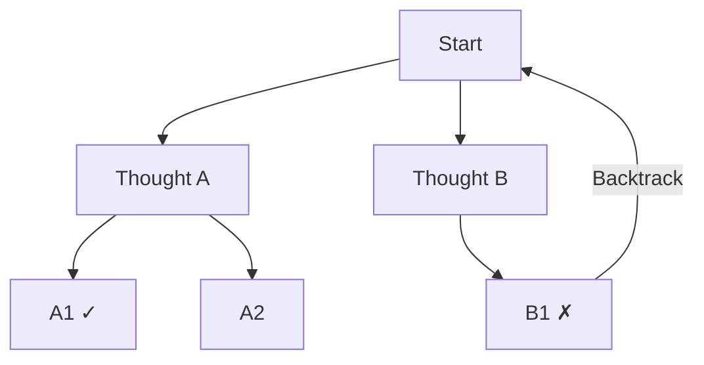

# Chain of Thought / Tree of Thought

## Overview

**Chain of Thought (CoT)** is a prompting technique that guides LLMs to explicitly generate step-by-step reasoning processes before giving a final answer. **Tree of Thought (ToT)** generalizes CoT by exploring multiple reasoning paths and selecting the most promising one via tree search.

## Chain of Thought (CoT)

### Origin
- **Authors**: Wei et al., Google Brain (2022)
- **Paper**: "Chain-of-Thought Prompting Elicits Reasoning in Large Language Models" — [arXiv:2201.11903](https://arxiv.org/pdf/2201.11903)

### Core Idea
Include intermediate reasoning steps in a "Let me think step by step" manner:

```
Without CoT:
  Q: "Roger has 5 tennis balls. He buys 2 cans with 3 each. Total?"
  A: "11" (correct)

With CoT:
  Q: Same
  A: "Roger starts with 5.
      2 cans × 3 balls/can = 6 additional.
      5 + 6 = 11"
  A: "11" (correct, with reasoning)
```

### Zero-shot CoT
Without examples, just add one line "Let's think step by step":
```
Q: "..." + "Let's think step by step."
```
- Discovered by Kojima et al. (2022)
- Simple but significantly improves performance on complex reasoning

### Few-shot CoT
Provide examples that include CoT reasoning:
```
Example:
  Q: "There are 15 flowers in a garden. 1/3 were picked. How many remain?"
  A: "1/3 of 15 is 5. After picking, 15 - 5 = 10 remain."

Question:
  Q: "45 people are on a bus. 1/5 get off at the next stop. How many remain?"
```

### Self-Consistency CoT
Generate multiple reasoning paths for the same question, then vote:
```
Generate 3~10 responses with higher temperature
→ Select the most common answer (majority vote)
→ More stable performance than single CoT
```

## Tree of Thought (ToT)

### Origin
- **Authors**: Yao et al., Princeton (2023)
- **Paper**: "Tree of Thoughts: Deliberate Problem Solving with Large Language Models" — [arXiv:2305.10601](https://arxiv.org/abs/2305.10601)

### Core Idea
Extend CoT's linear reasoning to **tree search**:



**Components**:
1. **Thought Generator**: Generate multiple candidate "thoughts" at each step
2. **State Evaluator**: Evaluate the promise of each thought (LLM self-evaluation or heuristic)
3. **Search Algorithm**: BFS (breadth-first) or DFS (depth-first) search

### Tasks Suited for ToT
- Problems with a search space (puzzles, code debugging, creative writing)
- Problems where intermediate steps can be evaluated
- Problems where backtracking is meaningful

## CoT vs ToT Comparison

| | CoT | ToT |
|--|-----|-----|
| **Reasoning structure** | Linear | Tree |
| **Backtracking** | No | Yes |
| **LLM calls** | 1 | Tens to hundreds |
| **Cost** | Low | High |
| **Suitable tasks** | Math, commonsense reasoning | Complex planning, puzzles |
| **Performance gain** | Large | Additional gain over CoT |

## Extensions: Graph of Thoughts & Beyond

- **Graph of Thoughts (GoT)**: Generalizes ToT to graphs (allows cycles and merging)
- **Algorithm of Thoughts**: Search within a single context
- **ReAct**: Combines external tool calls with CoT (→ [[en/AI/Engineering/Flow_Engineering/Graph_Flow/ReAct_Pattern|ReAct Pattern]])

## Thinking Mode (Extended Thinking)

Modern models (Claude 3.7 Sonnet, o1/o3, etc.) provide a "Thinking" mode that internally executes CoT:
- Model generates internal reasoning tokens before the response
- Only the final answer is shown to users (or thinking content can also be exposed)

## Role in AI Engineering

CoT is the most validated technique for eliciting LLM reasoning capabilities. It is the foundational prompting pattern for LLM applications requiring complex reasoning — math, coding, legal analysis, etc. — and a meaningful performance improvement can be obtained with just one "Think step by step" line.

## Related Concepts
[[en/AI/Engineering/Prompt_Engineering/Few_shot_Prompting|Few-shot Prompting]] · [[en/AI/Engineering/Prompt_Engineering/System_and_Role_Prompting|System & Role Prompting]] · [[en/AI/Engineering/Flow_Engineering/Graph_Flow/ReAct_Pattern|ReAct Pattern]] · [[en/AI/Engineering/Agent_Engineering/Planning_and_Reflection|Planning & Reflection]]

## Sources
- Wei et al. (2022) "Chain-of-Thought Prompting Elicits Reasoning in Large Language Models" — [arXiv:2201.11903](https://arxiv.org/pdf/2201.11903)
- Yao et al. (2023) "Tree of Thoughts" — [arXiv:2305.10601](https://arxiv.org/abs/2305.10601)
- Kojima et al. (2022) "Large Language Models are Zero-Shot Reasoners" — [arXiv:2205.11916](https://arxiv.org/abs/2205.11916)
- learnprompting.org "Chain-of-Thought Prompting" — [learnprompting.org](https://learnprompting.org/docs/intermediate/chain_of_thought)
