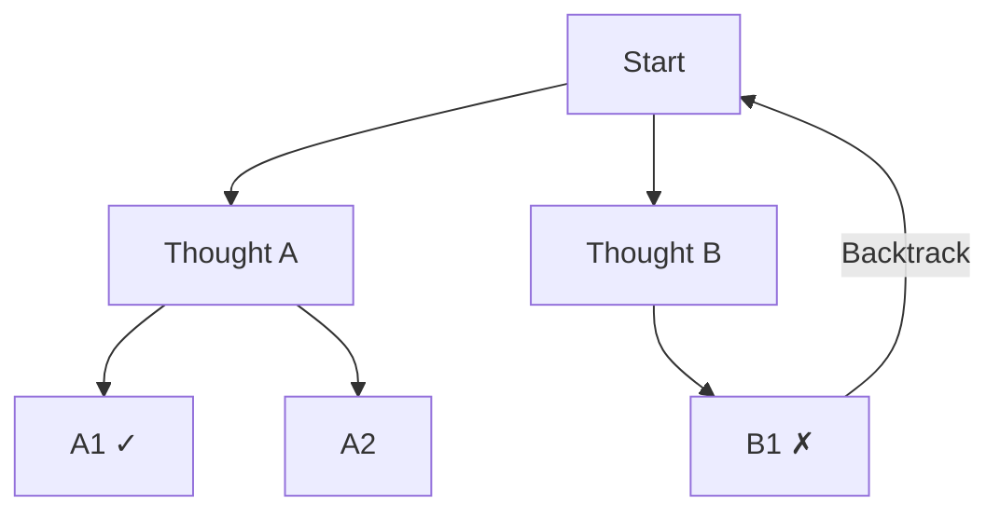

# Chain of Thought / Tree of Thought

## Overview

**Chain of Thought (CoT)** is a prompting technique that guides LLMs to explicitly generate step-by-step reasoning processes before giving a final answer. **Tree of Thought (ToT)** generalizes CoT by exploring multiple reasoning paths and selecting the most promising one via tree search.

## Chain of Thought (CoT)

### Origin
- **Authors**: Wei et al., Google Brain (2022)
- **Paper**: "Chain-of-Thought Prompting Elicits Reasoning in Large Language Models" — [arXiv:2201.11903](https://arxiv.org/pdf/2201.11903)

### Core Idea
Include intermediate reasoning steps in a "Let me think step by step" manner:

```
Without CoT:
  Q: "Roger has 5 tennis balls. He buys 2 cans with 3 each. Total?"
  A: "11" (correct)

With CoT:
  Q: Same
  A: "Roger starts with 5.
      2 cans × 3 balls/can = 6 additional.
      5 + 6 = 11"
  A: "11" (correct, with reasoning)
```

### Zero-shot CoT
Without examples, just add one line "Let's think step by step":
```
Q: "..." + "Let's think step by step."
```
- Discovered by Kojima et al. (2022)
- Simple but significantly improves performance on complex reasoning

### Few-shot CoT
Provide examples that include CoT reasoning:
```
Example:
  Q: "There are 15 flowers in a garden. 1/3 were picked. How many remain?"
  A: "1/3 of 15 is 5. After picking, 15 - 5 = 10 remain."

Question:
  Q: "45 people are on a bus. 1/5 get off at the next stop. How many remain?"
```

### Self-Consistency CoT
Generate multiple reasoning paths for the same question, then vote:
```
Generate 3~10 responses with higher temperature
→ Select the most common answer (majority vote)
→ More stable performance than single CoT
```

## Tree of Thought (ToT)

### Origin
- **Authors**: Yao et al., Princeton (2023)
- **Paper**: "Tree of Thoughts: Deliberate Problem Solving with Large Language Models" — [arXiv:2305.10601](https://arxiv.org/abs/2305.10601)

### Core Idea
Extend CoT's linear reasoning to **tree search**:


```mermaid
flowchart TD
    S[Start] --> A[Thought A] & B[Thought B]
    A --> A1[A1 ✓] & A2[A2]
    B --> B1[B1 ✗]
    B1 -->|Backtrack| S
```

**Components**:
1. **Thought Generator**: Generate multiple candidate "thoughts" at each step
2. **State Evaluator**: Evaluate the promise of each thought (LLM self-evaluation or heuristic)
3. **Search Algorithm**: BFS (breadth-first) or DFS (depth-first) search

### Tasks Suited for ToT
- Problems with a search space (puzzles, code debugging, creative writing)
- Problems where intermediate steps can be evaluated
- Problems where backtracking is meaningful

## CoT vs ToT Comparison

| | CoT | ToT |
|--|-----|-----|
| **Reasoning structure** | Linear | Tree |
| **Backtracking** | No | Yes |
| **LLM calls** | 1 | Tens to hundreds |
| **Cost** | Low | High |
| **Suitable tasks** | Math, commonsense reasoning | Complex planning, puzzles |
| **Performance gain** | Large | Additional gain over CoT |

## Extensions: Graph of Thoughts & Beyond

- **Graph of Thoughts (GoT)**: Generalizes ToT to graphs (allows cycles and merging)
- **Algorithm of Thoughts**: Search within a single context
- **ReAct**: Combines external tool calls with CoT (→ [[en/AI/Engineering/Flow_Engineering/Graph_Flow/ReAct_Pattern|ReAct Pattern]])

## Other CoT-Family Techniques

### Least-to-Most Prompting
Zhou et al. (2022) [4]. **Decomposes** a complex problem into a series of sub-problems, then solves them sequentially, using the answer to each sub-problem to help solve the next. Where Few-shot CoT shows "how to think" through examples, Least-to-Most first shows "how to break the problem apart." It generalizes better than Few-shot CoT on compositionally hard problems.

### Self-Ask
Press et al. (2022) [5]. Prompts the model to ask itself **follow-up questions** and answer them before answering the final question. The explicit "Are follow-up questions needed here?" prompt makes it easy to slot in external actions like search at each follow-up, making this a precursor to tool-use patterns like ReAct.

### Program-of-Thought (PoT)
Chen et al. (2022) [6]. Generates the reasoning process as **executable code** (typically Python) instead of natural language, and uses the code's execution result as the final answer. CoT sometimes narrates the arithmetic itself in text and makes computation errors; PoT separates "reasoning" (deciding what to compute) from "computation" (executing it correctly), delegating the latter to an interpreter.

## Thinking Mode and CoT in the Reasoning-Model Era

**Reasoning models** — Claude Opus/Sonnet's Extended Thinking, OpenAI's o-series and GPT-5 line, Gemini Deep Think — are trained during post-training to internally generate long reasoning chains on their own. This means what the CoT techniques above used to "elicit" via prompting is now a model's built-in default behavior, and that changes how practitioners prompt them.

```
Non-reasoning models (GPT-4, Claude 3.5, etc.):
  Explicitly add "Let's think step by step" to the prompt → reasoning must be elicited

Reasoning models (o1/o3, Claude Extended Thinking, Gemini Deep Think, etc.):
  The model generates internal reasoning tokens on its own before responding
  → CoT-eliciting phrases like "think step by step" are usually unnecessary
  → in some cases they can even hurt performance (by interfering with the model's own reasoning strategy)
```

**What changes when prompting reasoning models:**
- **Thinking budget / effort-level control**: "how deeply to think" is set directly via API parameters (e.g., `thinking_budget`, `reasoning_effort`) rather than through CoT phrasing.
- **Don't feed thinking blocks back on the next turn**: it's standard practice not to carry a model's internal reasoning content forward in the conversation history for reuse — prior reasoning can actually degrade the quality of later responses.
- **Prefer adaptive mode**: rather than forcing "always think deeply," letting the model scale its own reasoning depth to the problem's difficulty is often the better cost/quality tradeoff.

**When explicit CoT prompting still applies**: this shift hasn't fully replaced CoT. Explicit CoT prompting is still useful for non-reasoning models (low-cost tiers, lightweight models), for latency- or cost-sensitive situations where reasoning mode is turned off, and where explainability requirements call for exposing the model's thought process directly to users.

## Role in AI Engineering

CoT is the most validated technique for eliciting LLM reasoning capabilities. It is the foundational prompting pattern for LLM applications requiring complex reasoning — math, coding, legal analysis, etc. — and a meaningful performance improvement can be obtained with just one "Think step by step" line. That said, as reasoning models become standard, practice is shifting toward controlling "how deeply to think" via API-level parameters rather than prompt phrasing.

## Related Concepts
[[en/AI/Engineering/Prompt_Engineering/Few_shot_Prompting|Few-shot Prompting]] · [[en/AI/Engineering/Prompt_Engineering/System_and_Role_Prompting|System & Role Prompting]] · [[en/AI/Engineering/Flow_Engineering/Graph_Flow/ReAct_Pattern|ReAct Pattern]] · [[en/AI/Engineering/Agent_Engineering/Planning_and_Reflection|Planning & Reflection]] · [[en/AI/Engineering/Prompt_Engineering/Prompt_Caching|Prompt Caching]]

## Sources
- Wei et al. (2022) "Chain-of-Thought Prompting Elicits Reasoning in Large Language Models" — [arXiv:2201.11903](https://arxiv.org/pdf/2201.11903)
- Yao et al. (2023) "Tree of Thoughts" — [arXiv:2305.10601](https://arxiv.org/abs/2305.10601)
- Kojima et al. (2022) "Large Language Models are Zero-Shot Reasoners" — [arXiv:2205.11916](https://arxiv.org/abs/2205.11916)
- Zhou et al. (2022) "Least-to-Most Prompting Enables Complex Reasoning in Large Language Models" — [arXiv:2205.10625](https://arxiv.org/abs/2205.10625)
- Press et al. (2022) "Measuring and Narrowing the Compositionality Gap in Language Models" — [arXiv:2210.03350](https://arxiv.org/abs/2210.03350)
- Chen et al. (2022) "Program of Thoughts Prompting" — [arXiv:2211.12588](https://arxiv.org/abs/2211.12588)
- learnprompting.org "Chain-of-Thought Prompting" — [learnprompting.org](https://learnprompting.org/docs/intermediate/chain_of_thought)
